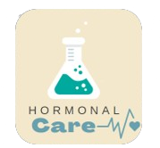
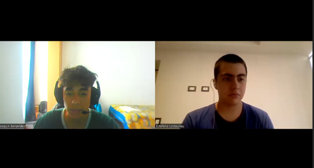
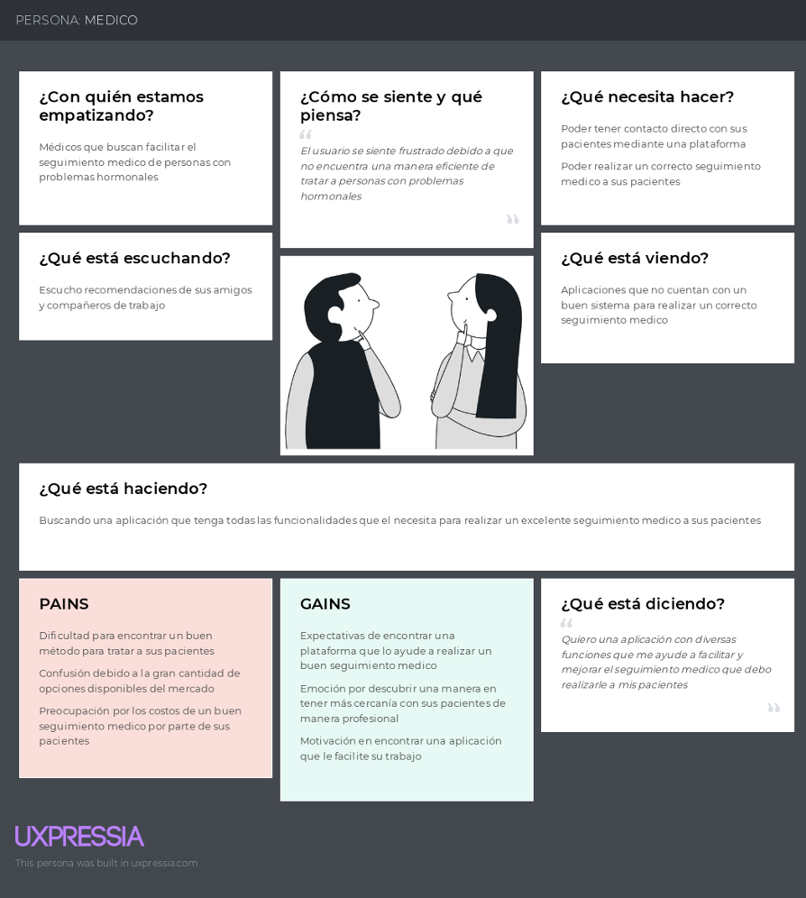
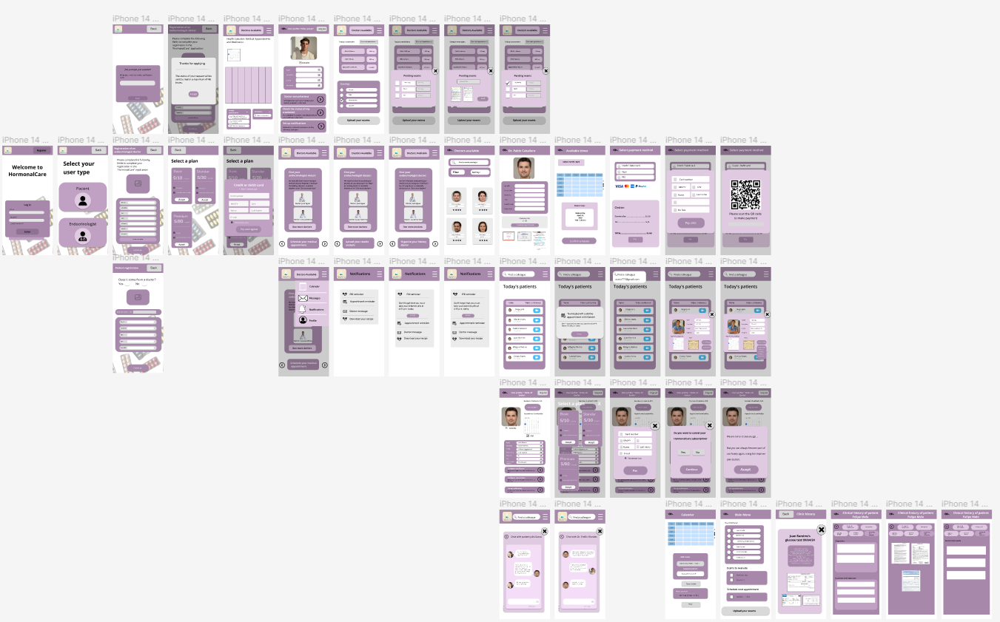
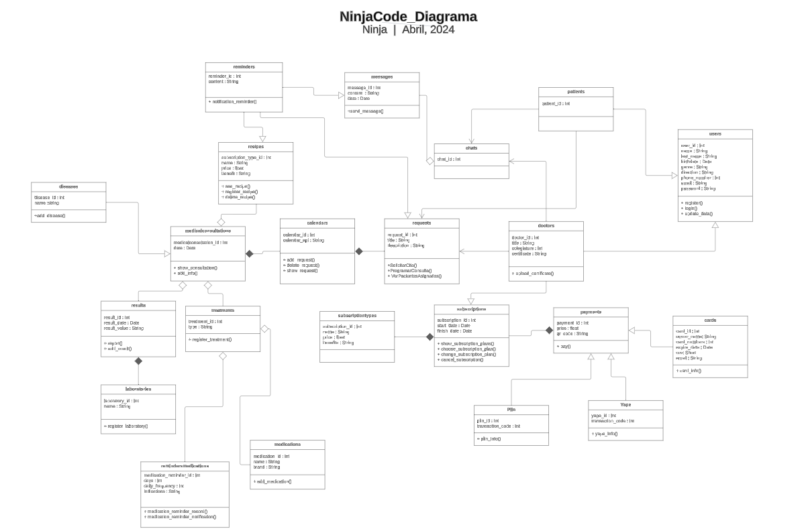
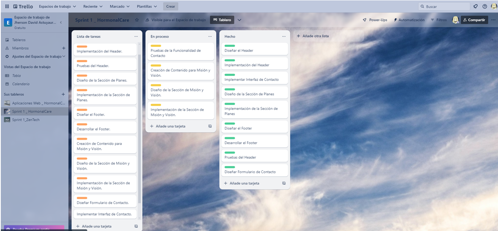
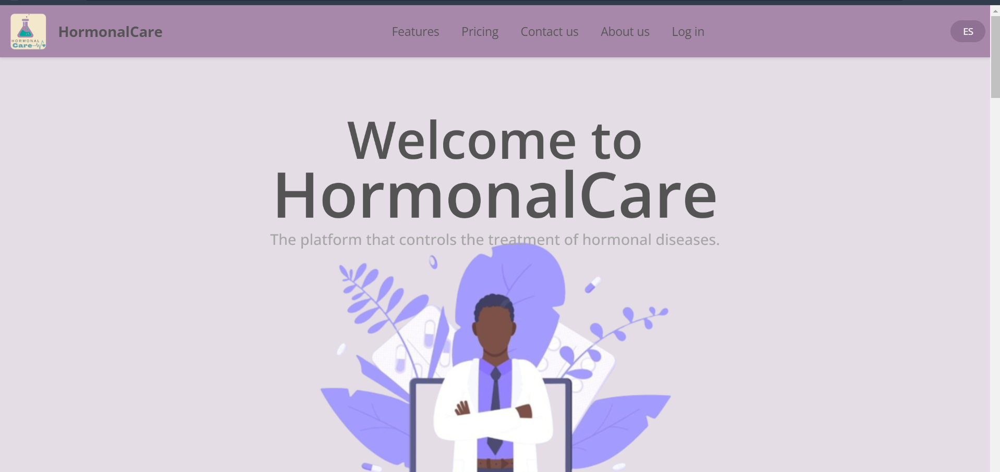
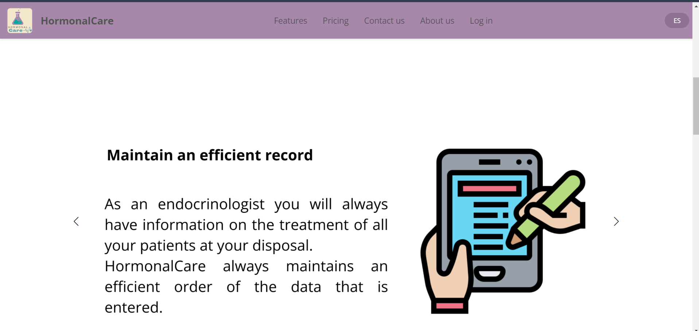

# Universidad Peruana de Ciencias Aplicadas

Ingeniería de Software

Ciclo 2024-01

# 
Aplicaciones Web

## TF REPORT

**Sección:** SW53

**Profesor**: Alex Humberto Sánchez Ponce

*StartUp Name*: NinjaCode

*Producto*: HormonalCare

### Team Members:

| Member                            |    Code    |
| :-------------------------------- | :--------: |
| Claudio Sandro Quispesivana Torres| U202215099 |
| Jherson David Astuyauri Calderon  | U202218451 |
| Estefano Sebastian Lostaunau Pereira | U202211742 |
| Luis Sebastian Chinchihualpa Saldarriaga | U202212112 |
| Sebastian Valente Lobato Pozo | U202215312 |

 

## Project Report Collaboration Insights
Enlace del Project Report: (https://github.com/upc-open-source-ninja-code/upc-pre-202401--si729-sw51-NinjaCode-report-tb1/blob/main/readme.md)

## Contenido

### [Registro de versiones](#)

### [Contenido](#)

### [STUDENT OUTCOME](#)

### [Capítulo I: Introducción](#)

[1.1.	Startup Profile](#)

[1.1.1.	Descripción de la Startup](#)

[1.1.2.	Perfiles de integrantes del equipo](#)

[1.2.	Solution Profile](#)

[1.2.1.	Antecedentes y problemática](#)

[1.2.2.	Lean UX Process](#)

[1.2.2.1.	Lean UX Problem Statements](#)

[1.2.2.2.	Lean UX Assumptions](#)

[1.2.2.3.	Lean UX Hypothesis Statements](#)

[1.2.2.4.	Lean UX Canvas](#)

[1.3.	Segmentos objetivo](#)

### [Capítulo II: Requirements Elicitation & Analysis](#)

[2.1. Competidores](#)

[2.1.1. Análisis competitivo](#)

[2.1.2. Estrategias y tácticas frente a competidores](#)

[2.2. Entrevistas](#)

[2.2.1.   Diseño de entrevistas](#)

[2.2.2.   Registro de entrevistas](#)

[2.2.3.   Análisis de entrevistas](#)

[2.3.      Needfinding](#)

[2.3.1.   User Personas](#)

[2.3.2.   User Task Matrix](#)

[2.3.3.   User Journey Mapping](#)

[2.3.4.   Empathy Mapping](#)

[2.3.5.   As-is Scenario Mapping](#)

[2.4.      Ubiquitous Language](#)

### [Capítulo III: Requirements Specification](#)

[3.1. To-Be Scenario Mapping](#)

[3.2. User Stories](#)

[3.3. Impact Mapping](#)

[3.4. Product Backlog](#)

### [Capítulo IV: Product Design](#)

[4.1.      Style Guidelines](#)

[4.1.1.   General Style Guidelines](#)

[4.1.2.	Web Style Guidelines](#)

[4.2.      Information Architecture](#)

[4.2.1.   Organization Systems](#)

[4.2.2.   Labeling Systems](#)

[4.2.3.   SEO Tags and Meta Tags](#)

[4.2.4.   Searching Systems](#)

[4.2.5.   Navigation Systems](#)

[4.3.      Landing Page UI Design](#)

[4.3.1.   Landing Page Wireframe](#)

[4.3.2.   Landing Page Mock-up.V1.0](#)

[4.4.      Web Applications UX/UI Design](#)

[4.4.1.   Web Applications Wireframes](#)

[4.4.2.   Web Applications Wireflow Diagrams](#)

[4.4.3.   Web Applications Mock-ups](#)

[4.4.4.   Web Applications User Flow Diagrams](#)

[4.5.      Web Applications Prototyping](#)

[4.6.      Domain-Driven Software Architecture](#)

[4.6.1.   Software Architecture Context Diagram](#)

[4.6.2.   Software Architecture Container Diagrams](#)

[4.6.3.   Software Architecture Components Diagrams](#)

[4.7.      Software Object-Oriented Design](#)

[4.7.1.   Class Diagrams](#)

[4.7.2.   Class Dictionary](#)

[4.8.      Database Design](#)

[4.8.1.   Database Diagram](#)

### [Capítulo V: Product Implementation, Validation & Deployment](#)

[5.1.      Software Configuration Management](#)

[5.1.1.   Software Development Environment Configuration](#)

[5.1.2.   Source Code Management](#)

[5.1.3.   Source Code Style Guide & Conventions](#)

[5.1.4.   Software Deployment Configuration](#)

[5.2.	Landing Page, Services & Applications Implementation](#)

[5.2.1.   Sprint 1](#)

[5.2.1.1. Sprint Planning 1](#)

[5.2.1.2. Sprint Backlog 1](#)

[5.2.1.3.	Development Evidence for Sprint Review](#)

[5.2.1.4.	Testing Suite Evidence for Sprint Review](#)

[5.2.1.5.	Execution Evidence for Sprint Review](#)

[5.2.1.6.	Services Documentation Evidence for Sprint Review](#)

[5.2.1.7.	Software Deployment Evidence for Sprint Review](#)

[5.2.1.8.	Team Collaboration Insights during Sprint](#)

[Conclusiones y recomendaciones](#)

[Bibliografía](#)

[Anexos](#)

## STUDENT OUTCOME 

El curso contribuye al cumplimiento del Student Outcome ABET:

**ABET – EAC - Student Outcome 3**
**Criterio:** Capacidad de comunicarse efectivamente con un rango de audiencias.

En el siguiente cuadro se describe las acciones realizadas y enunciados de conclusiones por parte del grupo, que permiten sustentar el haber alcanzado el logro del ABET – EAC - Student Outcome 3.

|Criterio específico|Acciones realizadas|Conclusiones|
| - | - | - |
|c1. Comunica oralmente sus ideas y/o resultados con objetividad a público de diferentes especialidades y niveles jerarquicos, en el marco del desarrollo de un proyecto en ingeniería.|
**Astuyauri Calderon Jherson David**	

TB1: Para esta entrega, me enfoqué en comunicar oralmente el problem statement y los resúmenes de entrevistas a mi equipo. Durante nuestras reuniones, aseguré que mi presentación fuera clara y accesible para todos los niveles jerárquicos y especialidades, facilitando así una comprensión común de los desafíos y objetivos del proyecto.
TP1:Al trabajar en equipo me he comunicado de forma asertiva y clara con mis compañeros para coordinar los avances, mejoras y demás del desarrollo de la aplicación web en el segundo sprint. 
  	

**Chinchihualpa Saldarriaga Luis Sebastian**	

TB1: En este trabajo, presenté oralmente nuestras ideas y enfoques durante el proceso de selección del tema del proyecto a diversos públicos, incluyendo desarrolladores, médicos y pacientes. Me aseguré de adaptar mi lenguaje para garantizar que los conceptos técnicos y médicos fueran entendidos adecuadamente por todos, especialmente durante las entrevistas a médicos endocrinólogos para definir claramente las funcionalidades necesarias. 
 
TP1: En reuniones de equipo, comuniqué de manera clara y objetiva el progreso y los desafíos del proyecto, adaptando mi enfoque según la audiencia. Utilicé medios audiovisuales adecuados y facilité sesiones de retroalimentación para fomentar la colaboración y la comprensión. Antes de emitir juicios críticos, escuché activamente a mis compañeros y buscando siempre la conciliación para avanzar de manera efectiva en el proyecto.
 
**Lostaunau Pereira Estéfano Sebatián**

TB1: Para esta primera entrega, me encargué de presentar oralmente nuestras Hypothesis Statements y User Stories al equipo y a los stakeholders, explicando cómo nuestras estrategias competirían en el mercado. Además, comuniqué los detalles de los Class Diagrams y el Database Diagram asegurándome de que todos los niveles técnicos y no técnicos entendieran nuestra propuesta de arquitectura y diseño de datos. 

**Quispesivana Torres Claudio Sandro**

TB1: Para el desarrollo de nuestra guía de estilos, presenté y justifiqué la selección de colores y diseños durante las reuniones con el equipo y stakeholders, explicando cómo estos elementos influirían positivamente en la experiencia de los usuarios, tanto pacientes como médicos. Me aseguré de que todos los participantes comprendieran la importancia de una interfaz amigable y acorde a las necesidades del usuario. 

**Sebastian Valente Lobato Pozo:**

TB1: En esta entrega, fui responsable de comunicar los avances de nuestros Lean UX Canvas y de compartir los insights obtenidos de las entrevistas con pacientes durante las reuniones de equipo. Presenté los mock-ups de la aplicación web, asegurándome de que cada elemento fuera comprendido claramente por todos los miembros del equipo, facilitando así una visión integrada y coherente del proyecto. 
| En conclusión, durante la fase inicial del proyecto hemos integrado las ideas y esfuerzos de todos los miembros del equipo, asegurando que nuestras actividades estén alineadas con los objetivos y parámetros establecidos. Esta colaboración ha sido fundamental para avanzar en el desarrollo del proyecto de manera efectiva y enfocada.|
|c2. Comunica en forma escrita ideas y/o resultados con objetividad a público de diferentes especialidades y niveles jerarquicos, en el marco del desarrollo de un proyecto en ingeniería.|
**Astuyauri Calderon Jherson David**	

TB1: En esta entrega, me dediqué a la elaboración de customer journey mappings y los escenarios As is y To be para ambos segmentos objetivos, asegurándome de documentar estos procesos de manera clara y detallada. Redacté las historias de usuario, el product backlog y los detalles del Sprint I, presentando la información de manera que fuera accesible y comprensible para todos los miembros del equipo y stakeholders, independientemente de su especialidad técnica.

TP1: En esta entrega, contribuí al colocar varias ideas en onenote para definir los nombres de cada feature. También, anotar las cosas que debemos mejorar y algunos puntos importantes que debemos tener en cuenta para esta segunda entrega.

**Chinchihualpa Saldarriaga Luis Sebastian**	

TB1: Utilizo un lenguaje claro y conciso al redactar los informes de progreso y documentación técnica relacionada con el proyecto. Me aseguro de que la información esté organizada de manera lógica y fácil de entender para diferentes audiencias, adaptando el nivel de detalle y tecnicismo según sea necesario. Además, mantengo una postura objetiva al presentar resultados y conclusiones, respaldando mis afirmaciones con datos y evidencia cuando sea posible. 

TP1: Durante la segunda entrega del proyecto, me centré en comunicar de manera clara y objetiva las ideas y los resultados a través de la documentación revisada y mejorada, así como en la web application desarrollada. Aseguré que la información fuera comprensible para diferentes audiencias, buscando retroalimentación para garantizar la precisión y utilidad de lo comunicado.

**Lostaunau Pereira Estéfano Sebatián**

TB1: Contribuí activamente redactando secciones clave de nuestra documentación técnica y reportes de progreso. Mi enfoque estuvo en garantizar que la comunicación escrita reflejara objetividad y claridad, adecuando el contenido a las necesidades de comprensión de nuestros diversos stakeholders, desde ingenieros hasta inversores y usuarios finales.

**Sebastian Valente Lobato Pozo:**

TB1: Durante esta entrega, fui responsable de documentar el proceso de los Lean UX Canvas y las entrevistas realizadas al segmento de pacientes. Me aseguré de que todos los detalles estuvieran claramente redactados, permitiendo que el equipo y los stakeholders comprendieran los objetivos y los insights obtenidos. También contribuí a la redacción detallada de las especificaciones para los mock-ups de la aplicación web. **Quispesivana Torres Claudio Sandro**

TB1: En mi contribución a la aplicación de wireframes y mock-ups, me enfoqué en redactar documentos que siguieran las Style Guidelines y Architecture Information establecidas. Aseguré que la documentación fuera precisa y fácil de entender, permitiendo que tanto desarrolladores técnicos como personal no técnico pudieran seguir y comprender las especificaciones y el impacto visual propuesto para la aplicación.|

### 1.1. Startup Profile
#### 1.1.1.Descripción de la Startup

NinjaCode es un startup compuesto por estudiantes de la Facultad de Ingeniería y Ciencias de la Universidad Peruana de Ciencias Aplicadas (UPC), dedicados a optimizar los seguimientos médicos. Nuestra visión es abordar los desafíos existentes en el sistema de atención médica peruano, especialmente en el seguimiento de enfermedades hormonales.
En el Perú, el sistema de atención médica para pacientes diagnosticados con enfermedades hormonales enfrenta desafíos significativos. La simplicidad del sistema se ve opacada por su falta de eficiencia, tanto para los médicos como para los pacientes. Esta ineficiencia se agudiza en los centros de salud estatales, donde la demanda supera ampliamente la capacidad de atención. Es en este escenario donde NinjaCode ha intervenido desarrollando soluciones tecnológicas que agilizan los tratamientos y optimizan los recursos disponibles en todas las regiones del Perú.
Nuestro enfoque se centra en la comunicación, seguridad y gestión eficiente de los datos de nuestros usuarios. La aplicación HormonalCare, desarrollada por NinjaCode, proporciona una experiencia de navegación óptima para el seguimiento médico de enfermedades hormonales en el Perú. Con HormonalCare, buscamos revolucionar la forma en que se realizan los seguimientos médicos, brindando una plataforma tecnológica segura, intuitiva y eficiente que permite a los pacientes y profesionales de la salud gestionar y monitorear enfermedades hormonales de manera efectiva.

Nuestra misión es simple pero poderosa: transformar la forma en que se realizan los seguimientos médicos, mejorando la calidad de vida de millones de personas en todo el mundo. Aspiramos a liderar la industria de la salud digital, siendo reconocidos por nuestra innovadora aplicación HormonalCare. Nos esforzamos por establecer estándares de excelencia en seguridad de datos, conectividad y experiencia de usuario en el campo del seguimiento médico de enfermedades hormonales.

Logo del Startup:

Logo del Producto:

#### 1.1.2. Perfiles de integrantes del equipo
|                             |                                                              |
|-----------------------------|--------------------------------------------------------------|
| **JHERSON DAVID ASTUYAURI CALDERON** |                                                     |
| **INGENIERIA DE SOFTWARE**  |                                                              |
| **U202218451**              |                                                              |
| Qué tal, soy Jherson Astuyauri. Tengo 19 años, curso el quinto ciclo de la carrera de Ingeniería de Software. Escogí la carrera porque me interesan los efectos de la tecnología en la vida de las personas. Ahora mismo me gusta la inteligencia artificial, jugar videojuegos, ver series de anime, nadar y aprender sobre finanzas. Mis conocimientos técnicos con los que puedo contribuir al equipo son los que he adquirido a lo largo de mi estancia en la universidad. Además, considero que tengo una actitud proactiva y responsabilidad para cumplir con las tareas.  | 

|                             |                                                              |
|-----------------------------|--------------------------------------------------------------|
| **CLAUDIO SANDRO QUISPESIVANA TORRES** |                                                     |
| **INGENIERIA DE SOFTWARE**  |                                                              |
| **U202215099**              |                                                              |
| Buenas, soy Sandro Quispesivana. Tengo 19 años, actualmente estoy cursando el quinto ciclo de la carrera de Ingeniería de Software. Podría decir que los conocimientos que mejor se me dan son la programación orientada a objetos para muchos tipos de lenguajes, mi agilidad en la creación de base de datos, el uso de herramientas para el desarrollo de FrontEnd como lo puede ser HTML, CSS y un poco de JavaScript, y capaz mi enfoque empresarial de querer nutrir en una gran variedad de mercados y marcar un antes y un después. Las habilidades que me más me representan son la responsabilidad y el ingenio que me nace en problemas serios.| 

|                             |                                                              |
|-----------------------------|--------------------------------------------------------------|
| **LUIS SEBASTIAN CHINCHIHUALPA SALDARRIAGA** |                                                  |
| **INGENIERIA DE SOFTWARE**  |                                                              |
| **U202212112**              |                                                              |
| Soy estudiante de la carrera de Ingeniería de Software en la Universidad Peruana de Ciencias Aplicadas y actualmente estoy cursando el quinto ciclo. Sé programar en C++, Java y un poco de Python. Me considero una persona muy responsable, exigente y trabajadora. En el grupo del proyecto puedo aportar con mis conocimientos adquiridos en los cursos de Especificación y Análisis de Requerimientos, Algoritmos y Estructuras de Datos y Diseño y Patrones de Software.  | 

|                             |                                                              |
|-----------------------------|--------------------------------------------------------------|
| **ESTÉFANO SEBASTIÁN LOSTAUNAU PEREIRA** |                                                     |
| **INGENIERIA DE SOFTWARE**  |                                                              |
| **U202211742**              |                                                              |
| Hola, soy Estéfano Lostaunau. Tengo 19 años, actualmente curso el quinto ciclo de la carrera de Ingeniería de Software. Estudié esta carrera por sus diversos enfoques con los que cuenta. Me gusta la programación y se programar en C++, Python y WEB. Mis conocimientos contribuirán al equipo para desarrollar las actividades propuestas. Me considero una persona responsable, colaborativa y perfeccionista.  |

|                             |                                                              |
|-----------------------------|--------------------------------------------------------------|
| **SEBASTIAN VALENTE LOBATO POZO** |                                                     |
| **INGENIERIA DE SOFTWARE**  |                                                              |
| **u202215312**              |                                                              |
| Soy Sebastian Valente Lobato Pozo, tengo 19 años, estudio la carrera de Ingeniería de Software en la Universidad Peruana de Ciencias aplicadas, actualmente estoy cursando el quinto ciclo de mi carrera, Tengo conocimientos en el lenguaje de C++, Python y LUA. Las habilidades que me representan son la amabilidad, comunicación asertiva, empatía y adaptabilidad al cambio, siento que todo lo dicho, puede aportar a la elaboración del trabajo.   |
   
### 1.2. Solution Profile
   #### 1.2.1.  Antecedentes y problemática
Las enfermedades hormonales representan una creciente preocupación en el ámbito de la salud pública, impactando a personas de todas las edades y géneros. En la urbe limeña, al igual que en numerosos entornos urbanos, se enfrenta a retos significativos en la atención y seguimiento de pacientes aquejados por estas condiciones médicas. Desde la menopausia hasta el hiperandrogenismo, estas patologías demandan una atención integral, vigilancia constante y ajustes regulares en la medicación para salvaguardar el bienestar de los pacientes. La relevancia epidemiológica de las enfermedades hormonales en el Perú, la escasez de acceso oportuno a la atención especializada debido a las deficiencias del sistema de salud peruano y la escasez de médicos especializados, así como la baja adherencia al tratamiento y el incumplimiento de los objetivos terapéuticos, se suman como factores que dificultan el manejo efectivo de estas enfermedades en la población de Lima.

Los estudios realizados por Farías y Bardales (2021) sobre el conocimiento y adherencia al tratamiento en pacientes con Diabetes Mellitus tipo 2 en el Hospital Reátegui, y por Pocohuanca-Ancco, Villacorta y Hurtado-Roca (2021) sobre la no-adherencia al tratamiento antihipertensivo en pacientes de un hospital del seguro, subrayan la preocupante realidad de la baja adherencia al tratamiento en enfermedades crónicas con tasas de no-adherencia del 40% y 27% respectivamente. Estas cifras evidencian la problemática que enfrentan los médicos endocrinólogos para realizar un seguimiento adecuado a pacientes con enfermedades hormonales, la cual, en muchos casos, es de por vida. Adicionalmente cabe recalcar los largos tiempos de espera, ya que en una encuesta realizada por el INEI (2014), a nivel nacional el promedio de días que los usuarios esperan para obtener una cita es de 17 días. Asimismo en los establecimientos del Ministerio de Salud (MINSA), el promedio de tiempo es de 12 días, en el Seguro Social de Salud (EsSalud) es de 19 días, en Fuerzas Armadas y Policiales es de 21 días y en las clínicas 8 días. Por otro lado El 49,3% de los encuestados identificaron como principal problema la demora en la atención de salud, el 34,4% indicó el maltrato en la atención y el 18,1% la falta de medicamentos en las farmacias de los establecimientos de salud. 

Asimismo, las estadísticas muestran una situación preocupante: solo hay contratados en locales del Minsa unos 42 médicos especialistas para cada 100 mil ciudadanos (Minsa, 2023) y solo hay 10 médicos endocrinólogos por cada medio millón de peruanos (Manrique, 2015), mientras que el porcentaje de población de 15 años a más con obesidad, hipertensión arterial y diabetes mellitus continúa en aumento, alcanzando cifras alarmantes en el año 2020 del 24,6%, 21,7% y 4,5%, respectivamente (INEI, 2020)

En consecuencia, frente a esta problemática, nuestro grupo ha visto la oportunidad de crear una aplicación que permita una gestión eficiente y eficaz de los registros médicos, un seguimiento de los niveles hormonales y una comunicación fluida entre los profesionales de la salud involucrados en el tratamiento de pacientes con enfermedades hormonales. Esta solución tecnológica busca agilizar el proceso de ajuste de tratamientos, reducir los tiempos de espera y de traslado, además de brindar una atención más coordinada, inmediata y personalizada a los pacientes con enfermedades hormonales en la ciudad de Lima. Esta solución se plantea debido a las experiencias positivas del piloto “Teletriaje y Teleurgencias” implementado por Centro Nacional de Telemedicina – CENATE, quienes indican que lograron reducir el tiempo de espera de 4 o 5 horas a 15 minutos, además de la digitalización de las historias clínicas lo cual permite que la evaluación médica sea mucha más ágil (EsSalud, 2022) y gracias a que el acceso a Internet en el Perú ha experimentado un significativo aumento, con un 71.1% de la población conectada en el 2021, lo que sugiere una oportunidad para la implementación de soluciones tecnológicas en el ámbito de la salud (OPS, 2023).

A continuación, se evidencia la utilización del método de las 5W’s y 2H’s para detallar la problemática:

**What:** ¿Cuál es el problema?

El principal problema es el manejo deficiente de las enfermedades hormonales en la ciudad de Lima. Estas condiciones requieren un seguimiento constante, ajustes frecuentes de medicación y una atención especializada. Sin embargo, factores como la falta de acceso oportuno a médicos endocrinólogos, la baja adherencia al tratamiento, los largos tiempos de espera para obtener citas y la escasez de recursos en el sistema de salud dificultan el manejo adecuado de estas enfermedades.

**Why:** ¿Por qué es un problema?

Esta problemática es preocupante porque las enfermedades hormonales, si no se tratan de manera adecuada, pueden provocar complicaciones graves y afectar significativamente la calidad de vida de los pacientes. Según los estudios mencionados, la baja adherencia al tratamiento en enfermedades crónicas como la diabetes mellitus tipo 2 e hipertensión arterial alcanza tasas alarmantes del 40% y 27%, respectivamente. Esto aumenta el riesgo de complicaciones como resistencia a la insulina, dislipidemia, problemas cardiovasculares y renales.

**Who:** ¿Quiénes se ven involucrados en el problema?

Los principales afectados son los pacientes con enfermedades hormonales en la ciudad de Lima, quienes enfrentan dificultades para acceder a una atención médica especializada y un seguimiento adecuado de su condición. También se ven involucrados los profesionales de la salud, especialmente los endocrinólogos, quienes deben lidiar con la escasez de recursos y la falta de herramientas para realizar un seguimiento eficiente y eficaz de sus pacientes.

**Where:** ¿Dónde se produce el problema?

El problema se produce principalmente en la ciudad de Lima y, en general, en el ámbito urbano peruano. Según las estadísticas citadas, la situación es preocupante en los establecimientos del Ministerio de Salud (MINSA) y del Seguro Social de Salud (EsSalud), donde los tiempos de espera para obtener una cita médica son considerables.

**When:** ¿Cuándo se convierte en un problema?

Esta problemática se convierte en un problema crítico cuando los pacientes no reciben un diagnóstico oportuno, un tratamiento adecuado y un seguimiento continuo de su enfermedad hormonal. Esto puede ocurrir desde el mismo momento en que se manifiestan los primeros síntomas, pero se agrava con el tiempo debido a la falta de atención médica especializada y la baja adherencia al tratamiento.

**How:** ¿Cómo puede ayudar esta aplicación a abordar esta problemática?

La aplicación propuesta busca abordar esta problemática de varias maneras:

   1. Facilitando el acceso a médicos endocrinólogos y reduciendo los tiempos de espera mediante la implementación de videoconsultas y la gestión eficiente de citas médicas.

   2. Permitiendo un seguimiento continuo de los niveles hormonales, síntomas y medicación de los pacientes, lo que ayudará a los médicos a realizar ajustes oportunos en el tratamiento.

   3. Brindando información personalizada y educación sobre las enfermedades hormonales, lo que puede mejorar la adherencia al tratamiento y el empoderamiento de los pacientes.

   4. Facilitando la comunicación entre pacientes y profesionales de la salud, lo que mejorará la coordinación y la calidad de la atención.

**How much:** ¿Cuál sería el impacto al implementar esta aplicación?

La implementación de esta aplicación podría tener un impacto significativo en el manejo de las enfermedades hormonales en la ciudad de Lima y, potencialmente, en todo el Perú. Algunas de las consecuencias positivas incluyen:

   1. Mejor acceso a la atención médica especializada y reducción de los tiempos de espera, lo que permitiría un diagnóstico y tratamiento más oportunos.

   2. Mayor adherencia al tratamiento gracias al seguimiento continuo, la educación y el empoderamiento de los pacientes, lo que disminuiría el riesgo de complicaciones.

   3. Optimización de los recursos del sistema de salud al facilitar la coordinación entre profesionales y reducir la necesidad de desplazamientos físicos.

   4. Mejora en la calidad de vida de los pacientes con enfermedades hormonales al recibir una atención más personalizada y eficiente.

   5. Reducción de los costos asociados a las complicaciones y hospitalizaciones derivadas del mal manejo de estas enfermedades.

#### 1.2.2.	Lean UX Process.
   ##### 1.2.2.1.	Lean UX Problem Statements.
   
En Lima, Perú, hemos observado que las enfermedades hormonales representan un desafío de salud pública marcado por la inequidad en el acceso a servicios especializados, la escasez de médicos capacitados y la baja adherencia al tratamiento. Según Abramo et al. (2020), la falta de acceso oportuno a atención médica especializada, exacerbada por la ausencia de telemedicina y la escasez de infraestructura tecnológica, produce un aumento del riesgo de complicaciones en enfermedades crónicas. 

Esta situación se refleja en la dificultad para realizar seguimientos adecuados de enfermedades y en la falta de educación para el autocuidado de los pacientes, lo que resulta en una mayor incidencia de hospitalizaciones y un incremento en los costos de salud (Ocronos, 2023). Además, se ve agravada por los largos tiempos de espera para consultas médicas (INEI, 2014), junto con la falta de médicos endocrinólogos, como lo señala Manrique (2015). Esto en medio de un aumento alarmante en el porcentaje de población con enfermedades hormonales, según datos del INEI (2020). 

La pregunta que guía nuestro proyecto es: ¿Cómo puede una aplicación web superar las barreras tecnológicas, económicas y sociales con el fin de promover una gestión eficiente del registro, seguimiento y agilizar el proceso de tratamiento para pacientes con enfermedades hormonales en Lima, Perú?

   ##### 1.2.2.2.	Lean UX Assumptions.

Business Assumptions:
1.	Creemos que nuestros usuarios necesitan agilizar su forma de llevar tratamientos médicos hormonales a través de la telemedicina puesto que esta ha demostrado ser rentable en cuanto a costos de servicios y que ha permitido la disminución de los gastos de traslado y tiempo que tienen los pacientes.
2.	Estas necesidades se pueden satisfacer con una plataforma que permita la comunicación y consulta de datos en la cual se pueda llevar el monitoreo y el acceso a una reunión medica sin la necesidad de pactar una cita presencial, lo cual agilizaría el seguimiento y tratamiento de enfermedades hormonales.
3.	Nuestros clientes iniciales serán médicos especializados en endocrinología quienes desean que el tratamiento de sus pacientes sea lo más estable y eficaz posible. Lo que permita su agilización en tiempos de monitoreo tanto para ellos como sus pacientes.
4.	El valor más importante que un cliente quiere de nuestro servicio es la simplicidad y efectividad, puesto que los pacientes y los médicos necesitan de una comunicación constante y organizada, sin complicaciones durante el manejo de la plataforma que forma parte de la experiencia de usuario.

5.	El cliente también va a obtener diversos beneficios adicionales como la organización que la plataforma da al momento del que el paciente ingrese sus controles de su respectiva enfermedad, el poder asignar pacientes a algún miembro de su red contactos y que la información sea compartida de manera inmediata, y el poder agregar laboratorios para la realización de exámenes de control, que hará el propio paciente, y que enviará para que el medico pueda analizarlas.

6.	Vamos a obtener la mayoría de nuestros clientes por medio de los periodos de prueba que ofrece nuestra plataforma en la cual los médicos podrán experimentar con los beneficios antes de comprometerse al pago de una suscripción, y además de los descuentos por referencias como el referir a otros colegas a que suscriban a la aplicación.

7.	Vamos a obtener ingresos mediante la suscripción que pagarán los médicos especializados en endocrinología quienes desean establecer una mejor relación en el tratamiento de sus pacientes agilizando los tiempos de cada control que se requiera.

8.	Nuestra competencia en el mercado será aplicaciones de los propios centros de salud que han desarrollado para no depender de una herramienta externa para el tratamiento de estas enfermedades tal como Teleatiendo que es la plataforma de Essalud que gestiona la solicitud, registro y consulta de datos sobre los servicios de telemedicina y monitoreo.

9.	Vamos a tener ventaja frente a nuestra competencia debido a la experiencia intuitiva de navegación que se ofrece tanto a pacientes como a médicos. La interfaz de usuario está diseñada para el fácil uso, la interacción y el flujo de trabajo tanto para los médicos como para los pacientes.

10.	El mayor riesgo del servicio es la perdida de la escalabilidad si se experimenta un aumento repentino en el número de usuarios que accedan a la plataforma de manera simultánea.

11.	Lo resolveremos realizando una cuidadosa planificación y gestión de la capacidad de nuestros servidores y recursos informáticos, lo que nos permitirá ajustar dinámicamente la capacidad del sistema según la demanda.

12.	Otras suposiciones podrían incluir la adaptación de nuestra estrategia empresarial según sea necesario para responder a cambios inesperados en el entorno médico.

User Assumptions:

1.	¿Quien es el usuario?

Los médicos endocrinólogos son los principales suscriptores de nuestro servicio. Además, los pacientes son añadidos a los registros por los propios médicos sin incurrir en una suscripción. Sin embargo, los pacientes también tendrán su propia interfaz para mantener el contacto durante el tratamiento de sus enfermedades hormonales.

2.	¿Qué problemas tiene nuestro producto?

La realidad en Perú difiere considerablemente de la de los países más desarrollados. Según el INEI (2020), solo el 40,1% de los hogares peruanos cuenta con acceso a Internet. Esta situación representa una gran desventaja para los servicios de salud a distancia, como el que propone HormonalCare.

3.	¿Qué características son importantes?

Las estadísticas que respaldan el tratamiento médico y la gestión de datos de los exámenes de laboratorio ordenados por el médico responsable son fundamentales. Además, la capacidad de recuperación y transferencia de datos de manera eficiente es crucial en situaciones donde un médico decide delegar la responsabilidad de un paciente a uno de sus colegas.

4.	¿Dónde encaja nuestro producto en su trabajo o vida?

Según Castillo (2023), en áreas rurales o remotas donde la disponibilidad de servicios médicos especializados es limitada, la telemedicina ofrece la oportunidad de acceder a expertos sin la necesidad de realizar largos desplazamientos. En el sistema tradicional, los pacientes a menudo enfrentan largos tiempos de espera, a veces semanas o meses, para obtener una cita con un médico especialista, como un endocrinólogo. En este contexto, HormonalCare surge como una solución que permite a los médicos agilizar el tratamiento de sus pacientes sin requerir la presencia física, facilitando así la atención médica remota. Esto permite que los pacientes realicen sus rutinas médicas de forma autónoma, con la supervisión del médico correspondiente.

5.	¿Cuándo y cómo es nuestro producto usado?

Nuestro servicio se utiliza cuando el paciente encuentra el espacio y el tiempo adecuados para concertar una reunión con su médico y llevar a cabo un autodiagnóstico cargando las pruebas de forma organizada en la plataforma. Durante esta sesión, el paciente es monitoreado por el médico a través de una videollamada. Dependiendo de los datos proporcionados por el paciente, HormonalCare genera un análisis estadístico detallado que permite al médico examinar con mayor precisión el comportamiento y los estímulos que experimenta el paciente durante el período de seguimiento autónomo. Estos datos se almacenan en el historial clínico del paciente, al cual solo el médico asignado tiene acceso, así como cualquier colega a quien pueda delegar el seguimiento.

6.	¿Cómo debe verse nuestro producto y como debe comportarse?

Nuestro producto debe ser simple y eficaz, de modo que tanto pacientes como médicos se sientan cómodos al utilizar todas sus funcionalidades. De esta manera, buscamos asegurar que la experiencia del usuario sea lo más confortable posible durante la navegación por la aplicación.

   ##### 1.2.2.3.	Lean UX Hypothesis Statements. 

1. Creemos que, al desarrollar una aplicación que permita una gestión eficiente y eficaz de los registros médicos, un seguimiento de los niveles hormonales y una comunicación fluida entre los profesionales de la salud involucrados en el tratamiento de pacientes con enfermedades hormonales en Lima, podremos reducir significativamente los tiempos de espera para obtener atención médica especializada. Sabremos que hemos tenido éxito, cuando observemos una disminución sustancial en los tiempos de espera reportados por los usuarios de nuestra aplicación en comparación con los datos previos a su implementación.

2. Creemos que. al digitalizar los registros médicos y facilitar una comunicación inmediata entre los profesionales de la salud, podremos mejorar la eficiencia en el proceso de atención médica de pacientes con enfermedades hormonales en Lima, reduciendo así la carga de trabajo y optimizando los recursos disponibles. Sabremos que hemos tenido éxito, cuando observemos una mejora en la eficiencia del proceso de atención médica para pacientes con enfermedades hormonales, medida a través de la reducción de quejas relacionadas con tiempos de espera y la optimización del flujo de trabajo de los profesionales de la salud.

3. Creemos que, al ofrecer una herramienta tecnológica que facilite el ajuste de tratamientos, reduzca los tiempos de traslado y mejore la coordinación entre profesionales de la salud, lograremos incrementar la adherencia al tratamiento y el cumplimiento de los objetivos terapéuticos por parte de los pacientes con enfermedades hormonales en Lima. Sabremos que hemos tenido éxito, cuando observemos un aumento notable en la adherencia al tratamiento y el cumplimiento de los objetivos terapéuticos por parte de los pacientes que utilicen nuestra aplicación en comparación con aquellos que no lo hacen.

4. Creemos que, al ofrecer una plataforma que permita una gestión centralizada de los registros médicos y una coordinación más efectiva entre los diferentes especialistas involucrados en el tratamiento de enfermedades hormonales, podremos mejorar la calidad de vida de los pacientes al garantizar una atención más integral y personalizada. Sabremos que hemos tenido éxito, cuando observemos una mejora en la percepción de la calidad de vida de los pacientes con enfermedades hormonales, evaluada a través de encuestas de satisfacción y testimonios positivos que reflejen una experiencia de atención médica más satisfactoria y efectiva.

   ##### 1.2.2.4.	Lean UX Canvas.

[https://miro.com/app/board/uXjVKZP_3i8=/?share_link_id=815368354305](https://miro.com/app/board/uXjVKZP_3i8=/?share_link_id=815368354305)

### 1.3.	Segmentos objetivo.

**Pacientes con enfermedades hormonales en Lima:** 

Este grupo enfrenta numerosos obstáculos en el manejo de sus condiciones médicas. A pesar de la creciente prevalencia de enfermedades como obesidad, hipertensión y diabetes mellitus, se ven afectados por la falta de acceso oportuno a médicos endocrinólogos, la escasez de recursos en el sistema de salud y las dificultades para realizar un seguimiento adecuado. Muchos experimentan largos tiempos de espera, baja adherencia al tratamiento y falta de atención personalizada, lo que puede provocar complicaciones graves y afectar su calidad de vida. Anhelan soluciones que les brinden una atención más eficiente, coordinada e inmediata, así como herramientas para monitorear sus niveles hormonales y síntomas de manera constante.

**Profesionales de la salud (endocrinólogos):**

Los médicos endocrinólogos en Lima se enfrentan a desafíos significativos en el manejo de pacientes con enfermedades hormonales. Con una preocupante escasez de especialistas en esta área y una alta demanda, su labor se ve obstaculizada por la sobrecarga de trabajo, la falta de herramientas para un seguimiento eficaz y las dificultades para coordinar ajustes oportunos en los tratamientos. Necesitan soluciones innovadoras que optimicen su tiempo, faciliten el monitoreo remoto de pacientes, mejoren la comunicación con otros profesionales de la salud involucrados y les permitan brindar una atención más personalizada y coordinada.

## Capítulo-II-Requirements-Elicitation-&-Analysis

### 2.1. Competidores

Algunos de los competidores a los que HormonalCare podría enfrentarse son:

- MyTherapy: Esta aplicación permite a los usuarios realizar un seguimiento de su medicación y recordatorios de citas médicas. También ofrece funciones de seguimiento de síntomas y permite crear informes que pueden compartirse con los médicos.

- Cara Care: Es una aplicación diseñada para el seguimiento y tratamiento del acné hormonal. Utiliza inteligencia artificial para analizar fotografías de la piel y proporcionar recomendaciones personalizadas de tratamiento.

- iClinic: Una aplicación de gestión médica que permite a los pacientes llevar un registro de sus consultas médicas, medicamentos, resultados de laboratorio y síntomas. Puede ser útil para el seguimiento de enfermedades hormonales mediante el registro de síntomas y medicamentos recetados.

#### 2.1.1. **Análisis competitivo**

<table><tr><th colspan="6" valign="top"><b>Competitive Analysis Landscape</b></th><th colspan="1"></th><th colspan="1"></th></tr>
<tr><td colspan="3" valign="top">¿Por qué llevar a cabo este análisis?  </td><td colspan="3" valign="top">Este análisis se lleva a cabo para poder investigar, analizar y comparar el comportamiento de los competidores directos o indirectos en el mercado.</td><td colspan="1"></td><td colspan="1"></td></tr>
<tr><td colspan="2" valign="top"><b>Nombre</b></td><td colspan="1" valign="top"><b>HormonalCare</b></td><td colspan="1" valign="top"><b>MyTherapy</b></td><td colspan="1" valign="top"><b>Cara Care</b></td><td colspan="1" valign="top"><b>iClinic</b></td><td colspan="1"></td><td colspan="1"></td></tr>

<tr><td colspan="1" rowspan="4" valign="top"><b>Perfil</b></td><td colspan="1" rowspan="2" valign="top"><b>Overview</b></td><td colspan="1" rowspan="2" valign="top">Plataforma tecnológica sólida y centrada en el paciente para el seguimiento médico de enfermedades hormonales en el Perú. Con funciones que van desde el acceso a especialistas hasta el seguimiento continuo, la educación y la comunicación mejorada.</td><td colspan="1" rowspan="2" valign="top">Aplicación integral diseñada para ayudar a las personas a gestionar su salud y bienestar de manera efectiva, facilitando el seguimiento de la medicación, el registro de síntomas y estados de ánimo, y la comunicación con los profesionales médicos.</td><td colspan="1" rowspan="2" valign="top">Aplicación integral diseñada para ayudar a las personas a gestionar y mejorar las condiciones de la piel, ofreciendo seguimiento de síntomas, asesoramiento personalizado, educación sobre la piel y comunicación con profesionales de la salud para un cuidado óptimo de la piel.</td><td colspan="1" rowspan="2" valign="top">Aplicación integral diseñada para mejorar la eficiencia y la calidad de la atención médica al ofrecer funciones de gestión de pacientes, programación de citas, historiales clínicos electrónicos, facturación y comunicación segura entre profesionales de la salud y pacientes.</td><td colspan="1"></td><td colspan="1"></td></tr>
<tr><td colspan="1"></td><td colspan="1"></td></tr>
<tr><td colspan="1" rowspan="2" valign="top"><b>Ventaja competitiva ¿Qué valor ofrece a los clientes?</b></td><td colspan="1" rowspan="2" valign="top">
Acceso conveniente a especialistas, seguimiento personalizado, educación, comunicación efectiva y mejora de la calidad de vida para los pacientes con enfermedades hormonales.

</td><td colspan="1" rowspan="2" valign="top">Un conjunto integral de herramientas que pueden mejorar la calidad de vida de los usuarios al facilitar la gestión de su salud y el seguimiento de su tratamiento médico.</td><td colspan="1" rowspan="2" valign="top">Enfoque personalizado, seguimiento integral, educación y recursos, comunicación con profesionales de la salud y enfoque en el bienestar integral.</td><td colspan="1" rowspan="2" valign="top">Gestión de consultorios médicos, que mejora la eficiencia operativa, la experiencia del paciente, el acceso a la información, la seguridad de datos y la adaptabilidad a las necesidades del cliente.</td><td colspan="1"></td><td colspan="1"></td></tr>
<tr><td colspan="1"></td><td colspan="1"></td></tr>
<tr><td colspan="1" rowspan="2" valign="top"><b>Perfil de Marketing</b></td><td colspan="1" valign="top"><b>Mercado objetivo</b></td><td colspan="1" valign="top">Pacientes con enfermedades hormonales que buscan una mejor gestión de su salud y profesionales de la salud especializados en endocrinología que desean mejorar la atención que brindan a sus pacientes.</td><td colspan="1" valign="top">Personas que enfrentan desafíos específicos en la gestión de su salud y medicación, así como en los profesionales de la salud que buscan mejorar la adherencia del paciente y la eficacia del tratamiento.</td><td colspan="1" valign="top">Desde aquellos que ya experimentan afecciones dermatológicas hasta aquellos interesados en el cuidado preventivo y el bienestar integral de la piel.</td><td colspan="1" valign="top">abarca tanto el sector público como el privado de la atención médica, y está dirigido a profesionales y establecimientos que deseen mejorar la gestión de sus consultorios médicos, la calidad de la atención al paciente y la eficiencia operativa.</td><td colspan="1"></td><td colspan="1"></td></tr>
<tr><td colspan="1" valign="top"><b>Estrategias de Marketing</b></td><td colspan="1" valign="top">Crear contenido educativo, utilizar redes sociales para promocionar la aplicación, colaborar con influencers en el campo de la salud y asistir a eventos médicos, conferencias y ferias comerciales relacionadas con la endocrinología.</td><td colspan="1" valign="top">Utilización de plataformas de publicidad en línea como Google Ads, Facebook Ads, etc. Colaboración con influencers y profesionales de la salud en redes sociales y colaboración con organizaciones de salud.</td><td colspan="1" valign="top">Utilizar plataformas como Facebook e instagram para promocionar la aplicación, trabajar con influencers y expertos en cuidado de la piel para aumentar la visibilidad de la aplicación y utilizar anuncios pagados en redes sociales y sitios web relacionados con la salud y el bienestar.</td><td colspan="1" valign="top">Utilización de plataformas de publicidad en línea como Google Ads, Facebook Ads, etc. Colaboración con influencers y profesionales de la salud en redes sociales y colaboración con organizaciones de salud.</td><td colspan="1"></td><td colspan="1"></td></tr>
<tr><td colspan="1" rowspan="3" valign="top"><b>Perfil de producto</b></td><td colspan="1" valign="top"><b>Productos y Servicios</b></td><td colspan="1" valign="top">Ofrece una aplicación diseñada para mejorar la gestión de enfermedades hormonales, facilitando el acceso a especialistas, ofreciendo seguimiento personalizado de la salud, proporcionando educación y recursos, gestionando citas médicas y facilitando la comunicación segura entre pacientes y profesionales de la salud.</td><td colspan="1" valign="top">Ofrece una suscripción premium que desbloquea características adicionales, como la capacidad de agregar recordatorios ilimitados, personalizar recordatorios con mensajes de voz y acceder a análisis avanzados de datos de salud.</td><td colspan="1" valign="top">Ofrece una combinación de tecnología móvil, seguimiento de síntomas y tratamiento, asesoramiento personalizado, comunicación con profesionales de la salud y educación sobre la piel para ayudar a las personas a gestionar y mejorar las condiciones de la piel de manera efectiva.</td><td colspan="1" valign="top">Ofrece una gama de productos y servicios diseñados para ayudar a los profesionales de la salud a gestionar de manera eficiente sus consultorios médicos, mejorar la atención al paciente y cumplir con las regulaciones de privacidad y seguridad de datos en el sector de la atención médica.</td><td colspan="1"></td><td colspan="1"></td></tr>
<tr><td colspan="1" valign="top"><b>Precios y Costos</b></td><td colspan="1" valign="top">Ofrece una suscripción mensual que brinda a los usuarios acceso a contenido exclusivo, funciones avanzadas y una experiencia sin publicidad a $8.95 USD al mes.</td><td colspan="1" valign="top">Ofrece una suscripción premium a $10 USD al mes, con posibles descuentos si se opta por planes trimestrales o anuales.</td><td colspan="1" valign="top">Ofrece una suscripción premium a $10 USD al mes, con posibles descuentos si se opta por planes trimestrales o anuales.</td><td colspan="1" valign="top">Los precios de suscripción mensual suelen oscilar entre $50 y $300 por usuario, dependiendo de las funcionalidades incluidas y el nivel de soporte ofrecido. Algunos proveedores también ofrecen descuentos por volumen para consultorios médicos con múltiples usuarios.</td><td colspan="1"></td><td colspan="1"></td></tr>
<tr><td colspan="1" valign="top"><b>Canales de distribución</b></td><td colspan="1" valign="top">
- Página web

- Aplicaciones móviles en dispositivos iOS y Android.
</td><td colspan="1" valign="top">
- Página web

- Aplicaciones móviles en dispositivos iOS y Android.
</td><td colspan="1" valign="top">
- Página web

- Aplicaciones móviles en dispositivos iOS y Android.
</td><td colspan="1" valign="top">
- Página web

- Aplicaciones móviles en dispositivos iOS y Android.
</td><td colspan="1"></td><td colspan="1"></td></tr>
<tr><td colspan="1" rowspan="4" valign="top"><b>Análisis FODA</b></td><td colspan="1" valign="top"><b>Fortalezas</b></td><td colspan="1" valign="top">
- Acceso rápido a médicos a través de video consultas.

- Plataforma tecnológica segura y eficiente

- Seguimiento continuo de los niveles hormonales y síntomas de los pacientes.
</td><td colspan="1" valign="top">
- Interfaz intuitiva y fácil de usar 

- Funcionalidades avanzadas como recordatorios personalizables.

- Disponibilidad en múltiples plataformas móviles

- Integración con dispositivos y aplicaciones de salud.
</td><td colspan="1" valign="top">
- La capacidad de proporcionar recomendaciones y consejos personalizados basados en la información del usuario 

- Comunicación con profesionales de la salud

- Enfoque en el bienestar integral

- Educación y recursos
</td><td colspan="1" valign="top">
- Ofrece un conjunto completo de herramientas para la gestión de consultorios médicos, que incluye programación de citas, gestión de pacientes, historiales clínicos electrónicos y facturación Interfaz intuitiva

- Seguridad y cumplimiento normativo

- Soporte técnico y formación:
</td><td colspan="1"></td><td colspan="1"></td></tr>
<tr><td colspan="1" valign="top"><b>Debilidades</b></td><td colspan="1" valign="top">
- Dependencia de la conectividad a internet

- Posible resistencia por parte de algunos pacientes a adoptar tecnologías de salud digital.

- Limitaciones en la disponibilidad de especialistas para consultas presenciales.
</td><td colspan="1" valign="top">
- Dependencia de la tecnología móvil

- Algunas características avanzadas pueden requerir una suscripción premium

- La competencia en el mercado de aplicaciones de salud y bienestar. 
</td><td colspan="1" valign="top">
- La aplicación móvil depende en gran medida de la tecnología

- Competencia en el mercado.

- Requerimiento de datos personales

- Necesidad de actualizaciones constantes
</td><td colspan="1" valign="top">
- Competencia en el mercado

- Dependiendo de las características y el alcance del plan de suscripción, los costos pueden ser prohibitivos para algunos consultorios médicos

- Adaptabilidad a mercados específicos
</td><td colspan="1"></td><td colspan="1"></td></tr>
<tr><td colspan="1" valign="top"><b>Oportunidades</b></td><td colspan="1" valign="top">
 

Potencial para expandir la aplicación a otras regiones o países.

Colaboraciones con organizaciones de salud pública para llegar a más pacientes.
</td><td colspan="1" valign="top">
- El crecimiento continuo del mercado de salud digital 

- La posibilidad de colaboraciones estratégicas con proveedores de atención médica

- El desarrollo de nuevas características y servicios innovadores.
</td><td colspan="1" valign="top">
- Expansión a nuevos mercados

- Colaboraciones estratégicas.

- La integración con tecnologías emergentes, como inteligencia artificial o realidad aumentada.

- Investigación y desarrollo continuos
</td><td colspan="1" valign="top">
- Crecimiento del mercado de salud digital

- Innovación tecnológica

- Expansión geográfica
</td><td colspan="1"></td><td colspan="1"></td></tr>
<tr><td colspan="1" valign="top"><b>Amenazas</b></td><td colspan="1" valign="top">
- Competencia de otras aplicaciones de salud digital que ofrecen servicios similares.

- Posible falta de confianza por parte de algunos pacientes en la seguridad y privacidad de los datos médicos en línea.
</td><td colspan="1" valign="top">
- La preocupación por la privacidad de los datos de salud y la seguridad de la información puede afectar la confianza de los usuarios en la aplicación.

- La competencia de otras aplicaciones de salud y bienestar
</td><td colspan="1" valign="top">
- Competencia de otras plataformas de suscripción

- Problemas legales de derechos de autor

- Limitaciones de catálogo

- Cambios en las preferencias de los usuarios
</td><td colspan="1" valign="top">
- Cambios en las regulaciones y políticas gubernamentales en el sector de la salud 

- Las amenazas de seguridad cibernética

- Competidores emergentes
</td><td colspan="1"></td><td colspan="1"></td></tr>
</table>

#### 2.1.2.   **Estrategias y tácticas frente a competidores.**

A continuación, vamos a incluir las estrategias y tácticas preliminares que nuestro startup implementará para afrontar a nuestros competidores, de modo que aplicaremos lo siguiente:

- Diseñar una interfaz de usuario intuitiva y amigable, superando la competencia en términos de facilidad de uso y experiencia del usuario.
- Implementar un sistema de seguimiento y análisis de datos avanzado, permitiendo una optimización proactiva de los tratamientos y diferenciándonos por nuestro enfoque basado en la evidencia.
- Brindar un servicio al cliente excepcional, ofreciendo soporte técnico y asesoramiento médico personalizado, destacándonos como una solución integral y confiable.
- Establecer políticas de precios flexibles y competitivas, garantizando una mayor accesibilidad a nuestra solución y capturando diferentes segmentos de mercado.
- Ofrecer un acceso fácil y rápido a la información médica personal, permitiendo a los pacientes monitorear y comprender mejor su condición de salud a través de nuestra aplicación.
- Proporcionar herramientas interactivas para el autocuidado y la gestión de la salud, como recordatorios de medicación, seguimiento de síntomas y consejos de estilo de vida saludable
- Incorporar funciones de telemedicina y consulta en línea, permitiendo a los pacientes acceder a atención médica inmediata y sin barreras geográficas desde la comodidad de sus hogares.
- Garantizar la privacidad y seguridad de los datos del paciente, estableciendo altos estándares de protección de la información personal y médica dentro de la aplicación.

### 2.2. Entrevistas.
#### 2.2.1.   Diseño de entrevistas.

**Para los médicos especialistas:**
1.	¿Cuál es su especialidad médica y cuántos años lleva ejerciéndola?
2.	¿Ejerce su práctica médica en el sector privado o público?
3.	¿Cómo calificaría la satisfacción de los pacientes en los centros de salud tradicionales estatales y cómo cree que una aplicación podría mejorar esta experiencia?
4.	¿Cuáles considera que son las enfermedades más frecuentes en su área de especialización?
5.	¿Cuáles son las mayores dificultades que enfrenta al hacer seguimiento a sus pacientes con enfermedades hormonales?
6.	¿Qué porcentaje de sus pacientes cumple con el tratamiento prescrito y alcanza los objetivos planteados en la evaluación médica?
7.	¿Con qué frecuencia realiza el seguimiento de sus pacientes y si considera que es indispensable realizarlo de manera presencial o puede ser a distancia a través de tecnologías de comunicación?
8.	¿Cuán frecuente es para usted modificar el tratamiento de sus pacientes en función de los resultados de seguimiento, como análisis de laboratorio, peso y síntomas variados?
9.	¿Consideraría que es importante una aplicación para el seguimiento y tratamiento de enfermedades hormonales?
10.	¿Qué ventajas cree que podría ofrecerle a usted y a sus pacientes la utilización de una aplicación para el seguimiento y tratamiento de enfermedades hormonales?
11.	¿Cuáles son las condiciones básicas que deberían cumplirse para que pueda darse una atención efectiva a través de una aplicación?
12.	¿Qué funcionalidades le gustaría que tuviera la aplicación por enfermedad a tratar?, ¿cuáles crees que deberían ser las principales?
13.	¿Cree que la implementación de esta aplicación podría aumentar su cartera de pacientes y la demanda de sus servicios?

Preguntas complementarias:
*	¿Cuál es su nombre?
*	¿Cuántos años tiene?
*	¿En qué localidad labora? 
*	¿Cuál es su estado civil?
*	¿Cuál es su rango salarial aproximado?
*	¿Cuál sería la frase con la que te sientes más identificado?
*	En una escala del 1 al 10, ¿hasta qué punto te sientes motivado por recompensas, reconocimientos o beneficios materiales en tu vida personal o profesional?
*	En una escala del 1 al 10, ¿hasta qué punto sientes que el miedo o la preocupación por ciertas consecuencias te impulsan a tomar decisiones o actuar de cierta manera?
*	En una escala del 1 al 10, ¿hasta qué punto te sientes motivado por alcanzar metas, superar desafíos o destacar en tus actividades?
*	En una escala del 1 al 10, ¿hasta qué punto te sientes motivado por aprender, desarrollarte personal o profesionalmente, y buscar nuevas experiencias?
*	En una escala del 1 al 10, ¿hasta qué punto te sientes motivado por demostrar fortaleza física, mental o emocional, y superar obstáculos?
*	En una escala del 1 al 10, ¿hasta qué punto te sientes motivado por interactuar con otras personas, establecer conexiones sociales y formar parte de grupos o comunidades?
*	¿Qué dispositivos tecnológicos usa más en su cargo como médico?
*	¿Qué sistema operativo usa más en su cargo como médico?
*	¿Cuál es su navegador web favorito?
*	¿Cuáles son las marcas de los dispositivos, artículos o softwares que te ayudan en tu labor en tu día a día?

**Para los pacientes:**
1. ¿Qué enfermedad hormonal padeces y cuánto tiempo llevas siendo diagnosticado/a con ella?
2. ¿Cuáles son las principales dificultades que enfrentas en el seguimiento y tratamiento de tu enfermedad hormonal?
3. ¿Con qué frecuencia visitas a tu médico endocrinólogo para seguimiento y ajuste de tratamiento?
4. ¿Te resulta complicado cumplir con el tratamiento médico prescrito? ¿Qué factores influyen en tu adherencia al tratamiento?
5. ¿Qué aspectos de tu tratamiento o seguimiento médico te gustaría que fueran más fáciles o convenientes?
6. ¿Has tenido alguna experiencia negativa o frustrante en la atención médica relacionada con tu enfermedad hormonal? ¿Qué mejorarías de esa experiencia?
7. ¿Utilizarías una aplicación móvil para llevar un registro de tu historial médico, resultados de análisis hormonales y comunicarte con tu médico?
8. ¿Qué características consideras más importantes en una aplicación diseñada para el seguimiento y tratamiento de enfermedades hormonales?
9. ¿Cómo preferirías recibir recordatorios o alertas sobre tu medicación y citas médicas?
10. ¿Qué información te gustaría poder compartir con tu médico a través de una aplicación para facilitar tu seguimiento y tratamiento?
11. ¿Te sentirías más seguro/a con la posibilidad de comunicarte con tu médico de forma remota a través de una aplicación?
12. ¿Consideras que una aplicación podría mejorar tu calidad de vida y control sobre tu enfermedad hormonal?

Preguntas complementarias:
*	¿Cuál es su nombre?
*	¿Cuántos años tiene?
*	¿En qué localidad vive? 
*	¿Cuál es su estado civil?
*	¿Cuál es su rango salarial aproximado?
*	¿Cuál sería la frase con la que te sientes más identificado?
*	En una escala del 1 al 10, ¿hasta qué punto te sientes motivado por recompensas, reconocimientos o beneficios materiales en tu vida personal o profesional?
*	En una escala del 1 al 10, ¿hasta qué punto sientes que el miedo o la preocupación por ciertas consecuencias te impulsan a tomar decisiones o actuar de cierta manera?
*	En una escala del 1 al 10, ¿hasta qué punto te sientes motivado por alcanzar metas, superar desafíos o destacar en tus actividades?
*	En una escala del 1 al 10, ¿hasta qué punto te sientes motivado por aprender, desarrollarte personal o profesionalmente, y buscar nuevas experiencias?
*	En una escala del 1 al 10, ¿hasta qué punto te sientes motivado por demostrar fortaleza física, mental o emocional, y superar obstáculos?
*	En una escala del 1 al 10, ¿hasta qué punto te sientes motivado por interactuar con otras personas, establecer conexiones sociales y formar parte de grupos o comunidades?
*	¿Qué dispositivos tecnológicos usa más?
*	¿Qué sistema operativo usa más?
*	¿Cuál es su navegador web favorito?
*	¿Cuáles son las marcas de los dispositivos, artículos o softwares que te ayudan en tu labor en tu día a día?

#### 2.2.2.   Registro de entrevistas.
##### >Segmento de usuario – Médicos endocrinólogos.

***Médico 1:***
| Datos del médico: | Entrevista |
|---|---|
|  
Nombres:  Luis Hernán
 
Apellidos: Chinchihualpa Montes
 
 Edad: 53 años
 
 Localidad: Lima
| [Enlace Entrevista](https://upcedupe-my.sharepoint.com/personal/u202212112_upc_edu_pe/_layouts/15/stream.aspx?id=%2Fpersonal%2Fu202212112%5Fupc%5Fedu%5Fpe%2FDocuments%2FShared%2FEntrevista%20endocrin%C3%B3logo%201%2Emp4&ga=1") |
| Resumen:
Luis Chinchihualpa proporciona una visión detallada de sus opiniones sobre la atención endocrinológica actual y la telemedicina. Destaca los desafíos presentes en la atención endocrinológica, como los largos tiempos de espera y la escasez de médicos, resaltando la importancia de mejorar la accesibilidad y la eficiencia del servicio. En cuanto a la telemedicina, considera que una aplicación ideal debería ser fácil de usar y ofrecer información clara sobre la patología y el tratamiento, así como permitir el registro de datos del paciente y facilitar el seguimiento del progreso. Destaca el potencial de la telemedicina para mejorar la calidad de vida de los pacientes con enfermedades endocrinas. Además, se menciona que Luis utiliza macOS como sistema operativo, Google Chrome como navegador web y un iPhone como dispositivo móvil, mostrando familiaridad con el ecosistema de productos de Apple. También se destaca su experiencia con programas propios de Essalud y Minsa para la gestión de pacientes.
 | 

| **Fila 2** |
***Médico 2:***
| Datos del médico: | Entrevista |
|---|---|
|  
Nombres:  Ricardo 
 
Apellidos: Durand
 
 Edad: 48 años
 
 Localidad: Surco
| [Enlace Entrevista](https://upcedupe-my.sharepoint.com/personal/u202215099_upc_edu_pe/_layouts/15/stream.aspx?id=%2Fpersonal%2Fu202215099%5Fupc%5Fedu%5Fpe%2FDocuments%2FEntrevista%20endocrin%C3%B3logo%202%2Emp4&nav=eyJyZWZlcnJhbEluZm8iOnsicmVmZXJyYWxBcHAiOiJTdHJlYW1XZWJBcHAiLCJyZWZlcnJhbFZpZXciOiJTaGFyZURpYWxvZy1MaW5rIiwicmVmZXJyYWxBcHBQbGF0Zm9ybSI6IldlYiIsInJlZmVycmFsTW9kZSI6InZpZXcifX0%3D&nav=eyJyZWZlcnJhbEluZm8iOnsicmVmZXJyYWxBcHAiOiJTdHJlYW1XZWJBcHAiLCJyZWZlcnJhbFZpZXciOiJTaGFyZURpYWxvZy1MaW5rIiwicmVmZXJyYWxBcHBQbGF0Zm9ybSI6IldlYiIsInJlZmVycmFsTW9kZSI6InZpZXcifX0=&ga=1) |
| Resumen:
Ricardo Durand, endocrinólogo con 3 años de experiencia en el sector privado, destaca la alta satisfacción de los pacientes debido a la rapidez de atención en comparación con el sector público. Sugiere el desarrollo de una aplicación para facilitar el control y la comunicación con el médico, especialmente en el manejo de la diabetes, que constituye el 95% de sus consultas y enfrenta dificultades en el control glucémico. 
Propone un seguimiento remoto para reducir la necesidad de citas presenciales, especialmente efectivo para pacientes estables, mientras que los recién diagnosticados podrían requerir visitas mensuales. Recomienda que la aplicación sea fácil de usar para una experiencia eficaz tanto para pacientes como para médicos.

 | 

| Resumen |
***Médico 3:***
| Datos del médico: | Entrevista |
|---|---|
|  
Nombres:  Roxana 
 
Apellidos: Podésta
 
 Edad: 38 años
 
 Localidad: Centro de lima
| [Enlace Entrevista](https://upcedupe-my.sharepoint.com/personal/u202212112_upc_edu_pe/_layouts/15/stream.aspx?id=%2Fpersonal%2Fu202212112%5Fupc%5Fedu%5Fpe%2FDocuments%2FShared%2FEntrevista%20endocrino%CC%81logo%203%2Emp4&nav=eyJyZWZlcnJhbEluZm8iOnsicmVmZXJyYWxBcHAiOiJTdHJlYW1XZWJBcHAiLCJyZWZlcnJhbFZpZXciOiJTaGFyZURpYWxvZy1MaW5rIiwicmVmZXJyYWxBcHBQbGF0Zm9ybSI6IldlYiIsInJlZmVycmFsTW9kZSI6InZpZXcifX0&ga=1&referrer=StreamWebApp%2EWeb&referrerScenario=AddressBarCopied%2Eview) |
| Resumen:
Roxana Podesta, endocrinóloga con 5 años de experiencia, describe las dificultades en la atención actual: largos tiempos de espera (4-5 meses) y baja adherencia al tratamiento. La telemedicina, mediante una aplicación, podría mejorar la accesibilidad, el seguimiento y la satisfacción del paciente. Las enfermedades más comunes son diabetes, resistencia a la insulina, obesidad, problemas de tiroides y dislipidemias. La falta de seguimiento adecuado y los largos tiempos de espera impactan negativamente en la salud del paciente. Se propone una aplicación que facilite la comunicación, el registro de datos, el seguimiento y la organización de citas. Esta herramienta optimizaría el tiempo del médico y la atención al paciente, especialmente para aquellos que requieren un seguimiento más estrecho. Además, se menciona que la doctora utiliza iOS como sistema operativo, Google Chrome como navegador web y un iPhone como dispositivo móvil. También se destaca su experiencia con programas propios de Essalud y Minsa para la gestión de pacientes.
 | 

 | 

##### >Segmento de usuario – Pacientes con enfermedades hormonales.

***Paciente 1:***
| Datos del paciente: | Entrevista |
|---|---|
|  
Nombres:  Joaquin 
 
Apellidos: Benavides
 
 Edad: 20 años
 
 Localidad: San Miguel, Lima
| [Enlace Entrevista](https://upcedupe-my.sharepoint.com/personal/u202211742_upc_edu_pe/_layouts/15/stream.aspx?id=%2Fpersonal%2Fu202211742%5Fupc%5Fedu%5Fpe%2FDocuments%2FEntrevista%5FJoaquin%2Emp4&ga=1) |
| Resumen:
Joaquín Benavides ha enfrentado desafíos en el seguimiento de su tratamiento para el hipotiroidismo debido a la burocracia en los servicios de salud y las largas esperas para consultas médicas. A pesar de visitar a su endocrinólogo cada tres meses, ha tenido dificultades al explicar sus síntomas a médicos poco familiarizados con su condición, lo que ha retrasado el tratamiento adecuado y afectado su adherencia al mismo. Para mejorar su experiencia, Joaquín estaría interesado en una aplicación móvil que le ayude a recordar tomar su medicación diaria, proporcione información sobre el hipotiroidismo y facilite la comunicación directa con su médico para consultas o ajustes en el tratamiento. Considera esencial que esta aplicación ofrezca características como recordatorios de medicación personalizables, acceso fácil a información relevante y una vía segura de comunicación con su médico.

 | 

***Paciente 2:***
| Datos del paciente: | Entrevista |
|---|---|
|  
Nombres:  Arnhol Alfredo 
 
Apellidos: Castrejón Calderon
 
 Edad: 19 años.
 
 Localidad: La Victoria, Lima.
| [Enlace Entrevista](https://upcedupe-my.sharepoint.com/personal/u202218451_upc_edu_pe/_layouts/15/stream.aspx?id=%2Fpersonal%2Fu202218451%5Fupc%5Fedu%5Fpe%2FDocuments%2FEntrevista%5FPaciente%5F2%2Emp4&nav=eyJyZWZlcnJhbEluZm8iOnsicmVmZXJyYWxBcHAiOiJTdHJlYW1XZWJBcHAiLCJyZWZlcnJhbFZpZXciOiJTaGFyZURpYWxvZy1MaW5rIiwicmVmZXJyYWxBcHBQbGF0Zm9ybSI6IldlYiIsInJlZmVycmFsTW9kZSI6InZpZXcifX0%3D&nav=eyJyZWZlcnJhbEluZm8iOnsicmVmZXJyYWxBcHAiOiJTdHJlYW1XZWJBcHAiLCJyZWZlcnJhbFZpZXciOiJTaGFyZURpYWxvZy1MaW5rIiwicmVmZXJyYWxBcHBQbGF0Zm9ybSI6IldlYiIsInJlZmVycmFsTW9kZSI6InZpZXcifX0=&ga=1) |
| Resumen:
El paciente Anrhol que presenta hipotiroidismo, indica que una de las principales desventajas que enfrenta en su tratamiento hormonal sería el seguimiento de sus controles, las fechas en las que tiene citas médicas y el horario para consumir su medicación. Además, expresa que va cada tres meses a una cita médica, donde se revisa los síntomas y el estado del tratamiento. 

Por otro lado, comenta que le gustaría tener acceso a una comunicación directa con el médico para consultarle algunos problemas que puedan surgir, ya que una experiencia frustrante en el proceso de su tratamiento fue la larga espera para lograr atenderse. Entonces, nuestro entrevistado comenta que utilizaría una aplicación sencilla y muy segura donde pueda comunicarse directamente con el médico de forma remota para comentarle sus necesidades, ver sus análisis, agendar las fechas para citas médicas y establecer un horario para consumir las medicinas con recordatorios a través de notificaciones directas desde la aplicación o como mensaje de texto por algún medio de preferencia. 

 Asimismo, el paciente nos comparte por medio de la encuesta que utiliza más Tablet, sistema operativo Android, software como spacedesk y otras aplicaciones para tomar notas. También, que utiliza Samsung y el navegador de Chrome. Luego, escribe que esta más motivado por desarrollarse y cumplir sus metas que el tener miedo de tomar decisiones.

 | 

***Paciente 3:***
| Datos del paciente: | Entrevista |
|---|---|
|  
Nombres:  Alicia Alison 
 
Apellidos: Garrido Lujan
 
 Edad: : 20 años
 
 Localidad: Surco
| [Enlace Entrevista](https://upcedupe-my.sharepoint.com/:v:/g/personal/u202215312_upc_edu_pe/Ea60WGZjSFFHj9kt3SmwzvABQ7xKJQlJuQYqo-SWBmZnQA?e=2S1EKe&nav=eyJyZWZlcnJhbEluZm8iOnsicmVmZXJyYWxBcHAiOiJTdHJlYW1XZWJBcHAiLCJyZWZlcnJhbFZpZXciOiJTaGFyZURpYWxvZy1MaW5rIiwicmVmZXJyYWxBcHBQbGF0Zm9ybSI6IldlYiIsInJlZmVycmFsTW9kZSI6InZpZXcifX0%3D) |
| Resumen:
El entrevistado es una mujer con hipertiroidismo diagnosticada hace aproximadamente 2 años. Enfrenta desafíos con los cambios constantes en sus niveles hormonales, que afectan su estado de ánimo y energía, y la dificultad de ajustar la medicación para controlar síntomas como ansiedad y fatiga. Visita a su endocrinólogo cada 3 meses. A veces le resulta complicado cumplir con el tratamiento debido a efectos secundarios y la interferencia de la rutina diaria. Le gustaría un sistema de recordatorios más efectivo y acceso a recursos educativos sobre su enfermedad. Ha tenido experiencias frustrantes con largos tiempos de espera y comunicación limitada con su médico. Utilizaría una aplicación móvil para llevar un registro médico y comunicarse con su médico, destacando la importancia de una interfaz fácil de usar, recordatorios personalizables y comunicación segura. Prefiere recibir notificaciones en su teléfono móvil y compartir información relevante con su médico a través de la aplicación. Se sentiría más segura con la posibilidad de comunicarse remotamente con su médico y cree que una aplicación mejoraría significativamente su calidad de vida y control sobre su enfermedad hormonal.

 | 

#### 2.2.3.  Análisis de entrevistas.
##### >Segmento de usuario – Pacientes con enfermedades hormonales.
1)	De la pregunta, "¿Qué enfermedad hormonal padeces y cuánto tiempo llevas siendo diagnosticado/a con ella?" se puede concluir que:

El 100% de los pacientes entrevistados padecen una enfermedad hormonal, con un 66.7% diagnosticado con hipotiroidismo y el restante 33.3% con hipertiroidismo. En cuanto al tiempo desde el diagnóstico, dos pacientes (66.7%) han sido diagnosticados hace aproximadamente 5 años, mientras que el tercero (33.3%) fue diagnosticado hace aproximadamente 2 años. Esto sugiere una prevalencia significativa de hipotiroidismo en la muestra, con una duración promedio del diagnóstico en torno a los 5 años.

2)	De la pregunta, "¿Cuáles son las principales dificultades que enfrentas en el seguimiento y tratamiento de tu enfermedad hormonal?" se puede concluir que:

El 100% de los pacientes reportan dificultades en el seguimiento y tratamiento de su enfermedad hormonal. La mayoría de ellos (66.7%) mencionan la necesidad constante de ajustar la dosis de medicación para mantener los niveles hormonales estables, debido a la lentitud de los servicios de salud en la programación de citas. Además, un paciente (33.3%) destaca las dificultades para seguir los controles y recordar tomar la medicación, mientras que otro (33.3%) menciona los cambios constantes en los niveles hormonales, que afectan su estado de ánimo y energía, así como la dificultad para ajustar la medicación y controlar los síntomas como la ansiedad y la fatiga. 

3)	De la pregunta, "¿Con qué frecuencia visitas a tu médico endocrinólogo para seguimiento y ajuste de tratamiento?" se puede concluir que:

El 100% de los pacientes entrevistados visitan a su médico endocrinólogo con una frecuencia de cada 3 meses para seguimiento y ajuste de tratamiento. Esto indica una consistencia en la atención médica programada, lo que sugiere una práctica estándar en el manejo de la enfermedad hormonal en la muestra analizada.

4)	De la pregunta, "¿Te resulta complicado cumplir con el tratamiento médico prescrito? ¿Qué factores influyen en tu adherencia al tratamiento?" se puede concluir que:

El 66.7% de los pacientes mencionan dificultades para cumplir con el tratamiento médico prescrito. Uno de los factores principales es la disponibilidad y los altos costos de la medicación, así como la dificultad para obtenerla debido a la falta de facilitación por parte de los hospitales. Además, otro paciente (33.3%) señala los efectos secundarios de la medicación, como la pérdida de apetito o problemas para conciliar el sueño, así como la interferencia de la rutina diaria en los horarios de medicación. 

5)	De la pregunta, "¿Qué aspectos de tu tratamiento o seguimiento médico te gustaría que fueran más fáciles o convenientes?" se puede concluir que:

El 100% de los pacientes expresan deseos de que el seguimiento médico y el tratamiento sean más fáciles y convenientes. Un aspecto comúnmente mencionado es la necesidad de una aplicación que facilite la adherencia al tratamiento, proporcionando recordatorios sobre la medicación y ofreciendo información útil sobre la enfermedad. También destacan la importancia de facilitar el contacto con el médico y obtener resultados de manera más rápida y accesible. Además, expresan el deseo de acceder a recursos educativos sobre su enfermedad y opciones de tratamiento. Esto indica una demanda clara de soluciones tecnológicas que mejoren la experiencia del paciente y simplifiquen la gestión de la enfermedad hormonal.

6)	De la pregunta, "¿Has tenido alguna experiencia negativa o frustrante en la atención médica relacionada con tu enfermedad hormonal? ¿Qué mejorarías de esa experiencia?" se puede concluir que:

El 66.7% de los pacientes reportan haber experimentado frustraciones en la atención médica relacionada con su enfermedad hormonal, principalmente debido a los largos tiempos de espera para las citas médicas. Además, los pacientes mencionan la dificultad para comunicarse con su médico entre visitas como un aspecto negativo de su experiencia.

7)	De la pregunta, "¿Utilizarías una aplicación móvil para llevar un registro de tu historial médico, resultados de análisis hormonales y comunicarte con tu médico?" se puede concluir que:

El 100% de los pacientes están dispuestos a utilizar una aplicación móvil para llevar un registro de su historial médico, resultados de análisis hormonales y comunicarse con su médico. Esto sugiere un interés generalizado en herramientas tecnológicas que faciliten la gestión de su enfermedad hormonal y mejoren la comunicación con los profesionales de la salud. 

8)	De la pregunta, "¿Qué características consideras más importantes en una aplicación diseñada para el seguimiento y tratamiento de enfermedades hormonales?" se puede concluir que:

El 100% de los pacientes destacan la importancia de ciertas características clave en una aplicación diseñada para el seguimiento y tratamiento de enfermedades hormonales. Esto incluye la necesidad de recordatorios para la medicación, acceso fácil a información sobre la patología que afecta al paciente y la capacidad de comunicarse de manera segura con el médico. Además, mencionan la importancia de la facilidad de uso, la seguridad de los datos personales y la disponibilidad de recordatorios para tomar la medicación. 

9)	De la pregunta, "¿Cómo preferirías recibir recordatorios o alertas sobre tu medicación y citas médicas?" se puede concluir que:

El 100% de los pacientes expresan preferencia por recibir recordatorios o alertas sobre su medicación y citas médicas a través de notificaciones push en su teléfono móvil. Destacan la importancia de la personalización, mencionando la posibilidad de ajustar la frecuencia y el contenido de los recordatorios según sus necesidades individuales. Esto resalta la conveniencia que ofrecen las notificaciones para mejorar la adherencia al tratamiento y la puntualidad en las citas médicas.

10)	De la pregunta, "¿Qué información te gustaría poder compartir con tu médico a través de una aplicación para facilitar tu seguimiento y tratamiento?" se puede concluir que:

El 100% de los pacientes desean poder compartir información relevante con su médico a través de una aplicación para facilitar su seguimiento y tratamiento. Esto incluye síntomas, cambios en el peso, efectos secundarios de la medicación y cualquier otra información que pueda ayudar al médico a comprender mejor su situación. 

11)	De la pregunta, "¿Te sentirías más seguro/a con la posibilidad de comunicarte con tu médico de forma remota a través de una aplicación?" se puede concluir que:

El 100% de los pacientes expresan sentirse más seguros con la posibilidad de comunicarse con su médico de forma remota a través de una aplicación. Destacan la conveniencia y rapidez que esto proporcionaría para abordar preocupaciones, recibir asesoramiento rápido y hacer preguntas sobre su tratamiento.

12)	De la pregunta, "¿Consideras que una aplicación podría mejorar tu calidad de vida y control sobre tu enfermedad hormonal?" se puede concluir que:

El 100% de los pacientes consideran que una aplicación podría mejorar significativamente su calidad de vida y control sobre su enfermedad hormonal. Destacan que una aplicación bien diseñada podría ofrecer un mejor control sobre la enfermedad, una comunicación rápida con el equipo médico y herramientas para gestionar el tratamiento de manera más efectiva.

Finalmente, se realizó una encuesta de Formulario de Google para la obtención de datos extra sobre nuestro segmento pacientes:

[Resultados de las respuesta de los pacientes](https://docs.google.com/spreadsheets/d/18ymG7icz4uSKDMLTZHZjehKpsIX3hhprjjFXo9H5tQ8/edit?usp=sharing)

##### >Segmento de usuario – Médicos endocrinólogos.
Conclusión:
1)	De la pregunta "¿Cuál es su especialidad médica y cuántos años lleva ejerciéndola?" podemos concluir que: 

La especialidad médica más común entre las respuestas es Endocrinología, representando el 100% de las respuestas. Respecto a la experiencia laboral, se observa una variedad en los años de ejercicio, con un promedio de 5.3 años y una desviación estándar de aproximadamente 2.1 años. La respuesta más común es 8 años de experiencia, seguida por 5 años y luego 3 años.

2)	De la pregunta "¿Ejerce su práctica médica en el sector privado o público?" podemos concluir que:

Existe una diversidad en las modalidades de ejercicio médico entre los entrevistados. El 66.7% ejerce en ambos sectores (tanto público como privado), mientras que el 33.3% ejerce únicamente en el sector privado. Esto sugiere una preferencia hacia la diversificación de la práctica médica entre los sectores público y privado, posiblemente influenciada por consideraciones financieras y de accesibilidad para los pacientes.

3)	De la pregunta "¿Cómo calificaría la satisfacción de los pacientes en los centros de salud tradicionales estatales y cómo cree que una aplicación podría mejorar esta experiencia?" podemos concluir que:

Se puede observar que existe una percepción generalizada de insatisfacción entre los pacientes respecto a los servicios ofrecidos en el sector público. El 66.7% de los médicos entrevistados destacan problemas como largos tiempos de espera para citas, infraestructura limitada y disponibilidad reducida de medicamentos. Sin embargo, el 33.3% considera que la experiencia en el sector privado es más satisfactoria, atribuyéndolo a la rapidez de la consulta. Todos los médicos coinciden en que una aplicación podría mejorar la experiencia del paciente, con un enfoque en agilizar los tiempos de espera para citas y mejorar la comunicación entre médico y paciente, lo que podría potencialmente aumentar la adherencia al tratamiento y el seguimiento del mismo.

4)	De la pregunta "¿Cuáles considera que son las enfermedades más frecuentes en su área de especialización?" podemos concluir que:

De acuerdo con las respuestas de los médicos entrevistados, se puede observar que hay un consenso en cuanto a las enfermedades más frecuentes en el área de endocrinología. El 100% de los médicos mencionan la diabetes como una de las principales patologías, con porcentajes específicos del 95% y un énfasis generalizado en su importancia. Además, trastornos relacionados con el peso, como la obesidad y el sobrepeso, son destacados por todos los médicos, con el 66.7% mencionando específicamente la obesidad como un factor de riesgo para la diabetes. Otras enfermedades endocrinas comunes incluyen trastornos de la glándula tiroides, resistencia a la insulina, síndrome de ovario poliquístico, así como dislipidemias. La prevalencia de ciertas condiciones, como el síndrome de ovario poliquístico, parece variar entre el sector público y privado, siendo más frecuente en el último, según el 33.3% de los médicos entrevistados. 

5)	De la pregunta "¿Cuáles son las mayores dificultades que enfrenta al hacer seguimiento a sus pacientes con enfermedades hormonales?" podemos concluir que:

El 66.7% de los médicos identifican largos tiempos de espera para conseguir una cita con un endocrinólogo, que puede variar entre 1 y 4 meses, debido a la escasez de especialistas, especialmente en el sector privado. Esto resalta la importancia de abordar la accesibilidad a la atención médica especializada en endocrinología. Además, el 33.3% de los médicos menciona dificultades en el control continuo de la enfermedad, especialmente con respecto al ajuste de la dosificación de insulina, lo que destaca la necesidad de soluciones alternativas para garantizar un seguimiento efectivo de los pacientes.

6)	De la pregunta "¿Qué porcentaje de sus pacientes cumple con el tratamiento prescrito y alcanza los objetivos planteados en la evaluación médica?" podemos concluir que:

Existe una marcada diferencia en el cumplimiento del tratamiento entre el sector público y privado. En el sector público, solo el 10-15% de los pacientes cumplen con el tratamiento, lo que refleja una lucha diaria y se atribuye en parte a la limitada rapidez en el contacto médico-paciente. Por otro lado, en el sector privado, el 90% de los pacientes cumplen con el tratamiento, principalmente porque lo están pagando de su propio bolsillo. En cuanto a los objetivos relacionados con la diabetes, el 70% de los pacientes en el sector privado los alcanzan, mientras que en el sector público este porcentaje tiende a ser más bajo. Además, en general, entre el 60-70% de los pacientes cumplen con sus objetivos, lo que sugiere que el cumplimiento del tratamiento puede verse influenciado por diversos factores, incluyendo el acceso y la capacidad de pago.

7)	De la pregunta "¿Con qué frecuencia realiza el seguimiento de sus pacientes y si considera que es indispensable realizarlo de manera presencial o puede ser a distancia a través de tecnologías de comunicación?" podemos concluir que:

Según los médicos entrevistados, el 66.7% considera que la tecnología puede agilizar el seguimiento de pacientes con enfermedades hormonales, permitiendo una comunicación más rápida y eficiente. El 33.3% menciona la posibilidad de utilizar teleconsulta y exámenes de laboratorio facilitados por el paciente, especialmente para enfermedades estables como la diabetes. Además, sugieren variar la frecuencia de seguimiento según la condición del paciente, con intervalos más cortos para nuevos casos. Esto sugiere una adaptación hacia un enfoque más flexible y tecnológico en el seguimiento de pacientes hormonales.

8)	De la pregunta "¿Cuán frecuente es para usted modificar el tratamiento de sus pacientes en función de los resultados de seguimiento, como análisis de laboratorio, peso y síntomas variados?" podemos concluir que:

La frecuencia de modificación del tratamiento varía según el estado del paciente y la estabilidad de su condición médica. En casos de pacientes nuevos o recién diagnosticados, la frecuencia de ajustes en el tratamiento tiende a ser más alta, con modificaciones mensuales e incluso diarias en algunos casos. Por otro lado, para pacientes con condiciones estables y regímenes de tratamiento establecidos, la frecuencia de modificación es menor, con controles regulares que pueden espaciarse a intervalos de tres o cuatro meses. Esta variabilidad en la frecuencia de modificación del tratamiento refleja la necesidad de una atención médica personalizada y adaptable a las necesidades cambiantes de los pacientes en función de su estado de salud y respuesta al tratamiento.

9)	De la pregunta "¿Consideraría que es importante una aplicación para el seguimiento y tratamiento de enfermedades hormonales?" podemos concluir que:

Se destaca la importancia de una aplicación para el seguimiento y tratamiento de enfermedades hormonales, especialmente en el contexto actual de la telemedicina, que se ha vuelto más común debido a la pandemia de COVID-19. La implementación de una aplicación podría agilizar el contacto entre médicos y pacientes, permitiendo alcanzar los objetivos terapéuticos de manera más rápida y mejorando la salud en general. Además, se señala que una aplicación sería especialmente útil para pacientes que requieren un seguimiento más cercano, como aquellos que utilizan insulina, ya que el tratamiento con esta hormona es dinámico y requiere ajustes frecuentes. La disponibilidad de una base de datos de pacientes con sus respectivas patologías y seguimientos actualizaría sería fundamental para garantizar un control adecuado, especialmente en entornos de atención médica pública.

10)	De la pregunta "¿Qué ventajas cree que podría ofrecerle a usted y a sus pacientes la utilización de una aplicación para el seguimiento y tratamiento de enfermedades hormonales?" podemos concluir que:

La utilización de una aplicación para el seguimiento y tratamiento de enfermedades hormonales ofrecería ventajas significativas tanto para los pacientes como para los médicos. Para los pacientes, implicaría menos costos y tiempo de movilización, además de permitirles continuar con su rutina diaria sin interrupciones. Esto aumentaría la accesibilidad al tratamiento. Para los médicos, la aplicación proporcionaría la capacidad de atender a más pacientes de manera más eficiente, lo que tendría un impacto económico positivo. Además, permitiría una modificación más rápida del tratamiento y una mejor gestión de la atención. En resumen, la aplicación mejoraría la adherencia al tratamiento, la calidad de la atención y reduciría los tiempos de espera para los pacientes, mientras que para los médicos facilitaría la organización y gestión de la atención médica.

11)	De la pregunta "¿Cuáles son las condiciones básicas que deberían cumplirse para que pueda darse una atención efectiva a través de una aplicación?" podemos concluir que:

Se destacan varias condiciones básicas que deben cumplirse para que la atención a través de una aplicación sea efectiva. En primer lugar, la aplicación debe ser accesible, intuitiva y fácil de usar, especialmente para pacientes de edad avanzada. Esto incluye características como botones grandes y visibles, así como una interfaz clara y sencilla. Además, la aplicación debe ser rápida y compatible con diferentes sistemas operativos, asegurando una conectividad adecuada incluso en áreas con condiciones climáticas adversas. También es crucial que la aplicación proporcione información clara y concisa sobre la patología del paciente, sus objetivos de tratamiento y el plan terapéutico utilizado. Por último, la aplicación debe contar con características como notificaciones y alertas para facilitar la comunicación entre el médico y el paciente, garantizando así una atención efectiva y oportuna.

12)	De la pregunta "¿Qué funcionalidades le gustaría que tuviera la aplicación por enfermedad a tratar?, ¿cuáles crees que deberían ser las principales?" podemos concluir que:

Las funcionalidades deseadas para una aplicación de seguimiento y tratamiento de enfermedades hormonales varían entre los médicos, pero hay algunas características principales que destacan. En primer lugar, la capacidad de registrar y monitorear datos relevantes para cada condición, como niveles de glucosa, parámetros de laboratorio y síntomas, es fundamental. Esto incluye la generación de informes y gráficos para una mejor visualización del progreso del paciente. Además, la aplicación debe permitir establecer objetivos claros y enviar recordatorios de medicación para mejorar la adherencia al tratamiento. También es importante que la aplicación facilite la exportación de datos para compartir información con otros profesionales de la salud y garantizar una atención coordinada. Por último, características específicas para cada enfermedad, como la generación de tablas basadas en resultados de laboratorio para el hipertiroidismo o la capacidad de registrar diferentes parámetros para pacientes diabéticos, son deseables para una atención personalizada y efectiva.

13)	De la pregunta "¿Cree que la implementación de esta aplicación podría aumentar su cartera de pacientes y la demanda de sus servicios?" podemos concluir que:

La implementación de esta aplicación podría tener un impacto positivo tanto en la cartera de pacientes como en la demanda de servicios. En primer lugar, facilitaría una comunicación más eficiente y una mejor gestión de los pacientes, lo que podría resultar en una mayor satisfacción y fidelidad por parte de estos. Esto podría conducir indirectamente a un aumento en la cartera de pacientes, ya que fortalecería la relación médico-paciente y evitaría la pérdida de clientes. Además, al mejorar la eficiencia en el seguimiento y tratamiento de enfermedades crónicas, como la diabetes, la aplicación podría liberar tiempo para que los médicos atiendan a nuevos pacientes, aumentando así la demanda de servicios médicos. En el sector estatal, donde la demanda ya supera la oferta, la implementación de la aplicación podría mejorar el seguimiento de los pacientes crónicos y liberar citas para nuevos pacientes, lo que haría que los servicios fueran más accesibles y, en última instancia, aumentaría la demanda de atención médica.

Finalmente, se realizó una encuesta de Formulario de Google para la obtención de datos extra sobre nuestro segmento médico:

[Resultados de las respuestas de los médicos](https://docs.google.com/spreadsheets/d/1AG_PKOa8czbNz00sYfzPndJZ8FENAuJ3JxAp0Lld1-Y/edit?usp=sharing)

### 2.3.      Needfinding.
#### 2.3.1.      User Personas.
La creación de User Personas es una práctica fundamental para comprender las necesidades, motivaciones y comportamientos de los usuarios. Un User Persona es una representación ficticia de un usuario típico de un producto o servicio, basada en datos reales de investigación de usuarios. Para esta ocasión se tomo en cuenta las respuestas que se dieron en la encuesta de Google Formularios, las respuestas que se dieron de durante la entrevista, tanto reacciones y la forma de expresarse de cada entrevistado, y el análisis de entrevista de cada segmento.

**Segmento paciente:**

[Enlace User Persona Paciente](https://drive.google.com/file/d/1af4btl7i7yPwyeY1d4j_AxOK0WOzMXru/view?usp=sharing)

**Segmento médico:**

[Enlace User Persona Médico](https://drive.google.com/file/d/1Ko71r-6_EvUxjYx1oJl8ELZcGRoFXeo4/view?usp=sharing)

### 2.3.2.   **User Task Matrix.** 

|**Task Matrix**|**Dr. Luis Chinchihualpa  Frecuencia    Importancia**|**Dr. Ricardo Durand  Frecuencia    Importancia**|**Dra. Roxana  Frecuencia    Importancia**|
**Joaquin Benavides**

 **Frecuencia    Importancia**
|**Arnold Castrejón  Frecuencia    Importancia**|**Alicia Garrido  Frecuencia    Importancia**||
| :-: | :-: | :-: | :-: | :-: | :-: | :-: | :- |
|**Enfrentan problemas de logística.**|A veces Alta|A veces Alta|A veces Alta|A veces Alta|A veces Alta|A veces Alta||
|**Registrar información médica personal.**|Siempre Alta|Siempre Alta|Siempre Alta|Siempre Alta|Siempre Alta|Siempre Alta||
|**Reservar una cita médica.**|A veces Alta|A veces Alta|A veces Alta|A veces Media|A veces Media|A veces Media||
|**Anotar los horarios (citas y receta medica).**|Siempre Media|Siempre Media|Siempre Media|Siempre Media|Siempre Media|Siempre Media||
|**Realizar seguimiento de la enfermedad hormonal.**|Siempre Alta|Siempre Alta|Siempre Alta|Siempre Media|Siempre Alta|Siempre Alta||
|**Acceder a información médica personal.**|Siempre Alta|Siempre Alta|Siempre Alta|Siempre Alta|Siempre Alta|Siempre Alta||
|**Analizar resultados de seguimiento.**|A veces Alta|Siempre Alta|Siempre Alta|A veces Baja|Siempre Media|Siempre Media||
|**Presentar resultado de los exámenes.**|A veces Alta|A veces Alta|A veces Alta|A veces Media|A veces Alta|A veces Alta||
|**Seguir una receta medica**|Siempre Alta|Siempre Alta|Siempre Alta|Siempre Media|Siempre Alta|Siempre Alta||

#### 2.3.3.   User Journey Mapping.
**User persona: Paciente**
Este User Journey Map sigue el viaje de un paciente que busca mejorar la gestión de su tratamiento hormonal a través de una aplicación especializada. Desde el descubrimiento de la aplicación hasta el seguimiento remoto de su progreso, exploraremos las experiencias, expectativas y desafíos que enfrenta el paciente a lo largo de su viaje para una atención médica más efectiva y personalizada.

[Enlace Customer journey map paciente](https://upcedupe-my.sharepoint.com/:i:/g/personal/u202218451_upc_edu_pe/EUt6YmBmmqBJhEAYMyU2sPoBD9v3z6-n6IC-Brbiz4juBA?e=3t796F)

**User persona: Médico**
Este User Journey Map sigue el viaje de un médico endocrinólogo que integra una aplicación de gestión de tratamientos hormonales en su práctica clínica. Desde la evaluación y la integración de la aplicación hasta el seguimiento remoto del progreso del paciente, exploraremos cómo esta herramienta mejora la coordinación, la eficiencia y la calidad de la atención médica para pacientes con enfermedades hormonales.

[Enlace Customer journey map medico](https://upcedupe-my.sharepoint.com/:i:/g/personal/u202218451_upc_edu_pe/ETzIplWry45GpxiDIa5cCrkB4mnJmWMK7207a6WB_jAnnA?e=0eRKCh)

#### 2.3.4.   Empathy Mapping.

**Paciente:**

**Médico:**

#### 2.3.5.   As-is Scenario Mapping.
El proceso de elaboración del As Is scenario mapping para nuestros dos segmentos objetivos implicó una detallada preparación, incluyendo la definición de objetivos, la identificación de stakeholders y la recopilación de datos relevantes sobre el proceso actual de atención médica. Luego, mediante una lluvia de ideas individual, cada miembro del equipo identificó aspectos positivos, negativos y áreas de mejora en el proceso. Estos hallazgos se revisaron y se identificaron las fases clave del proceso como columnas en el mapa. Posteriormente, se elaboró el mapa "As Is” en la herramienta indicada para cada User Persona.
**User Persona: Paciente**

**User Persona: Médico**

[Enlace As.is](https://miro.com/app/board/uXjVKaoDitI=/)

### 2.4.      Ubiquitous Language.

* **Appointment (Cita médica)** - Reunión entre el paciente y el especialista para evaluar la condición médica y ajustar el tratamiento. 
* **Condition (Enfermedad)** - Cualquier condición médica que afecte el sistema endocrino.  
* **Doctor (Especialista)** - Médico endocrinólogo o profesional de la salud calificado para el tratamiento de enfermedades hormonales. 
* **Follow-up (Seguimiento)** - Monitoreo regular de la condición médica del paciente por parte del especialista. 
* **Health professional (Profesional de la salud)** - Persona capacitada para brindar atención médica a los pacientes. 
* **Hormonal disease (Enfermedad hormonal)** - Cualquier condición médica que afecte el sistema endocrino. 
* **Medication (Medicamento)** - Fármaco utilizado para tratar la enfermedad hormonal. 
* **Medical record (Registro médico)** - Historial clínico del paciente, incluyendo información sobre su enfermedad hormonal, tratamiento y evolución. 
* **Notification (Notificación)** - Aviso o mensaje enviado al paciente a través de la aplicación. 
* **Patient (Paciente)** - Persona que utiliza la aplicación para gestionar su enfermedad hormonal. 
* **Pill reminder (Recordatorio de medicamentos)** - Función de la aplicación que recuerda al paciente tomar sus medicamentos a la hora indicada. 
* **Symptom (Síntoma)** - Manifestación física o subjetiva de una enfermedad. 
* **Treatment plan (Plan de tratamiento)** - Conjunto de indicaciones y recomendaciones para el manejo de la enfermedad hormonal. 
* **Adherence (Adherencia)** - Grado en que el paciente sigue las indicaciones del plan de tratamiento.
* **Patient portfolio (cartera de pacientes)** – Grupo de pacientes clientes de un médico en particular
* **Medication list (Lista de medicamentos)** - Lista de los medicamentos que el paciente está tomando para su enfermedad hormonal.
* **Monitoring (Monitoreo)** - Recopilación de datos sobre la condición médica del paciente.
* **Medical Network (Red)** - Grupo de profesionales de la salud que utilizan la aplicación para colaborar en el cuidado de los pacientes.

## Capítulo-III-Requirements-Specification

### 3.1. To-Be Scenario Mapping.
Nuestro equipo, durante el proceso de elaboración del mapa "To Be" involucró la generación de ideas y propuestas de mejora mediante una lluvia de ideas individual. Se identificaron soluciones potenciales para abordar los desafíos y problemas identificados en el mapa "As Is". Luego, se definieron las fases del proceso como columnas en el mapa "To Be" y se representaron las mejoras propuestas para cada fase. Estas mejoras incluyeron la implementación de soluciones tecnológicas para agilizar la gestión de citas, mejorar el acceso a la información del paciente y facilitar la comunicación entre médicos y pacientes.

**User Persona: Paciente**

**User Persona: Médico**

[Enlace To.be](https://miro.com/app/board/uXjVKaoDitI=/)

### 3.2. User Stories.
En la siguiente tabla, se presentan las User Stories junto con sus criterios de aceptación correspondientes para nuestro proyecto "HormonalCare". Las User Stories representan las funcionalidades clave que se desean implementar en la aplicación para mejorar la experiencia de los usuarios, tanto pacientes como médicos endocrinólogos. 

|
**Epic / Story** 

**ID**
|**Título**|**Descripción**|**Criterios de Aceptación**|**Relacionado con (Story ID/ Epic ID)**|
| - | - | - | - | - |
|Epic001.|Gestión de Suscripciones.|**Como usuario interesado en acceder a servicios premium, quiero poder suscribirme fácilmente para tener acceso a funciones adicionales y mejorar mi experiencia en la plataforma.**|**-**|US17, US32 y US38.|
|Epic002 |Gestión de horarios y calendarios |**Como usuario quiero tener la capacidad de organizar y gestionar mis horarios donde se incluyan las citas médicas programadas y los horarios de medicación en un calendario integrado para optimizar mi planificación diaria y asegurarme de no perder ninguna tarea del calendario.**|**-**|US08, US27, US41 y US43.|
|Epic003|Gestión de citas médicas.|**Como usuario, quiero poder programar y gestionar citas médicas de manera sencilla para garantizar una atención oportuna y eficiente.**|**-**|US09, US14, US18, US25, US31, US37 Y US44.|
|Epic004|Gestión de exámenes.|**Como usuario quiero poder gestionar mis exámenes para obtener un tratamiento personalizado eficiente.**|**-**|US15, US24.|
|Epic005|Gestión de la historia clínica exámenes médicos|Como usuario deseo gestionar la historia clínica de un paciente para observar los antecedentes y ajustar el proceso.|**-**|US29, US45, US47, US48, US49 & US50.|
|Epic006|Gestión de comunicación médica – paciente.|Como usuario, quiero poder comunicarme de manera segura y efectiva para hacer preguntas, obtener asesoramiento y recibir seguimiento.|**-**|US06, US21, US30 y US39.|
|Epic007|Gestión de notificaciones.|Como usuario de la plataforma, quiero recibir notificaciones relevantes y personalizadas sobre citas, recordatorios de medicación y actualizaciones importantes para mantenerme informado y organizado en todo momento|**.**|US07, US22, US42 y US46.|
|Epic008|Gestión de medicación y tratamiento.|
**Como paciente con un régimen de medicación, quiero recibir recordatorios y seguimiento de dosis para asegurarme de tomar mis medicamentos según lo prescrito y mantenerme en buen estado de salud.**

|**-**|US19, US20 y US23.|
|Epic 009|Gestión de la landing page|**Como visitante interesado en el proyecto, quiero encontrar información clara y atractiva sobre los servicios ofrecidos en la landing page para comprender rápidamente los beneficios y funcionalidades que ofrece la plataforma.**|**-**|US01, US02, US03, US04, US05.|
|Epic 010|Registro de usuarios|**Como nuevo usuario, quiero poder registrarme de manera rápida y sencilla para acceder a todas las funciones y servicios de la plataforma y comenzar a beneficiarme de sus características.**|**-**|US10, US11, US12, US13 y US16.|
|Epic 011|Gestión de perfiles de usuario|**Como usuario registrado, quiero tener la capacidad de personalizar mi perfil y ajustar mis preferencias para adaptar la experiencia de la plataforma a mis necesidades individuales.**|**-**|US26, US28 y US40.|
|Epic 012|Gestión de búsquedas y filtros|**Como usuario de información específica, quiero contar con herramientas de búsqueda avanzadas y filtros para encontrar rápidamente la información relevante dentro de la plataforma y mejorar mi experiencia de usuario.**|**-**|US33, US34, US35 y US36.|
|Scenario: Add US01 |
Visualización del Header.

|Como como visitante deseo observar un header con varias secciones para conocer más sobre el producto.|
**Escenario 1:** Un visitante explora el header.

**Dado que** el visitante visita la landing page.

**Cuando** el visitante observa las secciones disponibles en el header.

**Entonces** el visitante encuentra fácilmente información relevante para su interés profesional.

**Escenario 2:** Un visitante hace clic en una sección del header.

**Dado que** el visitante endocrinólogo observa la landing page

**Cuando** el visitante hace clic en una sección específica del header.

**Entonces** el visitante es redirigido a la página correspondiente con más detalles sobre esa sección.
|Epic009|
|
US02

|Información sobre Planes o Suscripciones.|Como como visitante deseo observar una sección con información de los planes o suscripciones de la app para elegir el que mejor se ajusta a mi situación.|
**Escenario 1:** Un visitante considera las opciones de suscripción.

**Dado que** el visitante está interesado en suscribirse a "HormonalCare"

**Cuando** el visitante explora la sección de planes o suscripciones.

**Entonces** el visitante comprende claramente las características y beneficios de cada opción disponible.

**Escenario 2:** Un visitante solicita más información sobre un plan específico.

**Dado que** el visitante está interesado en un plan de suscripción

**Cuando** el visitante solicita más detalles sobre ese plan específico.

**Entonces** el sistema proporciona información detallada sobre las características y beneficios de ese plan.
|Epic009|
|US03|Visualización del footer en la landing page.|Como visitante, quiero acceder rápidamente a información relevante sobre la aplicación para informarme o revisar información adicional.|
**Escenario 1:** Un visitante busca información adicional.

**Dado que** un visitante quiere encontrar información sobre la aplicación.

**Cuando** revisa el footer de la lading page.

**Entonces** encuentra enlaces rápidos hacia secciones como "Acerca de Nosotros", "Contacto" y "Planes de Suscripción".

**Escenario 2:** Un visitante busca acceso rápido a las redes sociales o recursos adicionales.

**Dado que** el visitante desea acceder a las redes sociales o recursos adicionales relacionados con la app.

**Cuando** busca en el footer de la lading page.

**Entonces** el visitante encuentra enlaces directos a las redes sociales de la aplicación y recursos como blogs o artículos relacionados.
|Epic009|
|US04|Conocer la misión y visión de la aplicación|Como visitante deseo conocer más sobre la misión, visión y valores de la empresa detrás de la aplicación.|
**Escenario 1:** Un visitante busca información sobre la empresa.

**Dado que** el visitante está interesado en conocer más sobre la empresa detrás de la aplicación.

**Cuando** navega hacia la sección "Acerca de Nosotros".

**Entonces** el visitante encuentra una descripción clara de la misión, visión y valores de la empresa.

**Escenario 2:** Un usuario busca entender la historia y el equipo detrás de la aplicación.

**Dado que** el visitante desea conocer la historia y el equipo detrás de la aplicación.

**Cuando** el visitante explora la sección "Acerca de Nosotros".

**Entonces** el visitante encuentra una breve historia de la empresa y una presentación del equipo clave involucrado en el desarrollo y mantenimiento de la aplicación.
|Epic009|
|
US05

|Comunicación directa con el equipo de soporte|Como visitante de la aplicación, deseo poder comunicarme directamente con el equipo de soporte para solucionar problemas técnicos o comentarios sobre la plataforma.|
**Escenario 1:** Un visitante busca asistencia o tiene preguntas sobre la aplicación.

**Dado que** el visitante necesita asistencia o tiene preguntas sobre la aplicación.

**Cuando** el visitante busca la sección "Contáctanos".

**Entonces** el visitante encuentra múltiples canales de comunicación, como un formulario de contacto, dirección de correo electrónico y números de teléfono, para ponerse en contacto con el equipo de soporte.

**Escenario 2:** Un visitante tiene un problema técnico y necesita ayuda inmediata.

**Dado que** el visitante experimenta un problema técnico mientras utiliza la aplicación.

**Cuando** el visitante accede a la sección "Contáctanos".

**Entonces** el visitante encuentra información clara sobre cómo reportar problemas técnicos urgentes y recibe una respuesta rápida y efectiva del equipo de soporte.
|Epic009|
|US06|Integración de Twilio para comunicación por chat entre pacientes y doctores.|
Como desarrollador,

Necesito integrar Twilio en nuestra aplicación médica

Para permitir la comunicación por chat entre pacientes y doctores.
|
**Escenario:** Iniciar chat entre paciente y doctor.

**Dado que** un paciente desea comunicarse con su doctor a través de chat en la aplicación.

**Cuando** el paciente inicia un chat con el doctor seleccionado en la lista de contactos.

**Entonces** la aplicación utiliza Twilio para establecer una conexión de chat en tiempo real entre el paciente y el doctor.

**Escenario:** Enviar mensaje en el chat

**Dado que** un paciente y un doctor están en una conversación de chat a través de la aplicación

**Cuando** el paciente o el doctor envía un mensaje

**Entonces** la aplicación utiliza Twilio para enviar el mensaje al destinatario en tiempo real.
|Epic006|
|US07|Integración de Twilio para notificaciones en la aplicación médica.|
Como desarrollador,

Necesito integrar Twilio en nuestra aplicación médica

Para enviar notificaciones importantes a pacientes y doctores.
|
Escenario: Enviar notificación de cita programada

Dado que un paciente tiene una cita médica programada en la aplicación

Cuando llega la hora de la cita

Entonces la aplicación utiliza Twilio para enviar una notificación de recordatorio al paciente sobre la cita programada.

Escenario: Enviar notificación de cambio de horario de cita

Dado que se ha producido un cambio en la hora de una cita médica programada en la aplicación

Cuando se actualiza la hora de la cita

Entonces la aplicación utiliza Twilio para enviar una notificación al paciente afectado sobre el cambio de horario de la cita.
|Epic007|
|US08|Integración de Google Calendar para visualizar citas médicas y medicamentos.|
Como desarrollador,

Necesito integrar Google Calendar en nuestra aplicación médica

Para permitir que los usuarios visualicen sus citas médicas programadas y los horarios de medicación.

|
**Escenario:** Visualizar citas médicas en Google Calendar

**Dado que** un paciente desea ver sus citas médicas programadas en la aplicación

**Cuando** accede a la función de calendario dentro de la aplicación

**Entonces** la aplicación utiliza la API de Google Calendar para mostrar todas las citas médicas del paciente en su calendario personalizado dentro de la aplicación.

**Escenario:** Visualizar horarios de medicación en Google Calendar.

**Dado que** un paciente desea ver los horarios de medicación programados en la aplicación.

**Cuando** accede a la sección de horarios de medicación dentro de la aplicación.

**Entonces** la aplicación utiliza la API de Google Calendar para mostrar los horarios de medicación junto con los medicamentos correspondientes en su calendario personalizado dentro de la aplicación.
|Epic002|
|US09|Integración de Google Meet para citas médicas virtuales|
Como desarrollador,

Necesito integrar Google Meet en nuestra aplicación médica

Para permitir citas médicas virtuales entre pacientes y doctores.
|
**Escenario:** Programar cita médica virtual

**Dado que** un paciente desea programar una cita médica virtual en la aplicación.

**Cuando** selecciona un horario disponible y elige la opción de cita médica virtual

**Entonces** la aplicación genera automáticamente un enlace de Google Meet para la reunión y lo comparte con el paciente y el doctor involucrado en la cita.

**Escenario:** Unirse a la reunión virtual de Google Meet

**Dado que** ha llegado el momento de una cita médica virtual programada

**Cuando** el paciente o el doctor accede a la cita médica en la aplicación

**Entonces** la aplicación utiliza el enlace de Google Meet asociado para iniciar automáticamente la reunión virtual en Google Meet.
|Epic003|
|**US10**|Registro de usuario.|Como usuario de "HormonalCare" quiero poder registrarme en la aplicación para guardar mi cuenta en la plataforma.|
**Escenario 1:** Registro exitoso

**Dado que** un visitante desea registrarse en "HormonalCare".

**Cuando** el visitante proporciona la información necesaria para el registro.

**Entonces** el sistema crea una nueva cuenta de usuario y envía un mensaje de confirmación.

**Escenario 2:** Registro fallido por correo electrónico inválido.

**Dado que** un visitante intenta registrarse con un correo electrónico que inválido.

**Cuando** el visitante proporciona la información necesaria para el registro

**Entonces** el sistema muestra un mensaje de error indicando que el correo electrónico es inválido.

|Epic010|
|**US11**|Inicio de sesión con cuenta de HormonalCare|Como usuario de "HormonalCare" quiero iniciar sesión con mi cuenta registrada para acceder a mis configuraciones de forma rápida y segura. |
**Escenario 1:** Inicio de sesión una cuenta registrada.

**Dado que** un usuario registrado elige iniciar sesión con su cuenta creada.

**Cuando** el usuario autentica correctamente su correo y contraseña.

**Entonces** el sistema le concede acceso a su cuenta de "HormonalCare".

**Escenario 2:** Inicio de sesión fallido por contraseña incorrecta.

**Dado que** un usuario registrado elige iniciar sesión.

**Cuando** el usuario ingresa una contraseña errónea.

**Entonces** el sistema muestra un mensaje de error y no completa el inicio de sesión.
|Epic010|
|**US12**|Selección de Rol|Como usuario de "HormonalCare" deseo poder elegir el rol de paciente o médico para utilizar la app según mis necesidades.|
**Escenario 1:** Un usuario elige su rol como paciente

**Dado que** el usuario está registrando sus preferencias iniciales en la aplicación

**Cuando** elige el rol de "paciente".

**Entonces** el sistema personaliza la interfaz y las opciones disponibles según el rol de paciente.

**Escenario 2:** Un usuario elige su rol como médico.

**Dado que** el usuario está registrando sus preferencias iniciales en la aplicación.

**Cuando** elige el rol de "médico".

**Entonces** el sistema personaliza la interfaz y las opciones disponibles según el rol de médico.
|Epic010|
|**US13**|Recuperación de contraseña|Como** usuario de "HormonalCare" quiero recuperar mi contraseña para mantener mi cuenta.|
**Escenario 1:** Usuario restablece su contraseña.

**Dado que** un usuario ha olvidado su contraseña.

**Cuando el usuario** ingresa la dirección de correo electrónico asociada a su cuenta 

Y el usuario solicita restablecer la contraseña.

**Entonces** el sistema envía un correo electrónico con un enlace válido para restablecer la contraseña.

**Escenario 2:** El usuario confirma su nueva contraseña.

**Dado que** el usuario se ha recibido un correo electrónico para restablecer la contraseña,

**Cuando** el usuario hace clic en el enlace proporcionado,

**Entonces** el usuario es redirigido a una página segura donde puede ingresar y confirmar una nueva contraseña.

|Epic010|
|**US14**|Agendar cita con médico endocrinólogo para usuarios totalmente nuevos.|Como paciente quiero poder agendar una cita con un médico endocrinólogo que me parezca adecuado tanto en precio como en calificación para poder recibir el tratamiento de mi enfermedad hormonal de manera remota.|
Escenario 1: Un paciente se encuentra en su pantalla principal.

Dado que un paciente que recién debuta con una enfermedad hormonal se encuentra en su pantalla principal de paciente.

Y desea agendar una cita con algún médico que tenga una buena relación costo-beneficio.

Cuando hace clic en la opción de “Médicos Disponibles” en el header.

Entonces este es redirigido a la página de Médicos Disponibles donde ver el perfil de algún médico que mejor le parezca en cuanto a calificación de estrellas, especialidad y/o precios.

Escenario 2: Agendar cita por parte del paciente con su médico deseado.

Dado que un paciente escoge un médico que ofrezca una mejor opción costo-beneficio.

Cuando hace clic en el botón “Agendar cita” que se encuentra en el perfil del médico.

Entonces es redirigido a la página de horarios disponibles del médico.

Y escogerá el turno de cita que mejor le perezca para un primer chequeo de su enfermedad hormonal.

Escenario 3: Pago de la cita previamente agendada por el paciente.

Dado que el paciente escoge un horario de cita con un médico que mejor le parezca.

Cuando hace clic en la opción de “Confirmar horario y proceder con el pago”.

Entonces el sistema lo redirige a la página de método de pago donde escogerá si quiere pagar con tarjeta, yape o plin.

|Epic003|
|**US15**|Subir resultados de exámenes médicos de laboratorio por parte del paciente.|Como paciente quiero poder cargar mis resultados de laboratorio para que mi medico los lea y me recete un determinado tratamiento para mi enfermedad hormonal.|
Escenario 1: Paciente encuentra el botón de subir resultados de exámenes para su médico.

Dado que un paciente fue recetado por un médico para hacerse exámenes de laboratorio sobre su enfermedad hormonal.

Y este se encuentre en su pantalla principal de paciente.

Cuando hace clic en el botón “Sube tus exámenes”.

Entonces aparece una ventana superpuesta en la pantalla principal en donde podrá observar todos los exámenes pendientes que tiene que subir.

Escenario 2: Pacientes su un examen de laboratorio en el sistema.

Dado que el paciente se encuentre en la ventana de Sube tus exámenes.

Cuando este hace clic en alguno de sus exámenes.

Entonces aparecerá una nueva ventana en donde podrá cargar los archivos de los resultados de sus exámenes hormonales.

Y se habilitará la opción de “Enviar” para que le lleguen los resultados a su médico.

|Epic004|
|**US16**|Usuario se registra como paciente con código que un médico le proporcionó. |Como paciente quiero poder registrarme con el código que me proporciono mi medico endocrinólogo para que sea él quien lleve mi tratamiento de manera remota.|
Escenario 1: Usuario desea registrase como paciente.

Dado que un usuario desea registrarse en HormonalCare como un paciente.

Cuando este se encuentre en la pantalla de bienvenida.

Y haga clic en la opción de “Registrese”.

Entonces se cargará el apartado donde podrá llenar sus datos personales.

Escenario 2: Usuario ingresa código de medico en su registro como paciente.

Dado que un usuario que se encuentre en el apartado de registro y tenga consigo un código de médico.

Cuando seleccione la respuesta “Si” de la pregunta “Viene de parte de algún medico”.

Entonces se habilitará la opción de Ingresar código del médico.

Y el sistema validará si código existe en la base de datos para que la pantalla principal del paciente se configuré de acuerdo con su médico.
|Epic010|
|**US17**|Cambiar plan de suscripción de médico desde su perfil de usuario.|Como medico quiero poder cambiar mi plan de suscripción actual para poder atender a una mayor cartera de clientes.|
Escenario 1: Médico encuentra la opción para cambiar su plan de suscripción.

Dado que el médico se encuentre en su pantalla principal.

Cuando el médico le dé clic al botón de “Perfil” en su header.

Entonces se cargará su perfil de usuario en donde aparecerá el contador de pacientes que le permite su plan.

Y también estará presente el botón para “Mejorar plan”

Escenario 2: Médico cambia su plan de suscripción.

Dado que el médico se encuentre en su perfil de usuario.

Cuando le de clic al botón de “Mejorar plan”.

Entonces se carga una ventana superpuesta en el perfil que mostrará el plan actual del médico y los demás planes que podría obtener.

Escenario 3: Médico anula su suscripción.

Dado que el médico se encuentre en la ventana superpuesta de cambiar plan en su perfil de usuario.

Cuando este hace clic en “Cancelar suscripción”.

Entonces se preguntará si realmente desea anular su suscripción. 

Y si es sí, se mostrará un mensaje de despedida, y si es no volverá al apartado de cambiar suscripción.
|Epic001|
|**US18**|Médico asigna a paciente y programa una cita con un colega.|Como medico quiero poder realizar un traslado de paciente a otro médico para que pueda tener un horario más flexible.|
**Escenario 1:** Médico busca a su colega.

**Dado que** el médico desea contactar con su colega para asignarle un paciente.

**Y** este encuentre en la pantalla principal.

**Cuando** hace clic en el apartado de barra de búsqueda.

**Y** ingresé el correo de su colega.

**Entonces** se mostrará el perfil de su colega con toda su información y certificados.

**Escenario 2:** Contactar con colega.

**Dado que** el médico este viendo el perfil de uno de sus colegas.

**Cuando** le di clic al botón de enviar mensaje.

**Entonces** se abrirá un chat donde podrá informar el traslado de un paciente.

**Escenario 3:** Traslado de un paciente.

**Dado que** el médico haya contactado con su colega y le haya comunicado el traslado de un paciente.

**Cuando** el médico este en el perfil de su colega y haga clic en el botón asignar paciente.

**Entonces** se mostrará todos los pacientes que tiene el médico y podrá añadirlo a su perfil de su colega asignado un horario con el sin previo pago.

|Epic003|
|**US19**|Ver información detallada de los pacientes.|Como medico quiero poder tener de manera organizada los resultados de mis pacientes para que pueda llevar un registro más detallado de su tratamiento.|
**Escenario 1:** Ver información resumida del paciente.

**Dado que** el médico desea ver la información resumida de su lista de pacientes.

**Cuando** el médico haya iniciado sesión en la plataforma.

**Entonces** esta mostrará en la pantalla principal toda la información de la lista de pacientes que tiene el médico según su plan de suscripción.

**Escenario 2:** Ver información a detalle de cada paciente.

**Dado que** el médico desea saber y tener de manera organizada toda la información principal del paciente.

**Y** se encuentre en la pantalla principal.

**Cuando** hace clic en uno de sus pacientes.

**Entonces** se mostrará toda la información del paciente determinado.
|Epic 008|
|**US20**|Ver lista de pacientes del día.|Como médico deseo ver los pacientes del día para tener una cita médica más eficiente.|
**Escenario 1:** El médico observa los pacientes de hoy.

**Dado que** el médico desea organizar su agenda para el día.

**Cuando** el médico accede a su sección principal.

**Entonces** se muestra una lista clara y completa de todos los pacientes programados para ese día, con información relevante como nombre, tipo de atención, hora, diagnóstico, alerta y videoconferencia.  

**Escenario 2:** El médico busca un paciente de su cartera.

**Dado que** el médico se encuentra en la sección principal propia.

**Cuando** el médico acceda al buscador de pacientes.

**Entonces** el sistema permite encontrar a cualquier paciente dentro de su cartera de pacientes.
|Epic 008|
|**US21**|Comunicación directa con el paciente.|Como médico quiero comunicarme de forma directa con el paciente para resolver consultas.|
**Escenario 1:** El médico accede al chat con el paciente.

**Dado que** un médico necesita resolver consultas de manera eficiente.

**Cuando** accede a la función de comunicación directa disponible en la plataforma.

**Entonces** puede seleccionar al paciente con quien desea comunicarse y comenzar una conversación.

**Escenario 2:** El médico recibe una notificación del mensaje de un paciente.

**Dado que** un médico está interactuando con un paciente a través de la función de comunicación directa.

**Cuando** el paciente responde a la consulta o plantea preguntas adicionales.

**Entonces** el médico recibe una notificación para responder y puede mantener una conversación fluida hasta resolver todas las consultas.

**Escenario 3:** El médico archiva una conversación con un paciente.

**Dado que** un médico ha finalizado la comunicación con el paciente.

**Cuando** la consulta se ha resuelto satisfactoriamente.

**Entonces** el médico puede cerrar la conversación y archivarla para futuras referencias si es necesario.
|Epic 006|
|**US22**|Notificaciones a médicos de las citas.|Como médico deseo recibir notificaciones de las citas para prepárame mejor.|
**Escenario 1:** El médico accede a sus preferencias de notificación.

**Dado que** un médico desea estar informado sobre sus citas programadas.

**Cuando** accede a la configuración de su cuenta en la plataforma,

**Entonces** puede encontrar una sección dedicada a las preferencias de notificación.

**Escenario 2:** El médico configura sus preferencias de notificación.

**Dado que** un médico está configurando sus preferencias de notificación,

**Cuando** selecciona la opción de recibir notificaciones de citas,

**Entonces** puede elegir el método de notificación preferido (por ejemplo, correo electrónico, mensaje de texto, notificación en la aplicación).

**Escenario 3:** El médico recibe una notificación.

**Dado que** un médico ha configurado sus preferencias de notificación para recibir alertas sobre citas.

**Cuando** se programan nuevas citas para el médico en la plataforma.

**Entonces** el médico recibe notificaciones inmediatas sobre las citas programadas, utilizando el método de notificación seleccionado previamente.

**Escenario 4:** El médico observa a detalle su notificación.

**Dado que** un médico ha recibido una notificación sobre una cita programada,

Cuando revisa la notificación,

**Entonces** la información proporcionada en la notificación incluye detalles relevantes sobre la cita, como la fecha, la hora y la información del paciente, para permitir una mejor preparación**.**

|Epic 007|
|**US23**|Ver la medicación del paciente.|Como médico quiero ver la medicación dispuesta a cada paciente para verificar o cambiar la receta médica.|
**Escenario 1:** El médico observa la medicación actual de un paciente.

**Dado que** el médico un médico necesita revisar la medicación de un paciente.

**Cuando** el médico accede a la vista de cada paciente.

**Entonces** el médico puede encontrar una sección dedicada a la medicación del paciente.

**Escenario 2:** El médico observa la lista completa al detalle de medicamentos del paciente.

**Dado que** un médico está revisando la medicación de un paciente.

**Cuando** selecciona la sección de medicación.

**Entonces** se muestra una lista completa de todos los medicamentos prescritos al paciente, junto con detalles como nombre del medicamento, dosis, frecuencia y duración del tratamiento.

**Escenario 3:** El médico realiza ajustes a la medicación del paciente.

**Dado que** el médico que un médico está revisando la medicación de un paciente,

**Cuando** el médico identifica la necesidad de cambiar la receta médica,

**Entonces** el médico puede realizar los ajustes necesarios en la medicación directamente desde el perfil del paciente.
|Epic 008|
|**US24**|Ver los exámenes a evaluar.|Como médico deseo observar los exámenes que tengo que evaluar de cada paciente para personalizar su tratamiento.|
**Escenario 1:** El médico observa los exámenes a evaluar.

**Dado que** un médico necesita personalizar el tratamiento de un paciente basándose en los resultados de los exámenes,

**Cuando** el medico accede a la vista de cada paciente,

**Entonces** el sistema muestra una sección dedicada a los resultados de los exámenes médicos.

**Escenario 2:** El médico ingresa al apartado de los exámenes a evaluar.

**Dado que** un médico está revisando los resultados de los exámenes de un paciente.

**Cuando** le médico selecciona la sección de resultados de exámenes,

**Entonces** el sistema muestra una lista completa de todos los exámenes realizados al paciente, junto con los resultados obtenidos.
|Epic 004|
|**US25**|Agendar una cita con el paciente.|Como médico quiero agendar una cita médica a un paciente que ya se atiende conmigo para continuar con el tratamiento.|
**Escenario 1:** El médico selecciona agendar una siguiente cita.

**Dado que** un médico necesita continuar el tratamiento de un paciente,

**Cuando** el medico accede a la vista de cada paciente,

**Entonces** puede agendar una siguiente cita para el paciente.

**Escenario 1:** El médico agenda una siguiente cita.

**Dado que** un médico ha seleccionado agendar una siguiente cita a un paciente,

**Cuando** el médico elige la fecha y hora para la cita médica,

**Entonces** el médico puede reservar la cita en el horario adecuado para ambas partes.
|**Epic003**|
|**US26**|Edición de Perfil por parte del Médico.|Como médico, quiero poder acceder y editar mi perfil en la plataforma para mantener actualizada mi información profesional.|
**Escenario 1:** Acceso al Perfil.

**Dado que** soy un médico registrado.

**Cuando** inicio sesión en la plataforma.

**Entonces** debo poder acceder a mi perfil médico.

**Escenario 2:** Edición del Perfil.

**Dado que** estoy en mi perfil médico.

**Cuando** deseo realizar cambios en mi información profesional (por ejemplo, especialidad, información de contacto, foto de perfil).

**Entonces** debo poder editar los campos necesarios y guardar los cambios de manera exitosa.
|**Epic 011**|
|**US27**|Visualización y Gestión de Horario por parte del Médico.|Como médico, quiero poder ver mi horario con eventos programados y tener la capacidad de crear nuevos eventos según sea necesario, para organizar eficientemente mis actividades diarias y administrar mi agenda profesional de manera efectiva.|
**Escenario 1:** Visualización del Horario.

**Dado que** soy un médico registrado.

**Cuando** accedo a la página principal de la plataforma.

**Entonces** debo poder ver claramente mi horario con los eventos médicos programados para cada día.  **Escenario 2:** Creación de Nuevo Evento.

**Dado que** estoy visualizando mi horario.

**Cuando** deseo agregar un nuevo evento (como una cita médica, reunión o procedimiento).

**Entonces** debo tener la opción de crear un nuevo evento, especificando la fecha, hora, tipo de evento y detalles relevantes.
|**Epic 002**|
|**US28**|Búsqueda y Visualización de Perfiles de Otros Médicos por parte del Médico.|Como médico, quiero poder buscar a otro médico en la plataforma desde la página principal, para visualizar su perfil con sus datos personales y tener la capacidad de enviar mensajes y asignar pacientes según sea necesario.|
**Escenario 1:** Búsqueda de Médico.

**Dado que** soy un médico registrado y me encuentro en la página principal.

**Cuando** utilizo el buscador para buscar a otro médico por nombre, especialidad u otros criterios.

**Entonces** debo poder encontrar y seleccionar el perfil del médico deseado.  **Escenario 2:** Visualización, Mensaje y Asignación.

**Dado que** he seleccionado el perfil de otro médico.

**Cuando** accedo al perfil, quiero ver información detallada como nombre, apellido, eMail, Nº Colegio, títulos y disponibilidad de citas.

**Entonces** debo poder visualizar todos estos datos de manera clara y organizada.

**Y** quiero tener la opción de enviar un mensaje al médico desde la plataforma y la capacidad de asignar pacientes específicos a ese médico si tengo la autorización correspondiente.
|**Epic011**|
|**US29**|Ver el historial médico de un paciente.|Como médico deseo ver el historial médico de mi paciente para garantizar un tratamiento óptimo.|
**Escenario 1:**  Un médico accede al historial clínico de un paciente.

**Dado que** un médico necesita revisar el historial médico de un paciente para proporcionar un tratamiento óptimo.

**Cuando** accede a la sección de historial médico del paciente en el sistema.

**Entonces** se muestra de manera clara y organizada la información relevante, como diagnósticos previos, tratamientos anteriores, alergias, resultados de exámenes médicos, medicaciones recetadas, entre otros.

**Escenario 2:** El médico observa información específica del historial de un paciente.

**Dado que** un médico está revisando el historial médico del paciente.

**Cuando** necesita información específica, como resultados de exámenes o tratamientos anteriores.

**Entonces** puede acceder a detalles adicionales haciendo clic en los elementos pertinentes del historial médico.
|**Epic005**|
|**US30**|Acceso al Chat desde el Perfil de Otro Médico por parte del Médico.|Como médico, cuando estoy visualizando el perfil de otro médico en la plataforma, quiero tener la capacidad de iniciar un chat directo con ese médico para enviarle mensajes de forma rápida y directa.|
**Escenario 1:** Acceso al Chat desde el Perfil.

**Dado que** soy un médico y estoy visualizando el perfil de otro médico.

**Cuando** deseo comunicarme con ese médico de manera privada.

**Entonces** debo tener la opción clara y accesible para iniciar un chat directo desde el perfil del médico.

**Escenario 2:** Interacción en el Chat Directo.

**Dado que** he iniciado un chat directo con otro médico desde su perfil.

**Cuando** envío un mensaje.

**Entonces** el médico destinatario debe recibir el mensaje de manera inmediata y poder responder en tiempo real.
|**Epic006**|
|**US31**|Asignación de Paciente a Otro Médico con Programación de Cita por parte del Médico.|Como médico, cuando estoy visualizando el perfil de otro médico en la plataforma y deseo asignarle un paciente, quiero tener la capacidad de seleccionar al paciente deseado y luego ver los horarios disponibles del médico para programar una cita con el paciente asignado.|
**Escenario 1:** Selección de Paciente.

**Dado que** soy un médico y estoy en el perfil de otro médico.

**Cuando** decido asignarle un paciente al médico seleccionado.

**Entonces** debo poder elegir al paciente deseado desde una lista de pacientes disponibles.

**Escenario 2:** Programación de Cita con Horarios Disponibles.

**Dado que** he seleccionado al paciente para asignar al médico.

**Cuando** busco los horarios disponibles del médico para programar una cita con el paciente.

**Entonces** debo poder ver los horarios disponibles del médico según el mes seleccionado.

**Y** también debo tener la capacidad de seleccionar y confirmar un horario específico para la cita con el paciente asignado.** 
|**Epic003**|
|**US32**|Cancelación de Plan de Suscripción desde el Perfil por parte del Médico.|Como médico, cuando estoy en mi perfil en la plataforma, quiero tener la capacidad de gestionar mi plan de suscripción, para cancelar la suscripción si así lo deseo.|
**Escenario 1:** Acceso a la Gestión de Suscripción.

**Dado que** soy un médico y estoy en mi perfil en la plataforma.

**Cuando** quiero gestionar mi plan de suscripción.

**Entonces** debo tener la opción clara y visible para acceder a la sección de gestión de suscripción.  **Escenario 2:** Cancelación de Suscripción.

**Dado que** he accedido a la sección de gestión de suscripción.

**Cuando** decido cancelar mi suscripción.

**Entonces** debo poder seleccionar la opción de cancelar mi suscripción.
|**Epic001**|
|**US33**|Buscador de colegas médicos.|Como médico quiero buscar a mis colegas gestionar un seguimiento conjunto de los pacientes.|
**Escenario 1:** Un médico busca correctamente a su colega.

**Dado que** el médico se encuentra en su página principal.

**Cuando** el medico acceda al buscador 

**Y** coloca un correo de un colega

**Entonces** el sistema muestra la información de su colega.

**Escenario 2:** Un médico busca a su colega con un valor inválido.

**Dado que** el médico se encuentra en su página principal.

**Cuando** el medico acceda al buscador 

**Y** coloca el nombre o la especialidad de algún colega

**Entonces** el sistema muestra un mensaje de error indicando que solo es posible buscar por correo.

|**Epic012**|
|**US34**|Visualizar médicos disponibles|Como paciente quiero poder visualizar a los médicos disponibles con campos como especialidad, subespecialidad, tarifa, recomendaciones, nombre y foto para tratar mi enfermedad hormonal|
**Escenario 1:** Paciente nuevo desea buscar un médico

**Dado que** soy un paciente recientemente registrado en la aplicación y no tengo la referencia de un médico y me encuentro en la pestaña principal de la aplicación

**Cuando** hago clic sobre Médicos disponibles

**Entonces** se despliega la interfaz de los médicos disponibles en los que se pueda visualizar todos los médicos disponibles en la plataforma y pueda previsualizar campos como especialidad, subespecialidad, tarifa, recomendaciones, nombre y foto
|**Epic012** |
|**US35**|Filtrar médicos disponibles|Como paciente nuevo en la aplicación quiero poder visualizar a todos los médicos disponibles y poder filtrarlos por campos como su sexo, subespecialidad, recomendaciones, experiencia y rango de tarifas para tomar elegir al mejor doctor de acuerdo con mis preferencias.|
**Escenario 1:** Paciente nuevo desea filtrar y buscar los médicos disponibles

**Dado que** soy un paciente recientemente registrado en la aplicación y no tengo la referencia de un médico y me encuentro visualizando a los médicos disponibles

**Cuando** hago clic sobre los campos de filtro y búsqueda del campo lateral

**Entonces** el sistema ordena, filtra o elige los médicos que cumplan con los filtros ingresados por el usuario con el fin de que pueda tomar la elección que este desee
|**Epic012**|
|**US36**|Selección de médico disponible|Como paciente nuevo quiero poder ver el perfil del médico elegido con campos como su nombre completo, sus años de experiencia, títulos adjuntos e información profesional como su formación de pregrado, postgrado, número de colegio médico, registro nacional de especialista y la tarifa estándar para informarme sobre las bondades de su servicio.|
**Escenario 1:** Paciente nuevo que elige al doctor con el que llevará el tratamiento

**Dado que** soy un paciente recientemente registrado en la aplicación y ya escogí al médico luego de filtrarlo

**Cuando** hago clic sobre su nombre

**Entonces** el sistema muestra el perfil del médico con campos como nombre completo, sus años de experiencia, títulos adjuntos e información profesional como su formación de pregrado, postgrado, número de colegio médico, registro nacional de especialista y la tarifa estándar
|Epic012|
|**US37**|Agendar cita con el médico especialista|Como paciente nuevo quiero ver y elegir el horario disponible del médico para poder agendar mi cita|
**Escenario 1:** Paciente nuevo que elige el horario disponible en el que tendrá su cita

**Dado que** soy un paciente recientemente registrado en la aplicación y ya escogí al médico luego de filtrarlo

**Cuando** hago clic sobre el botón de agendar cita

**Entonces** el sistema muestra despliega una interfaz en la que figura con un calendario los horarios más próximos en los que el médico estará disponible para agendar una cita 
|Epic003|
|**US38**|Pago de cita|Como paciente quiero poder seleccionar el método de pago como tarjeta de débito/crédito, Yape o Plin para poder pagar y agendar mi cita |
**Escenario 1:** Paciente nuevo que escogió el horario disponible en el que tendrá su cita y quiere hacer el pago con tarjeta de débito/crédito.

**Dado que** soy un paciente recientemente registrado en la aplicación

**Y** ya escogí al médico luego de filtrarlo

**Y** ya escogí el horario

**Y** quiero proceder a hacer el pago

**Cuando** hago clic sobre el botón sobre el botón “Confirmar horario y hacer pago”

**Y** escojo el método de pago tarjeta de débito/crédito 

**Y** completo los campos como número de la tarjeta, fecha de expiración, CVV, nombre y apellido, eMail y número de cuotas.

**Entonces** el sistema muestra una pantalla de Pago exitoso.

**Y** se agenda la cita en el calendario del paciente, así como en el calendario del médico.

**Escenario 2:** Paciente nuevo que escogió el horario disponible en el que tendrá su cita y quiere hacer el pago con Yape o Plin

**Dado que** soy un paciente recientemente registrado en la aplicación

**Y** ya escogí al médico luego de filtrarlo

**Y** ya escogí el horario

**Y** quiero proceder a hacer el pago

**Cuando** hago clic sobre el botón sobre el botón “Confirmar horario y hacer pago”

**Y** escojo el método de pago Yape o Plin

**Y** escaneo el código QR

**Entonces** el sistema muestra una pantalla de Pago exitoso.

**Y** se agenda la cita en el calendario del paciente, así como en el calendario del médico.
|Epic001|
|
**US39**

|Comunicación entre el paciente y el médico especialista|Como paciente, quiero poder comunicarme con mi doctor a través de un chat para poder hacer preguntas sobre mi enfermedad hormonal y su tratamiento|
Escenario 1: Paciente quiere comunicarse con el medico por alguna consulta medica

**Dado que** el paciente tiene una pregunta sobre su enfermedad hormonal,

**Cuando** inicia un chat con su médico en la aplicación,

**Y** envía un mensaje con su pregunta,

**Entonces** el médico recibe el mensaje y le responde dentro de las 24 horas.

|Epic006|
|**US40**|
Paciente accede a su perfil de usuario

|
Como paciente, quiero poder ver y editar mi perfil médico en la aplicación, para poder acceder a mi información médica de forma segura y cómoda.

|
Escenario 1: Paciente entra a su perfil de usuario para ver su informacion.

**Dado que** un paciente necesita ver su información médica,

**Cuando** inicia sesión en la aplicación,

**Y** accede a su interfaz de perfil de usuario

**Entonces** la aplicación muestra su nombre completo, correo, contraseña, foto, etc.

Escenario 2: El paciente quiere cambiar su información

**Dado que** un paciente necesita cambiar su información personal,

**Cuando** el paciente se encuentra en su perfil de usuario

**Y** presiona el boton de editar

**Entonces** la aplicación le muestra una interfaz donde cambiar el valor de su nombre, apellido, correo o contraseña.

**Y** puedo visualizar en mi calendario los medicamentes que debo tomar junto con la hora y dosis.
|Epic011|
|**US41**|Ver calendario paciente.|Como paciente, quiero poder ver mi calendario para revisar mis citas programadas y los medicamentes que debo tomar a qué hora.|
Escenario 1: Paciente quiere ver sus citas programadas

**Dado que** soy un paciente registrado en la aplicación

**Y** he programado una cita con un médico que he escogido hace tiempo

**Y** quiero poder ver cuando es la cita

**Cuando** estoy dentro de la aplicación, presiono el icono de calendario

**Entonces** puedo ver claramente todas mis citas programadas con el endocrinólogo, incluyendo la fecha, hora y motivo de cada cita.

Escenario 2: Paciente quiere revisar el horario de su medicación

Dado que soy un paciente con medicación activa 

Y quiero revisar cuando debo tomar mi medicación

Cuando estoy en el interfaz del calendario

Entonces hago clic y filtro para solo ver los medicamentos que debo tomar en el calendario                                                                                                   
|Epic002|
|US42|Ver recordatorios de hoy.|
Como paciente, quiero poder visualizar todos los recordatorios programados para el día de hoy, para estár al tanto de mis compromisos médicos y de salud.

|
Escenario 1: Ver citas médicas programadas para hoy

Dado que soy un paciente con citas médicas que desea ver los recordatorios de medicamentos para el día de hoy,

Cuando accedo a la sección de recordatorios en la aplicación,

Entonces debo ver una lista clara y ordenada de todas las citas médicas programadas para hoy, incluyendo la hora de cada cita y el nombre del médico.

Escenario 2: Ver recordatorio de medicamentos para hoy

Dado que soy un paciente con recordatorios de medicamentos para el día de hoy,

Cuando accedo a la sección de recordatorios en la aplicación,

Entonces debo ver una lista clara y ordenada de todos los medicamentos que debo tomar hoy, incluyendo la hora específica para cada dosis si es relevante, así como el nombre del medicamento y cualquier instrucción adicional asociada.
|Epic007|
| :- | :- | :- | :- | :- |
|US43|Ver próximas citas.|Como paciente, quiero poder visualizar mis próximas citas médicas programadas, para poder estar preparado y organizado para mis consultas.|
Escenario 1: Ver mis próximas citas programadas

Dado que soy un paciente que desea visualizar sus próximas citas programadas en la aplicación

Cuando le de click a la opción de “Tu próxima cita”

Entonces podré observar todas mis próximas citas con el día, la hora exacta y el nombre del médico que me citó.

Escenario 2: Regresar a mis citas programadas para hoy

Dado que terminé de ver todas mis próximas citas programadas

Cuando le de click al botón de “Atrás”

Entonces regresaré a la visualización de mis recordatorios para el día de hoy
|Epic003|
|US44|Enlace de videoconferencias|Como médico quiero poder acceder a la videollamada programada para poder atender a mi paciente.|
Escenario 1: Acceder a la videollamada para la cita

Dado que soy un médico endocrinólogo registrado en la aplicación

Y me encuentro en la pestaña principal de la aplicación.

Cuando presione el ícono de videollamada junto a los tados de un paciente en específico dentro de la hora programada para cita y dentro de la sección Pacientes de hoy

Entonces el sistema debe abrir un link vinculado a Google Meet  en el que pueda acceder a la videollamada con mi paciente
|Epic003|
|US45|Subir mis exámenes|Como paciente, quiero poder subir mis resultados de exámenes médicos en la aplicación de manera segura y sencilla para que mi médico pueda acceder a ellos y revisarlos cuando sea necesario.|
Escenario 1: Visualizar lista de exámenes pendientes

Dado que soy un paciente registrado en la aplicación

Y deseo visualizar que examenes medicos tengo pendientes para subir

Cuando le de click al botón de “Sube tus exámenes”

Entonces podré observar una lista de los exámenes médico que tengo pendiente 

Escenario 2: Subir examen médico

Dado que deseo subir los resultados de un examen médico

Y me encuentro dentro de la opción de “Sube tus exámenes”

Cuando me dirige al examen que deseo subir dandole click al recuadro de “subir”

Entonces debo poder seleccionar el archivo de mi examen desde mi dispositivo local y cargarlo con éxito en la aplicación

Escenario 3: Verificar carga exitosa del examen médico

Dado que he subido un examen médico a la aplicación

Cuando me dirige a la opción de “subir examen” nuevamente

Entonces el examen que acabo de subir estará tachado.

|Epic005|
|US46|Ver notificaciones|Como paciente, quiero poder recibir notificaciones sobre mensajes enviados por mi médico, para mantenerme informado sobre cualquier comunicación relevante relacionada con mi atención médica.|
Escenario 1: Recibir notificación de nuevo mensaje de médico

Dado que soy un paciente registrado en la aplicación

Cuando un nuevo mensaje es enviado por mi médico a través de la aplicación,

Entonces debo recibir una notificación clara y visible en la página web indicando que tengo un nuevo mensaje

Escenario 2: Acceder a notificación de mensaje de médico

Dado que soy un paciente y he recibido una notificación sobre un nuevo mensaje de mi médico,

Cuando accedo a la sección de mensajes en la aplicación

Entonces debo poder ver una lista de todos los mensajes recibidos junto a otras notificaciones como recordatorios de mis citas y pastillas.

|Epic007|
|US47|Visualización de la Historia Clínica del paciente por parte del médico|Como médico quiero poder visualizar una historia clínica con campos como datos del paciente, motivo de consulta, antecedentes, exámenes médicos, reportes externos y diagnósticos y tratamiento, vinculada al paciente para poder tener un registro del paciente y brindar una mejor atención|
Escenario 1: Médico quiere visualizar los datos médicos del paciente.

Dado que un médico endocrinólogo registrado en la aplicación se encuentra en su página principal

Cuando haga clic en ver la Historia clínica de uno de mis pacientes de mi cartera dentro de la pestaña principal.

Entonces el sistema mostrará los datos clínicos principales del paciente en el panel izquierdo de la interfaz.

Escenario 2: Médico quiere visualizar los antecedentes, razón de consulta, exámenes médicos,reportes externos y diagnósticos y tratamientos.

Dado que un médico endocrinólogo registrado en la aplicación se encuentra en su página principal

Cuando haga clic en ver la Historia clínica de uno de mis pacientes de mi cartera dentro de la pestaña principal.

Entonces el sistema mostrará los antecedentes, razón de consulta, exámenes médicos,reportes externos y diagnósticos y tratamientos del paciente en los distintos paneles derechos de la interfaz.
|Epic005|
|US48|Ingreso de información y edición de la historia clínica del paciente por parte del médico|Como médico quiero poder ingresar y editar la información de la historia clínica de mi paciente para poder tener la información actualizada de la historia clínica.|
Escenario 1: Médico quiere editar la razón de consulta de la historia clínica.

Dado que un médico endocrinólogo registrado en la aplicación se encuentra en la historia clínica del paciente

Cuando haga clic en la pestaña “Razón de consulta” en el panel derecho.

Y haga clic en el botón editar

Entonces el sistema le permitirá editar la información exitente o ingresar nueva información del campo en cuestión y de la sintomatología.

Escenario 2: Médico quiere editar los antecedentes de la historia clínica.

Dado que un médico endocrinólogo registrado en la aplicación se encuentra en la historia clínica del paciente

Cuando haga clic en la pestaña “Antecedentes” en el panel derecho.

Y haga clic en el botón editar

Entonces el sistema le permitirá editar la información exitente o ingresar nueva información en los campos de Antecedentes personales y antecedentes familiares.

Escenario 3: Médico quiere editar la sección de exámenes físicos de la historia clínica.

Dado que un médico endocrinólogo registrado en la aplicación se encuentra en la historia clínica del paciente

Cuando haga clic en la pestaña “Exámenes medicos” en el panel derecho.

Y haga clic en el botón editar de la sección “Examen físico”

Entonces el sistema le permitirá editar la información exitente o ingresar nueva información.

|Epic005|
|US49|Diagnóstico y tratamiento|Como médico quiero poder añadir Diagnósticos y tratamiento a mi paciente para tener un registro detallado de su evolución. |
Escenario 1: Médico quiere añadir un nuevo tratamiento y medicación a su paciente.

Dado que un médico endocrinólogo registrado en la aplicación se encuentra en la historia clínica del paciente

Cuando haga clic en la pestaña “Diagnósticos y tratamiento” en el panel derecho.

Y haga clic en el botón “Añadir” de la sección Tratamiento y medicación.

Entonces el sistema abrirá una pestaña que le permitirá añadir información sobre el tratamiento y poder añadir medicación con campos como el nombre del medicamento, cantidad, concentración y frecuecia en horas.

Escenario 2: Médico quiere añadir un nuevo Diagnóstico a su paciente

Dado que un médico endocrinólogo registrado en la aplicación se encuentra en la historia clínica del paciente

Cuando haga clic en la pestaña “Diagnósticos y tratamiento” en el panel derecho.

Y haga clic en el botón “Añadir” de la sección Diagnóstico

Entonces el sistema abrirá una pestaña que le permitirá añadir información sobre el nuevo Diagnóstico.
|Epic005|
|US50|Añadir medicación|Como médico quiero poder añadir una receta médica vinculada a la medicación para facilitar al paciente la obtención del medicamento.|
Escenario 1: Médico quiere añadir una receta médica para su paciente

Dado que un médico endocrinólogo registrado en la aplicación se encuentra en la historia clínica del paciente

Cuando haga clic en la pestaña “Añadir tratamiento y medicación”

Y haga clic en el botón “Añadir receta médica” 

Entonces el sistema abrirá una pestaña que le permitirá subir un archivo con la receta médica firmada por el paciente

Y le llegará una notifiación al paciente para que pueda descargarla y adquirir el medicamento.

|Epic005|

### 3.3. Impact Mapping.

### 3.4. Product Backlog.
Para elaborar nuestro product backlog hemos utilizado la escala Fibonacci (1,2,3,5…). Además, la Historia de usuario base elegida por el grupo es US016, ya que consideramos que su nivel de complejidad, frecuencia y riesgo son intermedios.

|#Orden|User Story Id|Titulo|Descripción|Story points (1/2/3/5/8)|
| - | - | - | - | - |
|01|US01|Visualización del Header.  |Como como visitante deseo observar un header con varias secciones para conocer más sobre el producto.|3|
|02|US02|Información sobre Planes o Suscripciones.|Como como visitante deseo observar una sección con información de los planes o suscripciones de la app para elegir el que mejor se ajusta a mi situación.|2|
|03|US03|Visualización del footer en la landing page.|Como visitante, quiero acceder rápidamente a información relevante sobre la aplicación para informarme o revisar información adicional.|1|
|04|US04|Conocer la misión y visión de la aplicación.|Como visitante deseo conocer más sobre la misión, visión y valores de la empresa detrás de la aplicación.|5|
|05|US05|Comunicación directa con el equipo de soporte.|Como visitante de la aplicación, deseo poder comunicarme directamente con el equipo de soporte para solucionar problemas técnicos o comentarios sobre la plataforma.|2|
|06|US09|Integración de Google Meet para citas médicas virtuales	|
Como desarrollador,

Necesito integrar Google Meet en nuestra aplicación médica

Para permitir citas médicas virtuales entre pacientes y doctores.
|5|
|07|US10|Registro de usuario.|Como usuario de "HormonalCare" quiero poder registrarme en la aplicación para guardar mi cuenta en la plataforma.|1|
|08|US14|Agendar cita con médico endocrinólogo para usuarios totalmente nuevos.|Como paciente quiero poder agendar una cita con un médico endocrinólogo que me parezca adecuado tanto en precio como en calificación para poder recibir el tratamiento de mi enfermedad hormonal de manera remota.|3|
|09|US25|Agendar una cita con el paciente.|Como médico quiero agendar una cita médica a un paciente que ya se atiende conmigo para continuar con el tratamiento.|3|
|10|US31|Asignación de Paciente a Otro Médico con Programación de Cita por parte del Médico.|Como médico, cuando estoy visualizando el perfil de otro médico en la plataforma y deseo asignarle un paciente, quiero tener la capacidad de seleccionar al paciente deseado y luego ver los horarios disponibles del médico para programar una cita con el paciente asignado.|5|
|11|US37|Agendar cita con el médico especialista	|Como paciente nuevo quiero ver y elegir el horario disponible del médico para poder agendar mi cita|3|
|12|US43|Ver próximas citas.|Como paciente, quiero poder visualizar mis próximas citas médicas programadas, para poder estar preparado y organizado para mis consultas.|5|
|13|US44|Enlace de videoconferencias|Como médico quiero poder acceder a la videollamada programada para poder atender a mi paciente.|3|
|14|US08|Integración de Google Calendar para visualizar citas médicas y medicamentos.|
Como desarrollador,

Necesito integrar Google Calendar en nuestra aplicación médica

Para permitir que los usuarios visualicen sus citas médicas programadas y los horarios de medicación.
|5|
|15|US11|Inicio de sesión con cuenta de HormonalCare|Como usuario de "HormonalCare" quiero iniciar sesión con mi cuenta registrada para acceder a mis configuraciones de forma rápida y segura.|1|
|16|US12|Selección de Rol|Como usuario de "HormonalCare" deseo poder elegir el rol de paciente o médico para utilizar la app según mis necesidades.|2|
|17|US18|Médico asigna a paciente y programa una cita con un colega.|Como medico quiero poder realizar un traslado de paciente a otro médico para que pueda tener un horario más flexible.|3|
|18|US20|Ver lista de pacientes del día.|Como médico deseo ver los pacientes del día para tener una cita médica más eficiente.|1|
|19|US27|Visualización y Gestión de Horario por parte del Médico.|Como médico, quiero poder ver mi horario con eventos programados y tener la capacidad de crear nuevos eventos según sea necesario, para organizar eficientemente mis actividades diarias y administrar mi agenda profesional de manera efectiva.|5|
|20|US41|Ver calendario paciente.|Como paciente, quiero poder ver mi calendario para revisar mis citas programadas y los medicamentes que debo tomar a qué hora.|3|
|21|US13|Recuperación de contraseña|Como usuario de "HormonalCare" quiero recuperar mi contraseña para mantener mi cuenta.|3|
|22|` `US15|Subir resultados de exámenes médicos de laboratorio por parte del paciente.|Como paciente quiero poder cargar mis resultados de laboratorio para que mi medico los lea y me recete un determinado tratamiento para mi enfermedad hormonal.|1|
|23|US19|Ver información detallada de los pacientes.|Como medico quiero poder tener de manera organizada los resultados de mis pacientes para que pueda llevar un registro más detallado de su tratamiento.|3|
|24|US23|Ver la medicación del paciente.|Como médico quiero ver la medicación dispuesta a cada paciente para verificar o cambiar la receta médica.|3|
|25|US24|Ver los exámenes a evaluar.|Como médico deseo observar los exámenes que tengo que evaluar de cada paciente para personalizar su tratamiento.	|3|
|26|US29|Ver el historial médico de un paciente.	|Como médico deseo ver el historial médico de mi paciente para garantizar un tratamiento óptimo.|5|
|27|US06|Integración de Twilio para comunicación por chat entre pacientes y doctores.|
Como desarrollador,

Necesito integrar Twilio en nuestra aplicación médica

Para permitir la comunicación por chat entre pacientes y doctores.
|8|
|28|US45|Subir mis exámenes.|Como paciente, quiero poder subir mis resultados de exámenes médicos en la aplicación de manera segura y sencilla para que mi médico pueda acceder a ellos y revisarlos cuando sea necesario.	|3|
|29|US50|Añadir medicación.|Como médico quiero poder añadir una receta médica vinculada a la medicación para facilitar al paciente la obtención del medicamento.|2|
|30|US49|Diagnóstico y tratamiento.|Como médico quiero poder añadir Diagnósticos y tratamiento a mi paciente para tener un registro detallado de su evolución.|3|
|31|US48|Ingreso de información y edición de la historia clínica del paciente por parte del médico.|Como médico quiero poder ingresar y editar la información de la historia clínica de mi paciente para poder tener la información actualizada de la historia clínica.|1|
|32|US47|Visualización de la Historia Clínica del paciente por parte del médico.|Como médico quiero poder visualizar una historia clínica con campos como datos del paciente, motivo de consulta, antecedentes, exámenes médicos, reportes externos y diagnósticos y tratamiento, vinculada al paciente para poder tener un registro del paciente y brindar una mejor atención|1|
|33|US40|Paciente accede a su perfil de usuario.|Como paciente, quiero poder ver y editar mi perfil médico en la aplicación, para poder acceder a mi información médica de forma segura y cómoda.	|2|
|34|US35|Filtrar médicos disponibles.|Como paciente nuevo en la aplicación quiero poder visualizar a todos los médicos disponibles y poder filtrarlos por campos como su sexo, subespecialidad, recomendaciones, experiencia y rango de tarifas para tomar elegir al mejor doctor de acuerdo con mis preferencias.|3|
|35|US33|Buscador de colegas médicos.|Como médico quiero buscar a mis colegas gestionar un seguimiento conjunto de los pacientes.|2|
|36|US28|Búsqueda y Visualización de Perfiles de Otros Médicos por parte del Médico.|Como médico, quiero poder buscar a otro médico en la plataforma desde la página principal, para visualizar su perfil con sus datos personales y tener la capacidad de enviar mensajes y asignar pacientes según sea necesario.|3|
|37|US16|Usuario se registra como paciente con código que un médico le proporcionó.|Como paciente quiero poder registrarme con el código que me proporciono mi medico endocrinólogo para que sea él quien lleve mi tratamiento de manera remota.|3|
|38|US17|Cambiar plan de suscripción de médico desde su perfil de usuario.|Como medico quiero poder cambiar mi plan de suscripción actual para poder atender a una mayor cartera de clientes.|3|
|39|US07|Integración de Twilio para notificaciones en la aplicación médica.|
Como desarrollador,

Necesito integrar Twilio en nuestra aplicación médica

Para enviar notificaciones importantes a pacientes y doctores.
|5|
|40|US21|Comunicación directa con el paciente.|Como médico quiero comunicarme de forma directa con el paciente para resolver consultas.|5|
|41|US22|Notificaciones a médicos de las citas.	|Como médico deseo recibir notificaciones de las citas para prepárame mejor.|3|
|42|US26|Edición de Perfil por parte del Médico.|Como médico, quiero poder acceder y editar mi perfil en la plataforma para mantener actualizada mi información profesional.|2|
|43|US29|Ver el historial médico de un paciente.|Como médico deseo ver el historial médico de mi paciente para garantizar un tratamiento óptimo.|3|
|44|US30|Acceso al Chat desde el Perfil de Otro Médico por parte del Médico.|Como médico, cuando estoy visualizando el perfil de otro médico en la plataforma, quiero tener la capacidad de iniciar un chat directo con ese médico para enviarle mensajes de forma rápida y directa.|3|
|45|US32|Cancelación de Plan de Suscripción desde el Perfil por parte del Médico.	|Como médico, cuando estoy en mi perfil en la plataforma, quiero tener la capacidad de gestionar mi plan de suscripción, para cancelar la suscripción si así lo deseo.|2|
|46|US36|Selección de médico disponible.|Como paciente nuevo quiero poder ver el perfil del médico elegido con campos como su nombre completo, sus años de experiencia, títulos adjuntos e información profesional como su formación de pregrado, postgrado, número de colegio médico, registro nacional de especialista y la tarifa estándar para informarme sobre las bondades de su servicio.|1|
|47|US38|Pago de cita.|Como paciente quiero poder seleccionar el método de pago como tarjeta de débito/crédito, Yape o Plin para poder pagar y agendar mi cita.|5|
|48|US39|Comunicación entre el paciente y el médico especialista.|Como paciente, quiero poder comunicarme con mi doctor a través de un chat para poder hacer preguntas sobre mi enfermedad hormonal y su tratamiento.|5|
|49|US42|Ver recordatorios de hoy.|Como paciente, quiero poder visualizar todos los recordatorios programados para el día de hoy, para estar al tanto de mis compromisos médicos y de salud.|2|
|50|US46|Ver notificaciones.|Como paciente, quiero poder recibir notificaciones sobre mensajes enviados por mi médico, para mantenerme informado sobre cualquier comunicación relevante relacionada con mi atención médica.|3|

**Asimismo, se adjunta el enlace del product backlog en la herramienta indicada.**

[Enlace product Backlog en Trello](https://trello.com/invite/b/66EkeO8t/ATTI7681f5c932b9217761b0224c0051dd4cC0E965E5/aplicaciones-web-hormonalcare) 

## CÁPITULO IV: PRODUCT DESIGN
### 4.1. Style Guidelines.

En esta sección presentaremos los diversos elementos que hemos seleccionado para la aplicación y página web de nuestro producto. Estos han sido escogidos no únicamente para brindarles una interfaz estética y práctica a nuestros usuarios, sino también para poder transmitirles a nuestros usuarios las emociones y valores positivos que deseamos lograr mediante los recursos visuales empleados.

#### 4.1.1. General Style Guidelines. 

**Colors:**
Para nuestra paleta de colores inicial hemos decidido emplear una escala de lilas de tono pastel. El motivo es porque son tonos suaves, que son gentiles a la vista y que además serán capaces de transmitir y producir al usuario una sensación de tranquilidad, sobre todo a quienes recién debutan con alguna enfermedad.

**Tipografía:**

**Escala**

Base: 16px

Tipografía: Open-Sans

interlineado:1,15

**Peso**

Light

Regular 

Medium

SemiBold

Bold

ExtraBold

Black

**Nomenclatura**

**Branding:**

El logo de la aplicación "Hormonal Care" combina colores azul, verde y blanco, y una tipografía sans-serif para transmitir confianza, profesionalidad y accesibilidad a médicos y pacientes. El nombre es claro, conciso y describe el objetivo de la aplicación. El logo busca crear una imagen familiar y confiable, similar a otras aplicaciones de salud.

#### 4.1.2. Web Style GUidelines.

**Colores:** En HormonalCare, elegimos colores que reflejan la tranquilidad. Malva, lavanda y azules para calma, verde para conexión con la naturaleza y marrón para estabilidad. Nuestros estilos de letra transmiten seriedad y vitalidad, creando un entorno que fomenta la paz interior y la claridad mental en tu práctica de mindfulness y meditación.

**Tipografía (Desktop):** Estos tamaños y estilos de fuente han sido elegidos para maximizar la legibilidad y la coherencia en toda la plataforma. Creemos que esta combinación de diseño visual y tipografía proporciona un ambiente propicio para tu práctica de mindfulness y meditación en línea.

**Botones:**

La aplicación "Hormonal Care" presenta botones con diferentes funciones, como pagar, aceptar, cancelar, enviar, ver historia clínica, próxima cita, etc. Estos botones están diseñados para facilitar la navegación y el uso de la aplicación, con colores, tipografía y etiquetas claras para una mejor experiencia de usuario.

**Íconos:**

### 4.2. Information Architecture.

#### 4.2.1.   Organization Systems.

En nuestra aplicación web, seguimos una estructura jerárquica en el diseño visual. Al entrar en la web como usuario, los elementos más destacados conforman el primer nivel, que incluye el logo, tarjetas y botones. En el segundo nivel, estan aquellos componentes que complementan al primer nivel, estos pueden ser descripciones, subtítulos y campos donde ingresar informacion. En el último nivel, se encuentran componentes como los íconos . De esta manera, se garantiza una experiencia  para el usuario clara y organizada, facilitando la navegación y la interacción con la aplicación. 

#### 4.2.2.   Labeling Systems.

#### Landing Page
| Etiqueta | Descripcion | 
|----------|----------|
| Features | En esta etiqueta se muestran todas las funcionalidades y características de nuestra aplicación.    | 
| Pricing     | En este apartado, se muestran cuáles son los planes que nuestra aplicación maneja, se muestran sus precios y características.    | 
| Contact Us     | Esta etiqueta, se muestra el interfaz de inicio de sesión para que el usuario pueda ingresar a la aplicación.   |

#### Aplicación
| Etiqueta | Descripcion | 
|----------|----------|
| Perfil del usuario  | Esta etiqueta proporciona acceso al perfil personal, donde pueden ver y editar su información personal, así     | 
| Notificaciones y Recordatorios      | En esta etiqueta se encuentran las notificaciones importantes para los pacientes, como recordatorios de citas médicas, alertas de medicación y avisos sobre cambios en el tratamiento.     | 
| Inicio      | En esta etiqueta, se muestra la interfaz principal del usuario, de forma customizada, para atender sus necesidades dependiendo de que tipo de usuario sea. Esta etiqueta se muestra al iniciar sesión.    |
| Medicos disponibles       | En esta sección se muestra los médicos disponibles para el usuario paciente.     |
| Calendario        | En esta sección se muestra un calendario con la información relevante personalizada para cada tipo de usuario.      |
| Mensajes         | En esta sección se muestran los mensajes entre los usuarios de la aplicación.      |

#### 4.2.3.   SEO Tags and Meta Tags.

A continuación, se mostrarán las etiquetas que representan el contenido que se va a mostrar en nuestra aplicación web, como en nuestra landing page. De esta manera, se podrá encontrar a HormonalCare en los buscadores. 

**Sitio web estatico**: 

Title: HormonalCare 

Description: HormonalCare – NinjaCode Oficial Landing Page 

Keywords: selfcare, medical, tracking, telemedicine, hormonaldisorder 

Authors: NinjaCode 

**Aplicacion web**: 

Title: HormonalCare 

Description: HormonalCare – NinjaCode Oficial Web Site 

Keywords: selfcare, medical, tracking, telemedicine, hormonaldisorder

Authors: NinjaCode 

#### 4.2.4.   Searching Systems.

Para HormonalCare, un sistema de búsqueda podría permitir a médicos y pacientes encontrar rápidamente información relevante dentro de la aplicación. En el contexto de nuestro proyecto, contamos con dos diferentes métodos de búsqueda por tipo de usuario, estos son: 

**Usuario Paciente:** 

Búsqueda de médicos disponibles: Los usuarios de tipo paciente, podrán buscar diferentes médicos que, atiendan a sus necesidades y preferencias, mediante el uso de filtros como: Rangos de precio, género y subespecialidades. 

Calendario: El usuario podrá realizar una búsqueda de cuando tiene reunión, tomar su medicación o exámenes pendientes, mediante un filtrado de estos, el usuario podra seleccionar cuales quiere que se muestren en su calendario. 

**Usuario Medico:** 

Búsqueda de colegas: El medico podrá buscar colegas mediante una barra de búsqueda, introduciendo su correo electrónico o nombre. 

Búsqueda de pacientes: Cuando se encuentre en su perfil principal, el médico mediante una barra de búsqueda, podrá buscar a sus pacientes de su portafolio mediante su nombre o correo electrónico. 

Mensajería: El usuario podrá realizar la búsqueda de sus diferentes pacientes o colegas mediante la selección de estos por botones, donde se muestran sus nombres. 

Información clínica: Al acceder a la información clínica del paciente, el medico podrá filtrar su información accediendo a diferentes interfaces donde se almacenan información del paciente. Esta información se accede mediante botones. 

#### 4.2.5.   Navigation Systems.

HormonalCare ha sido diseñado con un sistema de navegación intuitivo y claro para facilitar la experiencia del usuario. Los usuarios pueden explorar fácilmente las distintas secciones de la aplicación mediante un menú de navegación ubicado en la parte superior de la interfaz.  

### 4.3. Landing Page UI Design.
#### 4.3.1. Landing Page Wireframe.
Los wireframes de la landing page se considero lo siguiente.

Encabezado:

Slider de los beneficios:

Sección de los precios:

Sección de contacto:

Sección de About us:

Pie de página:

Para un navegador web en mobile.
Encabezado:

Slider de los beneficios:

Slider de los precios:

Sección de contacto:

Sección de About us:

Pie de página:

#### 4.3.2. Landing Page Mock-up. V1.0
Para el diseño Mock-up version 1.0 de la landing page se considero lo siguiente.

Encabezado:

Slider de los beneficios:

Slider de los precios:

Sección de contacto:

Sección de About us:

Pie de página:

Para el diseño Mock-up version 1.0 mobile se considero lo siguiente.

Encabezado:

Slider de los beneficios:

Slider de los precios:

Sección de contacto:

Sección de About us:

Pie de página:

### 4.4.      Web Applications UX/UI Design.

#### 4.4.1.   Web Applications Wireframes.

Enlace: [https://www.figma.com/file/mNslBv5s2hX1S8Yc1M25gV/Minimal-Wireframe-Kit-(Community)?type=design&node-id=16-1451&mode=design](https://www.figma.com/file/mNslBv5s2hX1S8Yc1M25gV/Minimal-Wireframe-Kit-(Community)?type=design&node-id=16-1451&mode=design)

#### 4.4.2.   Web Applications Wireflow Diagrams.

Enlace: [https://lucid.app/lucidchart/81746e82-7355-4883-af97-39e90c1214e8/edit?viewport_loc=-30442%2C5295%2C129066%2C44793%2C0_0&invitationId=inv_5a5a8229-a89a-422f-b095-b21994fcc49a](https://lucid.app/lucidchart/81746e82-7355-4883-af97-39e90c1214e8/edit?viewport_loc=-30442%2C5295%2C129066%2C44793%2C0_0&invitationId=inv_5a5a8229-a89a-422f-b095-b21994fcc49a)

#### 4.4.3.   Web Applications Mock-ups.

Figma Mock ups: [https://www.figma.com/file/5bhJ7aAWlbKHEJgjVZ8Gfc/ninjacode?type=design&node-id=0%3A1&mode=design&t=HeYuEY53eyYW4R5A-1](https://www.figma.com/file/5bhJ7aAWlbKHEJgjVZ8Gfc/ninjacode?type=design&node-id=0%3A1&mode=design&t=HeYuEY53eyYW4R5A-1)

#### 4.4.4.   Web Applications User Flow Diagrams.

User 1: Médico endocrinólogo desea registrarse por primera vez en HormonalCare.

User goal: Seleccionar el apartado de registro como médico endocrinólogo, luego ingresar sus datos personales y adjunta los documentos que validen su cargo como especialista.

Enlace: [https://lucid.app/lucidchart/81746e82-7355-4883-af97-39e90c1214e8/edit?viewport_loc=-4299%2C9238%2C5712%2C2663%2C0_0&invitationId=inv_5a5a8229-a89a-422f-b095-b21994fcc49a](https://lucid.app/lucidchart/81746e82-7355-4883-af97-39e90c1214e8/edit?viewport_loc=-4299%2C9238%2C5712%2C2663%2C0_0&invitationId=inv_5a5a8229-a89a-422f-b095-b21994fcc49a)

User 2: Paciente desea registrarse por primera vez en HormonalCare.

User goal: Seleccionar el apartado de registro como paciente, luego indicar si viene de parte de algún médico, caso sea “Si”, deberá ingresar el código que el médico le habrá proporcionado desde su perfil de médico, caso sea “No”, podrá continuar sin llenar el apartado de código de médico, e ingresará sus datos personales para crear su perfil de paciente.

Enlace: [https://lucid.app/lucidchart/81746e82-7355-4883-af97-39e90c1214e8/edit?viewport_loc=-4299%2C9238%2C5712%2C2663%2C0_0&invitationId=inv_5a5a8229-a89a-422f-b095-b21994fcc49a](https://lucid.app/lucidchart/81746e82-7355-4883-af97-39e90c1214e8/edit?viewport_loc=-4299%2C9238%2C5712%2C2663%2C0_0&invitationId=inv_5a5a8229-a89a-422f-b095-b21994fcc49a)

### 4.5.      Web Applications Prototyping.

#### Prototipos de UI para Desktop:

#### Prototipos de UI para Mobile Web Browser:

Link: [https://www.figma.com/file/5bhJ7aAWlbKHEJgjVZ8Gfc/ninjacode?type=design&node-id=0%3A1&mode=design&t=HeYuEY53eyYW4R5A-1](https://www.figma.com/file/5bhJ7aAWlbKHEJgjVZ8Gfc/ninjacode?type=design&node-id=0%3A1&mode=design&t=HeYuEY53eyYW4R5A-1)

### 4.6.      Domain-Driven Software Architecture.
#### 4.6.1.   Software Architecture Context Diagram.
**Diagrama de contexto:**

[https://structurizr.com/review/53553f42-3e09-4c86-adac-c1eb6cfb5546](https://structurizr.com/review/53553f42-3e09-4c86-adac-c1eb6cfb5546)

#### 4.6.2.   Software Architecture Container Diagrams.
**Diagrama de contenedores:**

[https://structurizr.com/review/655bac62-3716-4d0f-a793-cf94abfe0ff5](https://structurizr.com/review/655bac62-3716-4d0f-a793-cf94abfe0ff5)

#### 4.6.3.   Software Architecture Components Diagrams.
**API REST component diagram:**

[https://structurizr.com/review/c4694a1b-0399-4e90-8f21-e7af13ddd579](https://structurizr.com/review/c4694a1b-0399-4e90-8f21-e7af13ddd579)

**Medical Appointment BC Component Diagram:**

[https://structurizr.com/review/fda0c708-4e86-43d5-ac76-086b20a0f82b](https://structurizr.com/review/fda0c708-4e86-43d5-ac76-086b20a0f82b)

**Calendar BC Component Diagram:**

[https://structurizr.com/review/d51cf89a-ed30-4c9c-8a2f-609c81a902d3](https://structurizr.com/review/d51cf89a-ed30-4c9c-8a2f-609c81a902d3)

**History Medical BC Component Diagram:**

[https://structurizr.com/review/620c16a6-df93-409c-a657-0efb2572a59c](https://structurizr.com/review/620c16a6-df93-409c-a657-0efb2572a59c)

**Notification BC Component Diagram:**

[https://structurizr.com/review/79b22862-a261-4dd5-a5de-766efe361ce8](https://structurizr.com/review/79b22862-a261-4dd5-a5de-766efe361ce8)

**Indentity & Access BC Component Diagram:**

[https://structurizr.com/review/bf8600f3-0d8a-454f-a7a0-eaff9c48c8f6](https://structurizr.com/review/bf8600f3-0d8a-454f-a7a0-eaff9c48c8f6)

**Profile BC Component Diagram:**

[https://structurizr.com/review/996dd845-d120-4fed-b371-b97a0751d2a2](https://structurizr.com/review/996dd845-d120-4fed-b371-b97a0751d2a2)

**Communication BC Component Diagram:**

[https://structurizr.com/review/559d55a9-e201-422f-bb56-c4ee7ddc217a](https://structurizr.com/review/559d55a9-e201-422f-bb56-c4ee7ddc217a)

**Subscription and Payments BC Component Diagram:**

[https://structurizr.com/review/1dfebd9b-b248-4592-ad74-59585f1e1b08](https://structurizr.com/review/1dfebd9b-b248-4592-ad74-59585f1e1b08)

## 4.7.      Software Object-Oriented Design.
### 4.7.1.   Class Diagrams.

Link: [https://lucid.app/lucidchart/abe981e7-1c29-4d33-af25-1a2ba48c3300/edit?viewport_loc=-7598%2C-884%2C3976%2C2123%2C0_0&invitationId=inv_34e168e9-90db-4b20-9ca7-1c81ca7a0310](https://lucid.app/lucidchart/abe981e7-1c29-4d33-af25-1a2ba48c3300/edit?viewport_loc=-7598%2C-884%2C3976%2C2123%2C0_0&invitationId=inv_34e168e9-90db-4b20-9ca7-1c81ca7a0310)
### 4.7.2.   Class Dictionary.

|Class|Description|
| :- | :- |
|Doctor|La clase Doctor representa a los médicos especializados en endocrinología que utilizan la aplicación "HormonalCare". Los doctores pueden acceder a la plataforma para gestionar el tratamiento de pacientes, programar citas, revisar registros médicos y comunicarse con otros médicos y pacientes. |
|Usuario|La clase User representa a los usuarios de la aplicación "HormonalCare". Esta clase encapsula las características y comportamientos comunes compartidos tanto por los pacientes como por los médicos dentro del sistema.|
|
Paciente

|Esta clase representa a los pacientes dentro del sistema de la aplicación "HormonalCare". Esta clase hereda de la clase Usuario y agrega propiedades y métodos específicos para gestionar la información y las interacciones relacionadas con los pacientes.|
|Solicitud|En esta clase están las solicitudes realizadas por los pacientes dentro de la aplicación. Esta clase almacena información detallada sobre cada solicitud, incluyendo el, la fecha y hora solicitadas para la cita, el motivo de la cita médica, el estado actual de la solicitud, etc. |
|Calendario|Esta clase proporciona funcionalidades para gestionar citas médicas y eventos dentro de la aplicación. Esta clase permite la programación, visualización y gestión de eventos relacionados con la atención médica de los pacientes.|
|Enfermedad|Esta clase representa diferentes tipos de enfermedades, como gripe, diabetes o hipertensión. Cada enfermedad tiene un identificador único y un nombre. Las consultas médicas están relacionadas con las enfermedades, lo que significa que cuando visitas al médico por una enfermedad, se registra esa enfermedad.|
|Resultado|Esta clase maneja los resultados de tus exámenes médicos, como análisis de sangre o radiografías. Cada resultado tiene un número único, una fecha y el resultado del examen. Los resultados están relacionados con tus consultas médicas. Cuenta con la opción de poder ver el resultado y agregarlo.|
|Laboratorio|Aquí se registran los laboratorios médicos donde se realizan tus exámenes. Cada laboratorio tiene un número identificador y un nombre. Los resultados de exámenes provienen de estos laboratorios.	|
|Tratamiento|Representa los tratamientos que recibes para una enfermedad. Por ejemplo, si te diagnostican diabetes, el tratamiento podría incluir cambios en la dieta y medicamentos. Cada tratamiento tiene un número único y un tipo. Se puede registrar los tratamientos que el medico vea conveniente.|
|Medicamento|Aquí se incluyen los medicamentos que forman parte de tu tratamiento. Cada medicamento tiene un número identificador, un nombre genérico y una marca. Los medicamentos están asociados con los tratamientos que recibes y pueden registrarse dependiendo de las necesidades del doctor.|
|Recordatorio|La clase Recordatorio gestiona recordatorios dentro del sistema. Contiene un identificador único y un contenido descriptivo que especifica la tarea o evento a recordar. Ofrece funcionalidades para configurar y recibir notificaciones de recordatorios.|
|Mensaje|Esta clase representa los mensajes enviados dentro de la aplicación. Cada mensaje tiene un identificador único, un contenido de texto y una fecha y hora de envío. Permite enviar mensajes entre usuarios y mantener un registro de comunicaciones.|
|Chat|Aquí se organiza las conversaciones entre usuarios en la aplicación. Tiene un identificador único que representa cada chat y puede contener múltiples mensajes. Proporciona métodos para gestionar y enviar mensajes en tiempo real entre participantes.|
|Consulta\_Medica|La clase Consulta\_Medica registra consultas médicas realizadas en la aplicación. Cada consulta tiene un identificador único y una fecha asociada. Esta clase permite mostrar información relevante sobre la consulta y agregar detalles adicionales sobre el encuentro médico.|
|Receta|Aquí se maneja las recetas médicas generadas para los pacientes. Incluye información como el tipo de receta, el nombre, el precio y los beneficios asociados. Permite ver, registrar y eliminar recetas médicas dentro del sistema.|
|Recordatorio\_Medicacion|La clase Recordatorio\_Medicacion administra los recordatorios relacionados con la medicación de los pacientes. Contiene detalles como los días de recordatorio, la frecuencia diaria y las indicaciones. Ofrece funcionalidades para registrar recordatorios y enviar notificaciones relacionadas con la medicación.|
|Suscripcion|La clase Suscripcion gestiona las suscripciones de los usuarios a planes dentro de la aplicación. Almacena detalles como la fecha de inicio y finalización de la suscripción. Proporciona métodos para ver, elegir, cambiar y cancelar planes de suscripción.|
|Tipo\_Suscripcion|Tipo\_Suscripcion define los diferentes tipos de planes de suscripción disponibles en la aplicación. Cada tipo tiene un identificador único, un nombre, un precio y beneficios asociados. Esta clase facilita la gestión y visualización de los planes de suscripción.|
|Pago|La clase Pago registra los pagos realizados por los usuarios dentro del sistema. Contiene un identificador único, un precio y un código QR asociado al pago. Permite realizar y gestionar transacciones de pago en la aplicación.|
|Tarjeta|Aquí se representa la información de la tarjeta de crédito utilizada para pagos dentro del sistema. Incluye detalles como el nombre del titular, número de tarjeta, fecha de caducidad y número de seguridad. Esta clase facilita el manejo de datos de tarjetas para realizar transacciones.|
|Yape|La clase Yape maneja las transacciones realizadas a través del servicio de pagos Yape. Contiene un identificador único de transacción y un código de transacción asociado. Proporciona métodos para gestionar y visualizar datos relacionados con transacciones Yape.|
|Plin|Esta clase gestiona las transacciones realizadas a través del servicio de pagos Plin. Almacena un identificador único de transacción y un código asociado. Ofrece funcionalidades para manejar y consultar datos de transacciones Plin en la aplicación.|

## 4.8.      Database Design.
### 4.8.1.   Database Diagram.

Link: [https://upcedupe-my.sharepoint.com/:b:/g/personal/u202211742_upc_edu_pe/ERqeXmr72tpJsapVhOFRtwUBSZTw8gd5x9iD1lB0_XhtLw?e=lFrKWs](https://upcedupe-my.sharepoint.com/:b:/g/personal/u202211742_upc_edu_pe/ERqeXmr72tpJsapVhOFRtwUBSZTw8gd5x9iD1lB0_XhtLw?e=lFrKWs)

## CAPÍTULO V: PRODUCT IMPLEMENTATION, VALIDATION & DEPLOYMENT 
### 5.1.      Software Configuration Management.
#### 5.1.1.   Software Development Environment Configuration.

**Project Management:**

Discord: Utilizamos Discord como plataforma principal de comunicación y colaboración entre los miembros del equipo de desarrollo y gestión del proyecto. Discord proporcionó canales de comunicación en tiempo real para discusiones, reuniones y actualizaciones del proyecto.

WhatsApp: Se utilizó WhatsApp como una herramienta de comunicación para mantener el contacto con los miembros del equipo y colaborar en cierta medida.

Landing Page: Para dar vida a la primera impresión de nuestra landing page, decidimos usar HTML, CSS y JavaScrip que son ampliamente conocidas y utilizadas en la creación de páginas web. Estas tecnologías permitieron crear una página atractiva, funcional y adaptada a las necesidades del proyecto.

**Requirements Management:**

Miro: Utilizamos Miro como herramienta principal para la gestión de requisitos. En Miro, creamos mapas mentales y diagramas que ayudaron a visualizar y organizar los requisitos del proyecto, incluyendo características, funcionalidades y objetivos clave.

Lucidchart: Además, utilizamos Lucidchart como herramienta para realizar diagramas y documentación.

**Product UX/UI Design:** 

Figma: Empleamos Figma para el diseño de la interfaz de usuario (UI) y la experiencia de usuario (UX) de la aplicación HormonalCare. Figma permitió la creación de prototipos, wireframes y diseños visuales que guiarán el desarrollo del producto final. 
UXPressia: Utilizamos UXPressia como herramienta especializada en la creación de mapas de experiencia de usuario, perfiles de clientes y otros elementos relacionados con el diseño de UX. UXPressia nos permitió visualizar y comprender la experiencia del usuario en profundidad, ayudando a mejorar la usabilidad y el diseño de la aplicación.
Canva: Incorporamos Canva en la etapa de diseño para la creación de recursos gráficos adicionales, como imágenes, gráficos y presentaciones, que mejoró la estética y la presentación del producto.
Google Forms: Utilizamos Google Forms para recopilar retroalimentación y realizar encuestas de usuarios. Google Forms nos permitió recoger datos relevantes sobre la experiencia de los usuarios y las necesidades del cliente, lo que influyó en el diseño y desarrollo del producto.

**Software Development:**

IDE (Entorno de Desarrollo Integrado): Utilizamos Visual Studio Code como nuestro IDE principal debido a su capacidad para facilitar el desarrollo web moderno y eficiente. Visual Studio Code ofrece soporte robusto para los lenguajes y tecnologías clave que utilizamos, como HTML, CSS, JavaScript y frameworks como Angular o Vue.js. Además, su interfaz intuitiva y extensibilidad mediante plugins nos permitió trabajar de manera más productiva, asegurando una codificación de calidad y una depuración eficaz.

Control de Versiones: Git será fundamental para el control de versiones del código fuente. La integración nativa con sistemas de control de versiones como Git también es crucial para nuestra gestión de proyectos, lo cual, nos permitió un control preciso de nuestro código fuente y facilitando la colaboración entre el equipo de desarrollo.

Gestión de Dependencias: Usamos npm (Node Package Manager) para gestionar las dependencias del proyecto, incluyendo bibliotecas y paquetes necesarios para el desarrollo.

**Software Documentation:**

GitHub: Empleamos GitHub como plataforma principal para la documentación del código y la colaboración en el desarrollo. Utilizamos el README.md para documentar el proceso de desarrollo.

  
#### 5.1.2.   Source Code Management.

Para garantizar la eficiencia y evitar conflictos en el desarrollo de soluciones, los proyectos de NinjaCode se gestionaron en una organización de GitHub. Dentro de esta organización, se encuentran los repositorios correspondientes a cada proyecto. Aquí están los enlaces a los repositorios:

Landing page: [https://upc-open-source-ninja-code.github.io/Landing-Page/index.html](https://upc-open-source-ninja-code.github.io/Landing-Page/index.html)

Tests de Aceptación: [https://github.com/upc-open-source-ninja-code/Acceptance-Test](https://github.com/upc-open-source-ninja-code/Acceptance-Test)

En cuanto al manejo del Gitflow, fue de la siguiente forma:

En el desarrollo de ‘HormonalCare’, cada cambio que se realizó en los archivos se marcó con un mensaje con el formato “Conventional Commits”. Esta práctica facilitó la identificación de los cambios realizados en cada commit, permitió un seguimiento más eficiente del proyecto. Además, este modelo incluye la rama main, que contuvo las versiones finales y estables del proyecto. Para mantener una organización clara del proyecto, se creó una rama específica para cada capítulo del proyecto. Esto permitió un seguimiento más detallado y una mejor organización del código."

#### 5.1.3.   Source Code Style Guide & Conventions.
Nuestro equipo adoptó las siguientes convenciones y guías de estilo para garantizar un código fuente coherente, legible y mantenible en los diferentes lenguajes y tecnologías utilizados en nuestra solución:

HTML:
•	Se utilizó la sangría adecuada y un formato limpio para mejorar la legibilidad.
•	Se incluyó comentarios descriptivos cuando fue necesario, especialmente en secciones relacionadas con la estructura de la aplicación web y la renderización de componentes.
•	Se utilizó etiquetas semánticas adecuadas para mejorar la accesibilidad.

CSS:
•	Se prefirió el uso de abreviaturas y valores numéricos sin unidades cuando sea posible.
•	Se utilizaron comentarios para separar y organizar secciones del código CSS.
•	Se aplicaron principios de diseño responsivo y accesibilidad en los estilos.

JavaScript:
•	Las declaraciones de variables se realizaron al principio de su ámbito.
•	Se prefirió el uso de const y let sobre var.
•	Se incluyó comentarios descriptivos para explicar la funcionalidad de componentes, servicios y secciones complejas.
•	Se aplicaron principios de programación reactiva y patrones de diseño adecuados para la construcción de la aplicación web.

Para la gestión de versiones, adoptamos el flujo de trabajo Gitflow, que define un modelo estricto de ramificación enfocado en la publicación del proyecto. Este enfoque permitió a nuestro equipo trabajar independientemente en funcionalidades, correcciones de errores y otras tareas sin afectar el trabajo de los demás. Creamos ramas separadas para cada capítulo. Estas ramas se fusionaron con la rama principal (main) para su despliegue. Gitflow aumentó la velocidad de entrega, disminuyó los errores al mezclar ramas, eliminó dependencias al entregar código y nos proporcionó un control riguroso sobre versiones y cambios.

#### 5.1.4.   Software Deployment Configuration.

Utilizamos el servicio GitHub Pages para desplegar la landing page de HormonalCare. Este servicio nos permitió hospedar nuestra landing page directamente desde nuestro repositorio de GitHub. Los pasos que seguimos:

1.	Después de haber integrado los cambios y nuevas versiones de la landing page en el repositorio, y de asegurarnos de que las ramas estén actualizadas, ingresaremos a la plataforma de GitHub y nos dirigiremos a nuestro repositorio del proyecto.
2.	Dentro del repositorio, accedimos a la pestaña de "Settings" y buscamos la sección denominada "Pages" en el menú lateral.
3.	En la sección "Pages", seleccionamos la rama main desde la cual se desplegará la landing page.
4.	Después de haber seleccionado la rama, confirmamos los cambios realizados, y GitHub realizo el proceso de despliegue de la landing page.
5.	Una vez que el proceso de despliegue finalizó, GitHub nos proporcionó el enlace para ver nuestra landing page publicada ([https://upc-open-source-ninja-code.github.io/Landing-Page/index.html]( https://upc-open-source-ninja-code.github.io/Landing-Page/index.html)).

### 5.2. Landing Page, Services & Applications Implementation.

#### 5.2.1.   Sprint 1

##### 5.2.1.1. Sprint Planning 1.
|Sprint #|Sprint 1|
| - | - |
|**Sprint Planning Background**||
|Date|2024-04-04|
|Time|9:00|
|Location|Reunión realizada mediante Discord|
|Prepared By|Astuyauri Calderon Jherson David|
|Attendees (to planning meeting)|Astuyauri Calderon Jherson David / Chinchihualpa Saldarriaga Luis Sebastian/Hernan Emilio Morales Calderon/Lostaunau Pereira Estéfano Sebastián	/Quispesivana Torres Claudio Sandro|
|**Sprint Goal & User Stories**||
|Sprint 1 Goal|Organizar las secciones asignadas a cada uno para implementar la Landing Page.|
|Sprint 1 Velocity|15|
|Sum of Story Points|13|

##### 5.2.1.2. Sprint Backlog 1.
#### En el primer sprint de nuestra aplicación "HormonalCare", nos centraremos en la implementación de la Landing Page. Esta página será la primera impresión para nuestros potenciales usuarios, comunicando las funcionalidades que ofrecemos, los planes, etc. A través de un diseño cuidadoso y contenido persuasivo dirigido a nuestra audiencia objetivo.
####
<table><tr><th colspan="2" valign="top">Sprint #</th><th colspan="6" valign="top">Sprint 1</th></tr>
<tr><td colspan="2" valign="top">User Story</td><td colspan="6" valign="top">Work-Item / Task </td></tr>
<tr><td colspan="1" valign="top">Id</td><td colspan="1" valign="top">Title</td><td colspan="1" valign="top">Id</td><td colspan="1" valign="top">Title</td><td colspan="1" valign="top">Description</td><td colspan="1" valign="top">
Estimation

(Hours)
</td><td colspan="1" valign="top">Assigned To</td><td colspan="1" valign="top">Status (To-do / In Process / To-Review / Done)</td></tr>
<tr><td colspan="1" rowspan="3" valign="top">US01</td><td colspan="1" rowspan="3" valign="top">Visualización del Header.</td><td colspan="1" valign="top">T01</td><td colspan="1" valign="top">Diseñar el Header</td><td colspan="1" valign="top">Crear un diseño atractivo y funcional para el header que incluya secciones como inicio, sobre nosotros, contacto, etc.</td><td colspan="1" valign="top">Luis</td><td colspan="1" valign="top">2</td><td colspan="1" valign="top">Done</td></tr>
<tr><td colspan="1" valign="top">T02</td><td colspan="1" valign="top">Implementación del Header</td><td colspan="1" valign="top">Codificar el header basado en el diseño aprobado, utilizando HTML, CSS, y JavaScript si es necesario para interactividad.</td><td colspan="1" valign="top">Sandro</td><td colspan="1" valign="top">5</td><td colspan="1" valign="top"></td></tr>
<tr><td colspan="1" valign="top">T03</td><td colspan="1" valign="top">Pruebas del Header</td><td colspan="1" valign="top">Realizar pruebas funcionales para asegurar la correcta visualización y funcionalidad del header.</td><td colspan="1" valign="top">Jherson</td><td colspan="1" valign="top">3</td><td colspan="1" valign="top">Done</td></tr>
<tr><td colspan="1" rowspan="2" valign="top">US02</td><td colspan="1" rowspan="2" valign="top">Información sobre Planes o Suscripciones.</td><td colspan="1" valign="top">T01</td><td colspan="1" valign="top">Diseño de la Sección de Planes</td><td colspan="1" valign="top">Elaborar el diseño de la sección que detalla los planes o suscripciones disponibles, incluyendo beneficios y precios. </td><td colspan="1" valign="top">Estéfano</td><td colspan="1" valign="top">5</td><td colspan="1" valign="top">Done</td></tr>
<tr><td colspan="1" valign="top">T02</td><td colspan="1" valign="top">Implementación de la Sección de Planes</td><td colspan="1" valign="top">Codificar la sección de planes conforme al diseño, utilizando prácticas de desarrollo web responsivo para asegurar su correcta visualización en cualquier dispositivo.</td><td colspan="1" valign="top">Sebastian</td><td colspan="1" valign="top">5</td><td colspan="1" valign="top">Done</td></tr>
<tr><td colspan="1" rowspan="2" valign="top">US03</td><td colspan="1" rowspan="2" valign="top">Visualización del footer en la landing page.</td><td colspan="1" valign="top">T01</td><td colspan="1" valign="top">Diseñar el Footer</td><td colspan="1" valign="top">Crear un diseño para el footer que incluya información de contacto, enlaces rápidos a secciones relevantes, y créditos. </td><td colspan="1" valign="top">Estéfano</td><td colspan="1" valign="top">3</td><td colspan="1" valign="top">Done</td></tr>
<tr><td colspan="1" valign="top">T02</td><td colspan="1" valign="top">Desarrollar el Footer</td><td colspan="1" valign="top">Codificar el footer basándose en el diseño aprobado, utilizando tecnologías web estándar para garantizar su funcionamiento.</td><td colspan="1" valign="top">Sebastian</td><td colspan="1" valign="top">5</td><td colspan="1" valign="top">Done</td></tr>
<tr><td colspan="1" rowspan="3" valign="top">US04</td><td colspan="1" rowspan="3" valign="top">Conocer la misión y visión de la aplicación.</td><td colspan="1" valign="top">T01</td><td colspan="1" valign="top">Creación de Contenido para Misión y Visión.</td><td colspan="1" valign="top">Desarrollar el contenido textual que describe la misión, visión y valores de la empresa para ser incluidos en la landing page. </td><td colspan="1" valign="top">Jherson</td><td colspan="1" valign="top">2</td><td colspan="1" valign="top">Done</td></tr>
<tr><td colspan="1" valign="top">
T02

</td><td colspan="1" valign="top">Diseño de la Sección de Misión y Visión.</td><td colspan="1" valign="top">Diseñar una sección en la landing page que presente de manera atractiva la misión y visión de la empresa.</td><td colspan="1" valign="top">Sandro</td><td colspan="1" valign="top">3</td><td colspan="1" valign="top"></td></tr>
<tr><td colspan="1" valign="top">T03</td><td colspan="1" valign="top">Implementación de la Sección de Misión y Visión.</td><td colspan="1" valign="top">Codificar la sección de misión y visión en la página, utilizando el contenido y diseño aprobados. </td><td colspan="1" valign="top">Estéfano</td><td colspan="1" valign="top">5</td><td colspan="1" valign="top">Done</td></tr>
<tr><td colspan="1" rowspan="3" valign="top">US05</td><td colspan="1" rowspan="3" valign="top">Comunicación directa con el equipo de soporte.</td><td colspan="1" valign="top">T01</td><td colspan="1" valign="top">Diseñar Formulario de Contacto</td><td colspan="1" valign="top">Crear un diseño para un formulario de contacto o chat en vivo que permita a los visitantes enviar mensajes directos al equipo de soporte. </td><td colspan="1" valign="top">Sebastian</td><td colspan="1" valign="top">3</td><td colspan="1" valign="top">Done</td></tr>
<tr><td colspan="1" valign="top">T02</td><td colspan="1" valign="top">Implementar Interfaz de Contacto</td><td colspan="1" valign="top">Implementar la interfaz de contacto en la página.</td><td colspan="1" valign="top">Jherson</td><td colspan="1" valign="top">5</td><td colspan="1" valign="top"></td></tr>
<tr><td colspan="1" valign="top">T03</td><td colspan="1" valign="top">Pruebas de la Funcionalidad de Contacto</td><td colspan="1" valign="top">Realizar pruebas para asegurar que la funcionalidad de contacto funcione correctamente, los mensajes se envíen al equipo de soporte, y que toda la información se maneje de forma segura.</td><td colspan="1" valign="top">Luis</td><td colspan="1" valign="top">2</td><td colspan="1" valign="top">Done</td></tr>
</table>

Además, se incluye en la herramienta recomendada que es Trello.

#### Enlace: <https://trello.com/invite/b/H8Ifc2ko/ATTIf05ba6e9b91d336c0560f121fd1002790D3D9927/sprint-1-hormonalcare>
####
##### 5.2.1.3. Development Evidence for Sprint Review.
####
En cuanto a los avances de la implementación de nuestro primer sprint, se puede observar que varias tareas han sido resueltas. Como, la creación del header, footer y algunas secciones tales como suscripciones, funcionalidades, acerca del equipo, formulario de contacto, entre otras secciones y características que se han desarrollado para lograr entregar en esta primera fecha nuestro producto mínimo viable (MVP).

|Repository|Branch|Commit Id|Commit Message|Commit Message Body|Commited on (Date)|
| - | - | - | - | - | - |
|Landing-Page|docs/assets/styles/style.css|7a8d1c3f78a5757e1a9b66005983214c1f88165f|feat (footer)|se añadieron los estilos del footer|11/04/23|
|Landing-Page|docs/assets/styles/style.css|51f31cfe73de03fc86749e2e51381d3f7f483444|feat (contact-us)|se añadió los estilos para el contact us form|11/04/23|
|Landing-Page|docs/assets/styles/style.css|7a8d1c3f78a5757e1a9b66005983214c1f88165f|feat (planes)|se añadió el estilo para los planes|11/04/23|
|Landing-Page|docs/index.html|e7736c1|feat: Añadir el ahtml del index||11/04/23|
|Landing-Page|docs/assets/scripts/script.js|a9d2f88bb493a7cbe5d7dc6e4e26c896ff32fbb8|Update script.js| added: document.addEventListener |11/04/23|
|Landing-Page|docs/assets/images/FeatureMobile1ES.png|4dc8e0523ba7c8e628925ee2ac2d0eb2ea272584|fix(styleES and indexES) |incorporate of new Feature Mobile 1 2 3 4 ES|11/04/23|
|Landing-Page|docs/assets/images/BienbenidoAHormonalCare.png|fa77d2baaaad68c7ba69fe1b8db0d84b3d593c37|fix(image) |bienvenido a HormonalCare|11/04/23|

##### 5.2.1.4. Testing Suite Evidence for Sprint Review.
Para esta entrega, no se implementó el conjunto de apartados relacionados con Web Services, ya que el desarrollo se hizo en base al Landing Page.
##### 5.2.1.5. Execution Evidence for Sprint Review.
Lo alcanzado en este sprint es la implementación de nuestra landing page, junto a las secciones y caracteristicas de arquitectura de información elaboradas pro el equipo de desarrollo. Nuestra landing page, incluye las secciones de Beneficios, precios, contáctanos, sobre nosotros e iniciar sesión.
**_screenshots de las principales vistas implementadas:**

Link al video: [video landing page](https://upcedupe-my.sharepoint.com/:v:/g/personal/u202218451_upc_edu_pe/EbyAhQWeUI5MnsNLvfM42PcBVWQLQGO47PHjy2U5S_uHaA?e=OcifcD&nav=eyJyZWZlcnJhbEluZm8iOnsicmVmZXJyYWxBcHAiOiJTdHJlYW1XZWJBcHAiLCJyZWZlcnJhbFZpZXciOiJTaGFyZURpYWxvZy1MaW5rIiwicmVmZXJyYWxBcHBQbGF0Zm9ybSI6IldlYiIsInJlZmVycmFsTW9kZSI6InZpZXcifX0%3D)

##### 5.2.1.6. Services Documentation Evidence for Sprint Review.
Este primer Sprint solo trata la implementación del landing page, por lo que no se empleó ningún servicio adicional.

##### 5.2.1.7. Software Deployment Evidence for Sprint Review.

Para llevar a cabo la implementación automática de nuestra Landing Page, empleamos Github Pages. Esta herramienta facilita la creación de sitios web a partir de un repositorio público que contiene el código utilizado para desarrollar la página. Puedes visitar nuestra Landing Page en el siguiente enlace:https://upc-open-source-ninja-code.github.io/Landing-Page/assets/indexs/indexES.html

##### 5.2.1.8. Team Collaboration Insights during Sprint.
Para la realización de los commits de nuestro primer Sprint, hemos hecho uso de la herramienta Visual Studio Code, además del uso de Git. Uno de los integrantes realizó un primer commit para la creación del repositorio, luego utilizando Git clonamos el repositorio, para luego realizar los cambios en Visual Code y crear los branches correspondientes a dichos cambios, para finalmente realizar el commit, el cual deberá ser revisado dentro del repositorio de Github.

## **CONCLUSIONES Y RECOMENDACIONES**

•	Nuestro equipo de NinjaCode ha logrado desarrollar una solución tecnológica innovadora, HormonalCare, que aborda los desafíos críticos en el seguimiento médico de enfermedades hormonales en el Perú. Hemos colaborado estrechamente para diseñar y desarrollar una aplicación que permita una gestión eficiente de registros médicos, seguimiento remoto de niveles hormonales y una comunicación efectiva entre pacientes y profesionales de la salud.

•	A lo largo de este proyecto, hemos enfrentado desafíos significativos, desde la escasez de recursos tecnológicos hasta la competencia en el mercado de la salud digital. Sin embargo, nuestra determinación y compromiso nos han permitido superar obstáculos y seguir adelante.

•	El proyecto de NinjaCode tiene objetivos claros, incluida la optimización de los seguimientos médicos, la reducción de los tiempos de espera y la mejora de la adherencia al tratamiento. Estos objetivos están respaldados por una profunda comprensión de la problemática actual en el sistema de atención médica peruano y una visión innovadora para implementar soluciones tecnológicas efectivas.

•	La aplicación HormonalCare representa un avance significativo en la integración de tecnología digital en el campo de la salud. Desde la gestión eficiente de registros médicos hasta la facilitación de videoconsultas y la comunicación fluida entre pacientes y profesionales de la salud, esta innovación promete revolucionar la forma en que se realiza el seguimiento médico de enfermedades hormonales.

## BIBLIOGRAFÍA

* Abramo, L., Cecchini, S., & Ullmann, H.. (2020). Enfrentar las desigualdades en salud en América Latina: el rol de la protección 	social. Ciência & Saúde Coletiva, 25(5), 1587–1598. https://doi.org/10.1590/1413-81232020255.32802019

* Antara, D. (2015, febrero 10). SOLO HAY DIEZ ENDOCRINÓLOGOS POR CADA MILLÓN DE HABITANTES EN EL PERÚ. Diario Médico Perú - 		Noticias Médicas y Sanitarias en el Perú. https://www.diariomedico.pe/solo-hay-diez-endocrinologos-por-cada-millon-de-habitantes-en-el-peru/ 

* INEI. (2021, mayo 29). Instituto Nacional de Estadistica e Informatica. Gob.pe. Recuperado el 01 de abril de 2024, de 			https://m.inei.gob.pe/prensa/noticias/el-399-de-peruanos-de-15-y-mas-anos-de-edad-tiene-al-menos-una-comorbilidad-12903/

* Loza Quispe, A. J., Navarro Chuchon, B. D. & Pocco Gallardo, N. G. (2022). Nivel de conocimiento y adherencia al tratamiento 		farmacológico en pacientes diabéticos tipo II del Hospital San Juan de Lurigancho. Universidad Continental.  			https://repositorio.continental.edu.pe/bitstream/20.500.12394/12779/3/IV_FCS_502_TE_Loza_Navarro_Pocco_2023.pdf 

* Novedoso plan piloto de Teletriaje y Teleurgencias de EsSsalud supera las 12 mil atenciones en menos de 60 días. (2022, junio 7). 	Essalud. http://noticias.essalud.gob.pe/?inno-noticia=novedoso-plan-piloto-de-teletriaje-y-teleurgencias-de-esssalud-		supera-las-12-mil-atenciones-en-menos-de-60-dias 

* Ocronos (2023). El impacto de la telemedicina en la accesibilidad y calidad de la atención  médica. Ocronos - Editorial 		Científico-Técnica. https://revistamedica.com/impacto-telemedicina-calidad-atencion-medica/

* Pocohuanca-Ancco, L., Villacorta, J., & Hurtado-Roca, Y. (2021). Factores asociados a la no-adherencia al tratamiento 			farmacológico antihipertensivo en pacientes de un hospital del seguro social. Revista del Cuerpo Médico Hospital Nacional 	Almanzor Aguinaga Asenjo, 14(3), 316–321. https://doi.org/10.35434/rcmhnaaa.2021.143.1252 

* Quispe, A., & Manuel, G. (2021). Factores que contribuyen a la falta de adherencia terapéutica en pacientes con Diabetes Mellitus 	tipo 2 del Policlínico Fiori - Lima 2019. Universidad Privada Norbert Wiener. 							https://repositorio.uwiener.edu.pe/handle/20.500.13053/5674 

* Reisman, A. B. (2023, septiembre 30). El Perú tiene apenas 42 médicos especialistas por cada 100 mil habitantes. El Comercio 		Perú. https://elcomercio.pe/ecdata/el-peru-tiene-apenas-42-medicos-especialistas-por-cada-100-mil-habitantes-minsa-		regiones-ecdata-noticia/ 

* Vista de Factores asociados a la no-adherencia al tratamiento farmacológico antihipertensivo en pacientes de un hospital del 		seguro social. (s/f). Org.pe. Recuperado el 01 de abril de 2024, de 								http://cmhnaaa.org.pe/ojs/index.php/rcmhnaaa/article/view/1252/507 
>>>>>>> parent of 6751f98 (Update readme.md)

To get more help on the Angular CLI use `ng help` or go check out the [Angular CLI Overview and Command Reference](https://angular.io/cli) page.
